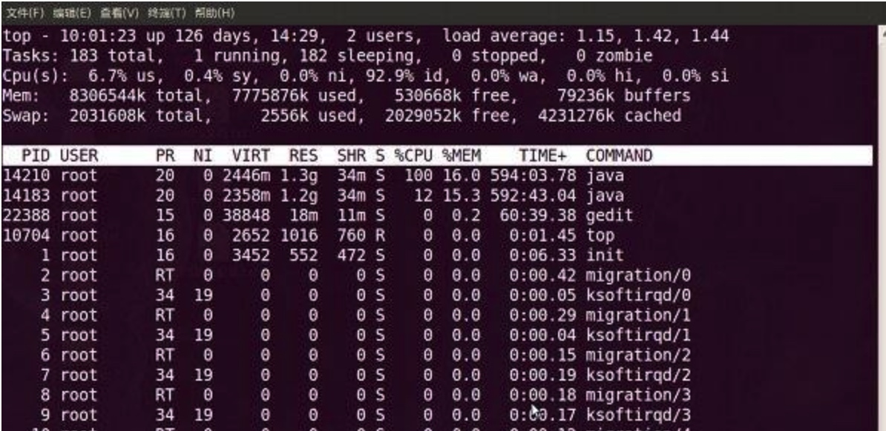

* [一. 进程相关命令](#一. 进程相关命令)
    * [1.1 top](#1.1-top)

    
# Linux常用命令
## 一. 进程相关命令
### 1.1 top
top命令提供了实时的对系统处理器的状态监视.它将显示系统中CPU最“敏感”的任务列表.该命令可以按CPU使用.内存使用和执行时间对任务进行排序；而且该命令的很多特性都可以通过交互式命令或者在个人定制文件中进行设定.

#### 第一行：任务队列信息
 - 10:01:23 当前系统时间
 - 126 days, 14:29 系统已经运行了126天14小时29分钟（在这期间没有重启过）
 - 2 users 当前有2个用户登录系统
 - **load average**: 1.15, 1.42, 1.44 load average后面的三个数分别是**1分钟、5分钟、15分钟**的负载情况。
 

##### load average
可参考： 

 - [理解Linux系统负荷](http://www.ruanyifeng.com/blog/2011/07/linux_load_average_explained.html)
 - [Understanding Linux CPU Load - when should you be worried?](http://blog.scoutapp.com/articles/2009/07/31/understanding-load-averages)

系统平均负载被定义为在特定时间间隔内运行队列中(在CPU上运行或者等待运行多少进程)的平均进程数。如果一个进程满足以下条件则其就会位于运行队列中：

 - 它没有在等待I/O操作的结果
 - 它没有主动进入等待状态(也就是没有调用’wait’)
 - 没有被停止(例如：等待终止)
 
是指系统的运行队列的平均利用率，也可以认为是可运行进程的平均数

##### Load误解
 - 系统load高一定是性能有问题。
   - 真相：Load高也许是因为在进行cpu密集型的计算
 - 系统Load高一定是CPU能力问题或数量不够？
   - 真相：Load高只是代表需要**运行的队列累计过多了**。但队列中的任务实际可能是耗Cpu的，也可能是耗I/O
- 在Load average 高的情况下如何鉴别系统瓶颈。
   - 是CPU不足，还是io不够快造成或是内存不足？

#### 第二行：进程信息
Tasks 任务（进程），系统现在共有183个进程，其中处于运行中的有1个，182个在休眠（sleep），stoped状态的有0个，zombie状态（僵尸）的有0个。
 
#### 第三行：cpu状态
- 6.7% us 用户空间占用CPU的百分比。
- 0.4% sy 内核空间占用CPU的百分比。
- 0.0% ni 改变过优先级的进程占用CPU的百分比
- 92.9% id 空闲CPU百分比
- 0.0% wa IO等待占用CPU的百分比
- 0.0% hi 硬中断（Hardware IRQ）占用CPU的百分比
- 0.0% si 软中断（Software Interrupts）占用CPU的百分比

在这里CPU的使用比率和windows概念不同，如果你不理解用户空间和内核空间，需要充充电了。
 
#### 第四行：内存状态
- 8306544k total 物理内存总量（8GB）
- 7775876k used 使用中的内存总量（7.7GB）
- 530668k free 空闲内存总量（530M）
- 79236k buffers 缓存的内存量 （79M）
 
#### 第五行：swap交换分区
- 2031608k total 交换区总量（2GB）
- 2556k used 使用的交换区总量（2.5M）
- 2029052k free 空闲交换区总量（2GB）
- 4231276k cached 缓冲的交换区总量（4GB）
 

