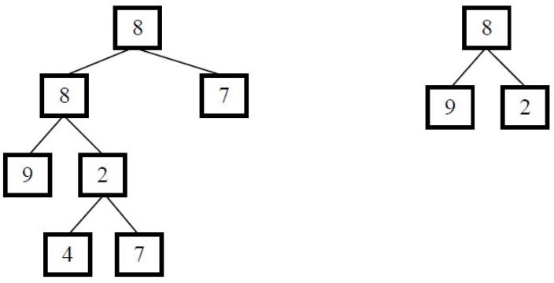
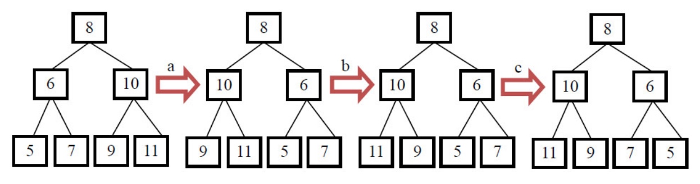

# 剑指offer
## 7. 斐波那契数列
### 7.1 算法描述
大家都知道斐波那契数列，现在要求输入一个整数n，请你输出斐波那契数列的第n项。
n<=39

[newCode](https://www.nowcoder.com/practice/c6c7742f5ba7442aada113136ddea0c3?tpId=13&tqId=11160&tPage=1&rp=1&ru=%2Fta%2Fcoding-interviews&qru=%2Fta%2Fcoding-interviews%2Fquestion-ranking)

### 7.2 算法思路
用两个指针，一个记录倒数第一个，一个记录倒数第二个。
用这两个指针计算新的值，并重新更新这两个指针。复杂度 O(N)

### 7.3 算法实现
```
public class Solution {
    public int Fibonacci(int n) {
        if (n <= 0) {
            return 0;
        }
        if(n == 1) {
            return 1;
        }
        int preOne = 1, preTwo = 1;
        for(int i = 3; i <= n; i++){
            int temp = preOne;
            preOne = preOne + preTwo;
            preTwo = temp;
        }
        return preOne;
    }
}
```

## 8. 跳台阶
### 8.1 算法描述
一只青蛙一次可以跳上1级台阶，也可以跳上2级。求该青蛙跳上一个n级的台阶总共有多少种跳法。

[newCode](https://www.nowcoder.com/practice/8c82a5b80378478f9484d87d1c5f12a4?tpId=13&tqId=11161&tPage=1&rp=1&ru=%2Fta%2Fcoding-interviews&qru=%2Fta%2Fcoding-interviews%2Fquestion-ranking)

### 8.2 算法思路
类似斐波那契数列。

### 8.3 算法实现

```
public class Solution {
    public int JumpFloor(int target) {
       if(target <=0) return 0 ;
       if(target == 1) return 1;
        
        int preOne = 2, preTwo = 1;
        for(int i = 3; i <= target; i++) {
            int temp = preOne;
            preOne = preOne + preTwo;
            preTwo = temp;
        }   
        return preOne;
    }
}
```

## 9. 变态跳台阶
### 9.1 算法描述
一只青蛙一次可以跳上1级台阶，也可以跳上2级……它也可以跳上n级。求该青蛙跳上一个n级的台阶总共有多少种跳法。

### 9.2 算法思路
是2的n次方

### 9.3 算法实现

```
public class Solution {
    public int JumpFloorII(int target) {
        if (target <= 0) return 0;
        int result = 1;
        target --;
        while (target > 0) {
            result = result << 1;
            target--;
        }
         
        return result;
    }
}
```

## 10. 矩形覆盖
### 10.1 算法描述
我们可以用2*1的小矩形横着或者竖着去覆盖更大的矩形。请问用n个2*1的小矩形无重叠地覆盖一个2*n的大矩形，总共有多少种方法？

[newCode](https://www.nowcoder.com/practice/72a5a919508a4251859fb2cfb987a0e6?tpId=13&tqId=11163&tPage=1&rp=1&ru=%2Fta%2Fcoding-interviews&qru=%2Fta%2Fcoding-interviews%2Fquestion-ranking)

### 10.2 算法思路
和斐波那契数列一样

### 10.3 算法实现
```
public class Solution {
     public int RectCover(int target) {
        if (target <= 0) return 0;
        if (target == 1) return 1;
        if (target == 2) return 2;
        int temp;
        int preOne = 2;
        int preTwo = 1;
        for (int i = 3; i <= target; i++) {
            temp = preOne;
            preOne = preOne + preTwo;
            preTwo = temp;
        }
        return preOne;
    }
}
```

## 11. 二进制中1的个数---再看下书
### 11.1 算法描述
输入一个整数，输出该数二进制表示中1的个数。其中负数用补码表示。

[牛客网](https://www.nowcoder.com/practice/8ee967e43c2c4ec193b040ea7fbb10b8?tpId=13&tqId=11164&tPage=1&rp=1&ru=%2Fta%2Fcoding-interviews&qru=%2Fta%2Fcoding-interviews%2Fquestion-ranking)
### 11.2 算法思路
O(logM) 时间复杂度解法，其中M表示1的个数。


```
假如 n = 5
    n          0101   5 
    n - 1      0100   4
    n=n&(n-1)  0100   4
    n - 1      0011   3
    n=n&(n-1)  0000   0
    进行了两次&运算，得到二进制5中的1的个数2
```
    
### 11.3 算法实现
```
public class Solution {
    public int NumberOf1(int n) {
        int count = 0;
        while (n != 0 ) { // 注意，是不等于0
            count ++;
            n = n & (n -1);
        }
        return count;
    }
}
```

## 12. 数值的整数次方
### 12.1 算法描述
给定一个double类型的浮点数base和int类型的整数exponent。求base的exponent次方。

[牛客网](https://www.nowcoder.com/practice/1a834e5e3e1a4b7ba251417554e07c00?tpId=13&tqId=11165&rp=1&ru=/ta/coding-interviews&qru=/ta/coding-interviews/question-ranking)
### 12.2 算法思路
需要考虑的点：

 1. exponent的负数问题
 2. exponent为负数时，base不能为0

思路：将exponent转为正数，按整数方式处理，然后再求倒数。

### 12.3 算法实现
```
import java.lang.IllegalArgumentException;

public class Solution {
    public double Power(double base, int exponent) {
        if (base == 0 && exponent < 0) {
            throw new IllegalArgumentException("参数非法");
        }
        boolean flag = false;
        if (exponent < 0 ) {
            flag = true;
        }
        
        double result = doPower(base, exponent);
        if (flag) {
            return  1.0 / result;
        } else {
            return result;
        }
        
   }
    
    private double doPower(double base, int exp) {
        if (exp == 0)
            return 1;
        
        if (exp%2 == 0) {
            double r1 = doPower(base, exp/2);
            return r1 * r1;
        } else {
             double r1 = doPower(base, exp/2);
             return r1 * r1 * base;
        }
    }
}
```

## 13. 调整数组顺序使奇数位于偶数前面
### 13.1 算法描述
输入一个整数数组，实现一个函数来调整该数组中数字的顺序，使得所有的奇数位于数组的前半部分，所有的偶数位于位于数组的后半部分，并保证奇数和奇数，偶数和偶数之间的相对位置不变。

[牛客网](https://www.nowcoder.com/practice/beb5aa231adc45b2a5dcc5b62c93f593?tpId=13&tqId=11166&rp=1&ru=/ta/coding-interviews&qru=/ta/coding-interviews/question-ranking)

### 13.2 算法思想
如果要保证奇数和奇数，偶数和偶数之间的相对位置不变，那么需要开辟新的空间来保存奇数和偶数，方法有两种：

 1. 开辟一个新数组，遍历第一遍原数组，将奇数依次写入新数组，遍历第二遍原数组，将偶数依次写入新数组，返回新数组；

 2. 开辟两个数组，遍历一遍原数组，分别将奇数和偶数存入两个新数组，再将奇数数组和偶数数组分别写入原数组，返回原数组；

如果无需保证奇数和奇数，偶数和偶数之间的相对位置不变，那么可以通过前后遍历，奇偶对换的方法来实现：

维护两个指针，分别指向数组的首尾，然后一个向后一个向前，在两个指针相遇之前，如果第一个指针指向偶数，而第二个指针指向奇数，那么就交换这两个数。（无需开辟新空间）

**类似题目**：

 - 将题目改成将数组分成两部分，所有负数在非负数前面；
 - 将题目改成将数组分成两部分，能被3整除的在不能被3整除的前面；

### 13.3 算法实现
```
public class Solution {
    public void reOrderArray(int [] array) {
        if (array == null || array.length == 0) {
            return;
        }
        int[] newArray = new int[array.length];
        int idx = 0, nIdx = 0;
        for (int i = 0; i < array.length; i++) {
            if (array[i] % 2 == 0) {
                newArray[nIdx++] =  array[i];
            } else {
                array[idx++] = array[i];
            }
        }
        
        for (int i = 0; i < nIdx; i++) {
            array[idx++] = newArray[i];
        }
    }
}
```

## 14. 链表中倒数第k个结点
### 14.1 算法描述
输入一个链表，输出该链表中倒数第k个结点。


[牛客网](https://www.nowcoder.com/practice/529d3ae5a407492994ad2a246518148a?tpId=13&tqId=11167&rp=1&ru=%2Fta%2Fcoding-interviews&qru=%2Fta%2Fcoding-interviews%2Fquestion-ranking)


### 14.2 算法思路
参考： https://www.cnblogs.com/edisonchou/p/4769164.html
为了能够只遍历一次就能找到倒数第k个节点，可以定义两个指针：

  - 第一个指针从链表的头指针开始遍历向前走k-1，第二个指针保持不动；
  - 从第k步开始，第二个指针也开始从链表的头指针开始遍历；
  - 由于两个指针的距离保持在k-1，当第一个（走在前面的）指针到达链表的尾结点时，第二个指针（走在后面的）指针正好是倒数第k个结点。

　　下图展示了在有6个结点的链表上找倒数第3个结点的过程：
　　
　　


**注意点**：

 - 可能链长度小于k， 返回null
 - 链为空判断
 - k <= 0 判断。 如果是返回null

 **举一反三**：当我们用一个指针遍历链表不能解决问题的时候，可以尝试用两个指针来遍历链表。可以让其中一个指针遍历的速度快一些（比如一次在链表上走两步），或者让它先在链表上走若干步。

### 14.3 算法实现
```
/*
public class ListNode {
    int val;
    ListNode next = null;

    ListNode(int val) {
        this.val = val;
    }
}*/
public class Solution {
     public ListNode FindKthToTail(ListNode head, int k) {
        if (k <= 0 || head == null) {
            return null;
        }
             
        // 先走k-1步
        int count = 1;
        ListNode quick = head;
        while(quick.next != null && count < k) {
            quick = quick.next;
            count ++;
        }
        if (count < k) {
            return null;
        }
         
        // 两指针一起移动 
        ListNode slow = head;
        while(quick.next != null ) {
            quick = quick.next;
            slow = slow.next;
        }
        return slow;
    }
}
```

## 15. 反转链表
### 15.1 算法描述
输入一个链表，反转链表后，输出链表的所有元素。


- [Edison Zhou](http://www.cnblogs.com/edisonchou/p/4769537.html)
- [牛客网](https://www.nowcoder.com/practice/75e878df47f24fdc9dc3e400ec6058ca?tpId=13&tqId=11168&rp=1&ru=%2Fta%2Fcoding-interviews&qru=%2Fta%2Fcoding-interviews%2Fquestion-ranking)

### 15.2 算法思路
采用头插入法， 定义3个指针，分别指向当前遍历到的结点cur、后一个结点next、nHead新链表的头结点。
 
 1. 用next记录cur的后一个节点，用于后面遍历。
 2. 插入到新表的头部：将cur.next = nHead；  nHead = cur
 4. 继续处理后续节点：cur = next；
 
### 15.3 算法实现
```
/*
public class ListNode {
    int val;
    ListNode next = null;

    ListNode(int val) {
        this.val = val;
    }
}*/
public class Solution {
    public ListNode ReverseList(ListNode head) {
        if (head == null) return null;
        
        ListNode cur = head;
        ListNode next = cur.next;
        head.next = null;
        ListNode nHead = head;
        
        while(next != null) {
            cur = next;
            next = cur.next;
            cur.next = nHead;
            nHead = cur;
        }
       return nHead;     
    }
}
```

## 16. 合并两个排序的链表
### 16.1 算法描述
输入两个单调递增的链表，输出两个链表合成后的链表，当然我们需要合成后的链表满足单调不减规则。


- [牛客网](https://www.nowcoder.com/practice/d8b6b4358f774294a89de2a6ac4d9337?tpId=13&tqId=11169&rp=1&ru=%2Fta%2Fcoding-interviews&qru=%2Fta%2Fcoding-interviews%2Fquestion-ranking)
- [Edison Zhou](http://www.cnblogs.com/edisonchou/p/4771515.html)

### 16.2 算法思路
Step1.定义一个指向新链表的指针，暂且让它指向NULL；

Step2.比较两个链表的头结点，让较小的头结点作为新链表的头结点；

Step3.递归比较两个链表的其余节点，让较小的节点作为上一个新节点的后一个节点；

### 16.3 算法实现
```
/*
public class ListNode {
    int val;
    ListNode next = null;

    ListNode(int val) {
        this.val = val;
    }
}*/
public class Solution {
    public ListNode Merge(ListNode list1, ListNode list2) {
        if (list1 == null) 
            return list2;
        if (list2 == null)
            return list1;
       
        ListNode head;
        if (list1.val < list2.val) {
            head = list1;
            head.next = Merge(list1.next, list2);
        } else {
            head = list2;
            head.next = Merge(list1, list2.next);
        }
        return head;
    }
}
```

## 17. 树的子结构
### 17.1 算法描述
输入两棵二叉树A，B，判断B是不是A的子结构。（ps：我们约定空树不是任意一个树的子结构）



- [牛客网](https://www.nowcoder.com/practice/6e196c44c7004d15b1610b9afca8bd88?tpId=13&tqId=11170&rp=1&ru=%2Fta%2Fcoding-interviews&qru=%2Fta%2Fcoding-interviews%2Fquestion-ranking)
- [Edison Zhou](http://www.cnblogs.com/edisonchou/p/4771939.html)

### 17.2 算法思想
要查找树A中是否存在和树B结构一样的子树，我们可以分成两步：

 - Step1.在树A中找到和B的根结点的值一样的结点R；
 - Step2.判断树A中以R为根结点的子树是不是包含和树B一样的结构。

很明显，这是一个递归的过程。

### 17.3 算法实现
```
/**
public class TreeNode {
    int val = 0;
    TreeNode left = null;
    TreeNode right = null;
    public TreeNode(int val) {
        this.val = val;
    }
}
*/
public class Solution {
    public boolean HasSubtree(TreeNode root,TreeNode subRoot) {
         if (root == null || subRoot == null) {
             return false;
         }
        
         boolean flag = false; // 关键，因为不是二叉搜索树，树中数据无规律，可能存在其左右孩子节点中
        if (root.val == subRoot.val) {
            flag = isSubTree(root, subRoot);
        }
        if (!flag) {
            flag = HasSubtree(root.left, subRoot);
        } 
        if (!flag) {
            flag = HasSubtree(root.right, subRoot);
        }
        return flag;
    }
    
    private boolean isSubTree(TreeNode root, TreeNode subRoot) {
        if (subRoot == null) {
            return true;
        }
        if (root == null) {
            return false;
        }
        
        if (root.val != subRoot.val) {
            return false;
        }
        return isSubTree(root.left, subRoot.left) && isSubTree(root.right, subRoot.right);
    }
}
```

## 18. 二叉树的镜像
### 18.1 算法描述
操作给定的二叉树，将其变换为源二叉树的镜像。
 
 
 - [牛客网](https://www.nowcoder.com/practice/564f4c26aa584921bc75623e48ca3011?tpId=13&tqId=11171&rp=1&ru=%2Fta%2Fcoding-interviews&qru=%2Fta%2Fcoding-interviews%2Fquestion-ranking)
 - [Edison Zhou](http://www.cnblogs.com/edisonchou/p/4774626.html)   
 
### 18.2 算法思路	  

- Step1.**先序遍历**原二叉树的每个节点，如果遍历到的结点有子结点，就交换它的两个子结点。或者按照**后序遍历**原二叉树的每个节点，先对它的每个结点做镜像变化，然后交互它的两个子结点。
- Step2.递归遍历每个节点的子节点，同样，如果遍历到的子节点有子节点，就交换它的两个子节点。

当交换完所有非叶子结点的左右子结点之后，就得到了树的镜像。下图展示了求二叉树的镜像的过程：



### 18.3 算法实现
```
/**
public class TreeNode {
    int val = 0;
    TreeNode left = null;
    TreeNode right = null;
    public TreeNode(int val) {
        this.val = val;

    }
}
*/
public class Solution {
    public void Mirror(TreeNode root) {
        if (root == null) return;
        
        TreeNode temp = root.left;
        root.left = root.right;
        root.right = temp;
        
        Mirror(root.left);
        Mirror(root.right);
    }
}
```

## 19. 顺时针打印矩阵---看书
### 19.1 算法描述
输入一个矩阵，按照从外向里以顺时针的顺序依次打印出每一个数字，例如，如果输入如下矩阵： 1 2 3 4 5 6 7 8 9 10 11 12 13 14 15 16 则依次打印出数字1,2,3,4,8,12,16,15,14,13,9,5,6,7,11,10.


### 19.2 算法思想

### 19.3 算法实现
```
import java.util.ArrayList;
public class Solution {
    public ArrayList<Integer> printMatrix(int [][] matrix) {
       ArrayList<Integer> result = new ArrayList<Integer>();
       if (null == matrix || matrix.length == 0 || matrix[0].length == 0) {
           return result;
       }
        int row = 0, col = 0;
        int min = Math.min(matrix.length, matrix[0].length);
        for (int level = 0; 2 * level < min; level ++) {
            int rowEnd = matrix.length - 1 - level;
            int colEnd = matrix[0].length - 1- level;
            // 上行
            for (int i = level; i <= colEnd; i++) {
                result.add(matrix[level][i]);
            }
            
            // 右列
            if (level < rowEnd) {
                for (int i = level + 1; i <= rowEnd; i++) {
                    result.add(matrix[i][colEnd]);
                }
            }
            
            // 下行
            if (level < rowEnd && level < colEnd) {
                for (int i = colEnd - 1; i >= level; i--) {
                    result.add(matrix[rowEnd][i]);
                }
            }
            
            // 左列
            if (level + 1 < rowEnd && level < colEnd) {
                 for (int i = rowEnd - 1; i > level; i--) {
                    result.add(matrix[i][level]);
                }
            }
        }
       return result;
    }
}
```

## 20. 包含min函数的栈
### 20.1 算法描述
定义栈的数据结构，请在该类型中实现一个能够得到栈最小元素的min函数。

### 20.2 算法思路
用一个辅助栈，栈顶元素记录当前压如栈的最小元素。 每次入栈的时候都需要将最小值压入辅助栈。只需要判断当前值和辅助栈的栈顶元素，如果小于辅助栈顶元素，则将当前元素压入辅助栈中；否则用压入一个一样的栈顶元素。下图展示了栈内压入3、4、2、1之后接连两次弹出栈顶数字再压入0时，数据栈、辅助栈和最小值的状态。


### 20.3 算法实现
```
import java.util.Stack;
public class Solution {
    Stack<Integer> stack = new Stack<Integer>();
    Stack<Integer> minStack = new Stack<Integer>();
    public void push(int node) {
        stack.push(node);
        if (minStack.isEmpty()) {
            minStack.push(node);
        } else if (node < min()) {
            minStack.push(node);
        } else {
            minStack.push(min());
        }
    }
    
    public void pop() {
        stack.pop();
        minStack.pop();
    }
    
    public int top() {
        return stack.peek();
    }
    
    public int min() {
        return minStack.peek(); // 查看
    }
}
```


