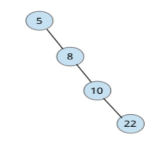
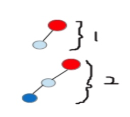
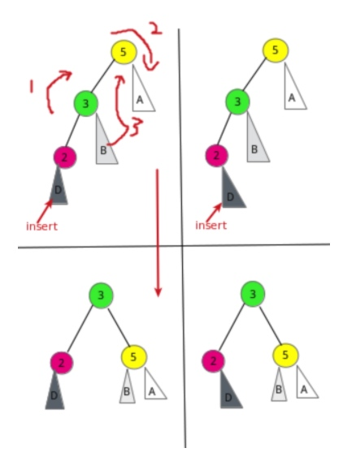
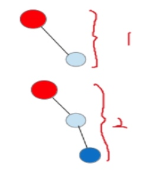
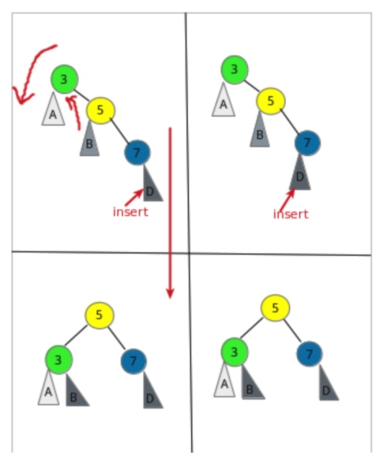
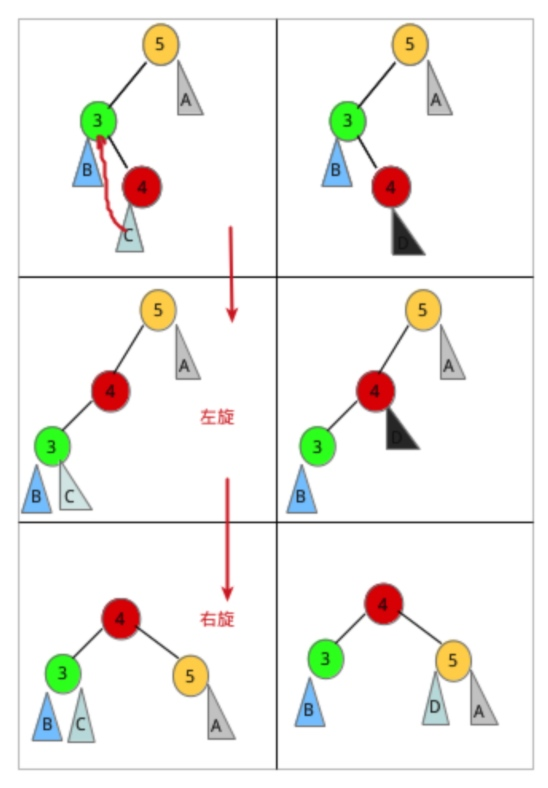
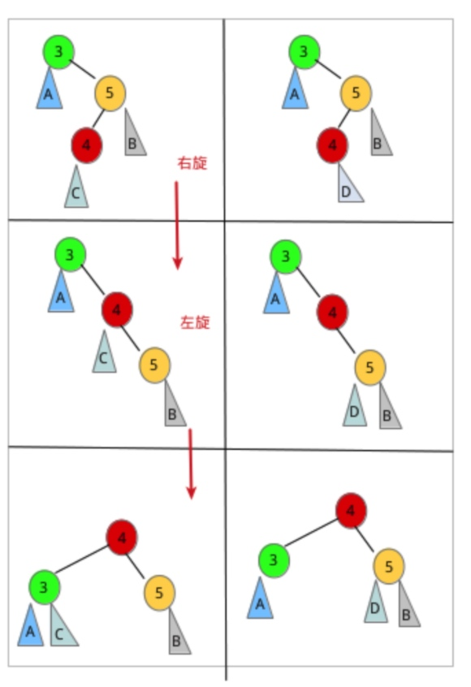

# 平衡二叉树
# 一. 背景
二叉搜索树具有不平衡性，如果向一颗二叉搜索树插入已排好序的数字序列，会有出现二叉失衡，右孩子深度过深，导致查询效率变为线性。查找效率变为O(N)



平衡二叉树定义（AVL）：它或者是一棵空树，或者是具有一下性质的二叉查找树--**它的结点左子树和右子树的深度之差不超过1,而且该结点的左子树和右子树都是一棵平衡二叉树**。

当二叉查找树中插入一个结点时，首先检查是否因为插入而破坏了平衡。若破坏了则找出其中的最小不平衡二叉树，在保持二叉查找树特性的情况下，调整最小不平衡子树中结点之间的关系，以达到平衡。最小不平衡二叉树指距离插入结点最近且以平衡因子的绝对值大于1的结点作为根的子树。那么最小不平衡二叉树结点的关系到底是如何进行调整的呢？分为四种情况讨论。

# 二. 四种不平衡类型
## 2.1 LL型（右旋操作）
插入一个新的结点到根结点的左子树的左子树，导致根结点的平衡因子1变为2。



具体右旋转的方式：




## 2.2 RR型（左旋操作）
插入一个新的结点到根结点的右子树的右子树，导致根结点的平衡



左旋方式：



## 2.3 LR型（左旋+右旋）
在根结点的左孩子的右子树上插入结点。直接演示其操作过程:



## 2.4 RL型（右旋+左旋）
在根结点的右子树的左子树上插入结点。




# 三. 代码实现
## 3.1 简单版本
```
/**
 * 平衡二叉树 简单版本
 * https://blog.csdn.net/lcore/article/details/8892648
 * @author zhengjianglong
 * @since 2018-04-02
 */
public class AvlTree {
    /**
     * avl树节点
     */
    private static class AvlNode {

        AvlNode(int val) {
            this(val, null, null);
        }

        AvlNode(int val, AvlNode lt, AvlNode rt) {
            val = val;
            left = lt;
            right = rt;
            height = 0;
        }

        int val;      // 节点中的数据
        AvlNode left;         // 左儿子
        AvlNode right;        // 右儿子
        int height;       // 节点的高度
    }

    /**
     * 在avl树中插入数据，重复数据复略
     *
     * @param root
     * @param val
     * @return
     */
    public AvlNode insert(AvlNode root, int val) {
        if (root == null) {
            return new AvlNode(val);
        }
        if (root.val == val) {
            return root;
        } else if (root.val > val) {
            root.left = insert(root.left, val);
            if (height(root.left) - height(root.right) == 2) {
                if (val < root.left.val) { // LL型
                    root = rightLeftChild(root);
                } else {
                    // LR 型
                    root = leftRightChild(root);
                }
            }
        } else {
            root.right = insert(root.right, val);
            if (height(root.right) - height(root.left) == 2) {
                if (val > root.right.val) {
                    // RR型
                    root = rotateWithRightChild(root);
                } else {
                    // RL
                    root = rightLeftChild(root);
                }
            }
        }

        // 更新高度
        root.height = Math.max(height(root.left), height(root.right)) + 1;//更新高度
        return root;
    }

    public int height(AvlNode node) {
        return node == null ? -1 : node.height;
    }

    /**
     * 带左子树旋转,适用于LL型
     *
     * @param node
     * @return
     */
    private AvlNode rotateWithLeftChild(AvlNode node) {
        AvlNode leftNode = node.left;
        node.left = leftNode.right;
        leftNode.right = node;

        // 更新深度
        leftNode.height = Math.max(height(leftNode.left), height(leftNode.right)) + 1;
        node.height = Math.max(height(node.left), height(node.right)) + 1;

        return node;
    }

    /**
     * 带右子树旋转，适用于RR型
     *
     * @param node
     * @return
     */
    private AvlNode rotateWithRightChild(AvlNode node) {
        AvlNode rightNode = node.right;
        node.right = rightNode.left;
        rightNode.left = node;

        // 更新深度
        rightNode.height = Math.max(height(rightNode.left), height(rightNode.right)) + 1;
        node.height = Math.max(height(node.left), height(node.right)) + 1;
        return rightNode;
    }


    /**
     * LR 类型
     * @param node
     * @return
     */
    private AvlNode leftRightChild(AvlNode node) {
        node.left = rotateWithRightChild(node.left);
        return rotateWithLeftChild(node);
    }

    /**
     * RL
     * @param node
     * @return
     */
    private AvlNode rightLeftChild(AvlNode node) {
        node.right = rotateWithLeftChild(node.right);
        return rotateWithRightChild(node);
    }

    /**
     * 寻找最小值
     * @param avlNode
     * @return
     */
    private AvlNode findMin(AvlNode avlNode) {
        if (avlNode == null) {
            return null;
        }
        while (avlNode.left != null) {
            avlNode = avlNode.left;
        }
        return avlNode;
    }

}

```


