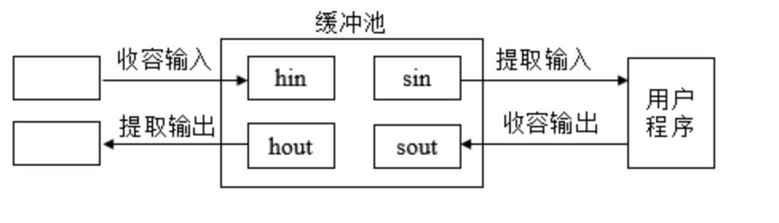
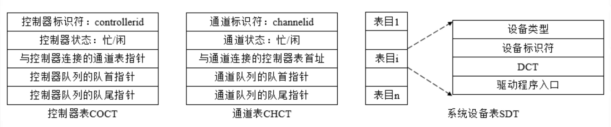
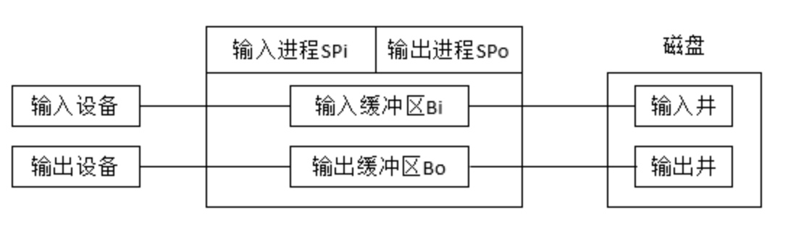

## 一. 设备管理概述
### 1.1设备管理的任务和功能
设备管理的主要任务是完成用户提出的I/O请求，为用户分配I/O设备，提高I/O设备的利用率，方便用户使用I/O设备。设备管理应该具备以下功能：

 - **设备分配**。按照设备类型和相应的分配算法决定将I/O设备分配给哪一个要求使用该设备的进程。如果在I/O设备与CPU之间还存在着设备控制器和通道，则还需分配相应的控制器和通道，以保证I/O设备与CPU之间有传递信息的通路。凡未分配到所需设备的进程应放入一个等待队列。为了实现设备分配，系统中应设置一些数据结构，用于记录设备的状态。
 
 - **设备处理**。设备处理程序实现CPU和设备控制器之间的通信。即当CPU向设备控制器发出I/O指令时，设备处理程序应启动设备进行I/O操作，并能对设备发来的中断请求做出及时的响应和处理。
 
 - **缓冲管理**。设置缓冲区的目的是缓和CPU与I/O设备速度不匹配的矛盾。缓冲管理程序负责完成缓冲区的分配和释放及有关的管理工作。
 
 - **设备独立性**。设备独立性又称设备无关性，是指应用程序独立于物理设备。用户在编制应用程序时，要尽量避免直接使用实际设备名。如果程序中使用了实际设备名，则当该设备没有连接在系统中或者该设备发生故障时，用户程序无法运行，若要运行此程序则需要修改程序。如果用户程序不涉及实际设备而使用逻辑设备，那么它所要求的输入/输出便与物理设备无关。设备独立性可以提高用户程序的可适应性，使程序不局限与某个具体的物理设备。

### 1.2设备控制器与I/O通道
#### 1.设备控制器 

设备一般由机械和电子两部分组成，设备的电子部分通常称为**设备控制器**。设备控制器处于CPU与I/O设备之间，**它接收从CPU发来的命令，并去控制I/O设备工作，使CPU从繁杂的设备控制事务中解脱出来**。设备控制器是一个可编址设备，当它仅控制一个设备时，它有一个设备地址；当控制器连接多个设备时，则应具有多个设备地址，使每一个地址对应一个设备。 

设备控制器应具有以下功能：

 - **数据交换**：实现CPU与控制器之间、控制器与设备之间的数据交换，对于前者，通过数据总线，由CPU并行地将数据写入控制器，或从控制器中并行地读出数据，对于后者，是是被将数据输入到控制器，或从控制器传送给设备，为此，在控制器中必须设置一个数据寄存器。
 
 - **接收和识别命令**，CPU可以向控制器发送多种不同的命令，设备控制器应能够接收并识别这些命令，为此，控制器中应具有相应的控制寄存器，用来存放接收的命令和参数，并对所接收的命令进行译码，相应的，在磁盘控制器中有多个寄存器和命令译码器。

 - **数据缓冲**，由于I/O设备的速率较低而CPU和内存速率很高，故在控制器中必须设置一个缓冲器。在输出时，用此缓冲器暂存由主机高速传来的数据，然后才以I/O设备所具有的速率将缓冲器的数据传送给I/O设备，在输入时，缓冲器则用于暂存从I/O设备送来的数据，待接收一批数据后，再将缓冲器中的数据高速地传送至主机。
 
 - **地址识别**，系统中的每一个设备都有一个地址，而设备控制器又必须能够识别它所控制的每个设备的地址，此外，为使CPU能向（或从）寄存器中写入（或读出）数据，这些寄存器都应该具有唯一的地址，如硬盘控制器中各寄存器的地址分别为320~32F之一，控制器应该能正确识别这些地址，为此，需要在控制器中配置地址译码器。
 

由于设备控制器位于CPU与设备之间，既要与CPU通信，又要与设备通信，还应具有按照CPU所发来的命令去控制设备工作的功能，因此，现有的大多数控制器都是由如下的三部分组成：

 - **设备控制器与处理器的接口**，该接口用于实现CPU与设备控制器之间的通信，共有三类信号线，数据线、地址线、控制线，数据线与两类寄存器相连接，第一类是数据寄存器，第二类是控制/状态寄存器。

 - **设备控制器与设备的接口**，设备控制器可以连接一个或多个设备，相应地，在控制器中便有一个或多个设备接口，一个接口连接一台设备，在每个接口中都存在数据、控制和状态三种类型的信号，控制器中的I/O逻辑根据处理机发来的地址信号去选择一个设备接口。

 - **I/O逻辑**，用于实现对设备的控制，通过一组控制线与处理机交互，处理机利用该逻辑向控制器发送I/O命令，I/O逻辑对收到的命令进行译码，每当CPU要启动一个设备时，一方面将启动命令发送给控制器，另一方面又同时通过地址线把地址发送给控制器，由控制器的I/O逻辑对收到的地址进行译码，再根据所译出的命令对所选设备进行控制。

#### 2.I/O通道 
在一般计算机系统中，**通道指专门用于负责输入/输出工作的处理机**。通道有自己的指令系统，具有执行I/O指令的能力，并通过执行通道（I/O）程序来控制I/O操作。该指令系统比较简单，一般只有数据传送指令、设备控制指令等。通道所执行的程序称为通道程序。 

虽然在CPU与I/O设备之间增加了设备控制器后，可以大大减少CPU对I/O的干预，但是当主机所配置的外设很多时，CPU的负担仍然很重，因此，在CPU和设备控制器之间又增设了通道。其主要目的是为了建立独立的I/O操作，不仅使数据的传送能独立于CPU，而且也希望有关对I/O操作的组织、管理及其结束处理尽量独立，以保证CPU有更多的时间去进行数据处理。

**在设置了通道后，CPU只需要向通道发送一条I/O指令，通道在收到该指令后，便从内存中取出本次要执行的通道程序，然后执行该通道程序，仅当通道完成了规定的I/O任务后，才向CPU发中断信号**。

根据信息交换方式的不同，可以将通道分成以下几种类型：

 - **字节多路通道**。这是一种按照字节交叉方式工作的通道，通常都含有许多非分配型子通道，其数量可以几十到数百个，每个子通道连接一台I/O设备，并控制该设备的I/O操作，**这些子通道按照时间片轮转方式共享主通道**。
 
 
 
 - **数据选择通道**。字节多路通道不适合连接高速设备。数据选择通道又称数组选择通道，它以成组方式进行数据传输，即每次传输一批数据，传输的速率很高。数组选择通道按数组进行数据传送，其通常只含有一个分配型子通道，**在一段时间内只能执行一道通道程序，控制一台设备进行数据传送**，致使当某台设备占用了该通道后，便一直由它独占，即使是它无数据传送，通道被闲置，也不允许其他设备使用该通道，直至该设备传送完毕释放该通道，其利用率很低。

 - **数据多路通道**。数据多路通道又称数组多路通道，它结合了数据选择通道传输速度高和字节多路通道能进行分时并行操作的优点，这使得它既具有很高的数据传送速率，又能获得满意的通道利用率。数据多路通道以分时的方式执行几个通道程序，它每执行一个通道程序的一条通道指令控制传送一组数据后，就转向另一个通道程序。这种通道广泛用于连接高、中速I/O设备。
 

## 二. 输入输出控制方式
常用的输入/输出控制方式有以下几种：

### 2.1 程序直接控制方式

在早起计算机系统中，由于无中断机构，处理机对I/O设备的控制采取程序I/O方式，或称为**忙-等待方式**，即在处理机向控制器发出一条I/O指令启动输入设备输入数据时，要同时把状态寄存器中的忙/闲标志busy设置为1，然后CPU便不断地**循环测试busy**，只有当其为0时，表示输入已经送入控制器的数据寄存器中，于是处理机将数据寄存器中的数据取出，送入内存指定单元中，这样便完成了一个字（符）的I/O。

在程序I/O方式中，由于CPU的高速性和I/O设备的低速性，致使CPU的绝大部分时间都处于等待I/O设备完成数据I/O的循环测试中，造成对**CPU的极大浪费**。
　　
### 2.2 中断控制方式
当某进程要启动某个I/O设备工作时，便由CPU向相应的设备控制器发出一条I/O命令，然后立即返回继续执行原来的任务，设备控制器于是按照该命令的要求去控制指定I/O设备，此时，CPU与I/O设备并行操作。一旦数据进入数据寄存器，控制器便通过控制线向CPU发送一个中断信号，由CPU检查输入过程中是否出错，若无错，便由控制器发送取走数据的信号，再通过控制器及数据线将数据写入内存指定单元中。

在I/O设备输入每个数据的过程中，由于无需CPU干预，因而可使CPU与I/O设备并行工作，仅当完成一个数据输入时，才需CPU花费极短的时间去做一些中断处理。

与程序直接控制方式相比，中断控制方式大大提高了CPU的利用率。但这种控制方式仍然存在许多问题，如每台设备每输入/输出一个数据都要求中断CPU，这样在一次数据传送过程中，**中断发生的次数较多，从而耗去大量CPU处理时间**。

### 2.3 直接存储器访问(DMA)控制方式
**DMA控制方式的基本思想是在外围设备和内存之间开辟直接的数据交换通路**。在DMA控制方式中，I/O控制器具有更强的功能，在它的控制下，设备和内存之间可以**成批地进行数据交换，而不用CPU干预**。这样既大大减轻了CPU的负担，也使I/O数据传送速度大大提高。这种方式一般用于块设备（块设备处理信息的基本单位是字符块。一般块的大小为512B~8KB）的数据传输。 

该方式的特点如下:

 - 数据传输的基本单位是数据块，即在CPU与I/O设备之间，每次传送至少一个数据块。
 - 所传送的数据是从设备直接送入内存的，或者相反。
 - 仅在传送一个或多个数据块的开始和结束时，需要CPU干预，整块数据的传送是在控制器的控制下完成的。

 DMA控制方式下进行数据输入的过程如下：

 - 当进程要求设备输入一批数据时，CPU将准备存放输入数据的内存始址以及要传送的字节数分别送入DMA控制器中的内存地址寄存器和传送字节计数器；另外，还要将中断位和启动位设置为1，以启动设备开始进行数据输入，并允许中断。
 
 - 发出数据请求的进程进入等待状态，进程调度程序调度其他进程占据CPU。
 
 - 此后，整个数据传送过程便由DMA控制器进行控制.将数据寄存器中的数据源源不断地写入内存，直到所要求的字节全部传送完毕。
 
 - DMA控制器在传送字节数完成时通过中断请求线发出中断信号，CPU收到中断信号后转去执行中断处理程序，唤醒等待输入完成的进程，并返回被中断程序。
 
 - 在以后的某个时刻，进程调度程序选中提出请求输入的进程；该进程从指定的内存单元取出数据并做进一步的处理。
 

DMA控制器由三部分组成:

 - 主机与DMA控制器的接口
 - DMA控制器与块设备的接口
 - I/O控制逻辑。
 
　

DMA控制器中的寄存器说明如下:
 
  - **命令/状态寄存器（CR）**，用于接收从CPU发送来的I/O命令，或有关控制信息，或设备的状态。
  - **内存地址寄存器（MAR）**，在输入时，它存放把数据从设备传送到内存的起始目标地址，在输出时，它存放由内存到设备的内存源地址。
  - **数据寄存器（DR）**，用于暂存从设备到内存，或从内存到设备的数据。
  - **数据计数器（DC）**，存放本次CPU要读或写的字（节）数。

DMA控制方式下进行数据输入的过程如下：

 - 当CPU要从磁盘读入一个数据块时，便向磁盘控制器发送一条读命令，该命令被送到其中的命令寄存器（CR）中
 - 同时，还需要发送本次要将数据读入的内存起始目标地址，该地址被送入内存地址寄存器（MAR）中
 - 本次要读数据的字（节）数被送入数据寄存器（DC）中
 - 还须将磁盘中的源地址直接送至DMA控制器的I/O控制逻辑上，
 - 启动DMA控制器进行数据传送，以后，CPU便可去处理其他任务,此后，整个数据传送过程便由DMA控制器进行控制.
 - 当DMA控制器已从磁盘中读入一个字（节）的数据并送入数据寄存器（DR）后，再挪用一个存储器周期，将该字（节）传送到MAR所指示的内存单元中
 - 接着便对MAR内容加1，将DC内存减1，若减后DC内存不为0，表示传送未完成，便继续传送下一个字（节），否则，由DMA控制发出中断请求。
 
DMA控制方式与中断控制方式的主要区别是：

 - 中断控制方式在每个数据传送完成后中断CPU，而DMA控制方式则是在所要求传送的一批数据全部传送结束时中断CPU；
 
 - 中断控制方式的数据传送是在中断处理时由CPU控制完成，而DMA控制方式则是在DMA控制器的控制下完成的。

不过DMA控制方式仍然存在一定的局限性，如数据传送的方向、存放数据的内存始址及传送数据的长度等都由CPU控制，并且每台设备需一个DMA控制器，当设备增加时，多个DMA控制器的使用也不经济。

### 2.4通道控制方式
通道控制方式与DMA控制方式类似，也是一种以内存为中心，实现设备与内存直接交换数据的控制方式。与DMA控制方式相比，

虽然DMA方式比起中断方式已经显著地减少CPU的干预，即已由以字（节）为单位的干预减少到了以数据块为单位进行干预，但CPU每次发出一条I/O指令，也只能去读（或写）一个连续的数据块，而当我们需要一次去读多个数据块且将他们分别传送到不同的内存区域，或者相反时，则须由CPU分别发出多条I/O指令及进行多次中断才能完成。

I/O通道方式是DMA的发展，可以做到一个通道控制多台设备，它可以进一步减少CPU的干预，即把一个数据块的读（或写）为单位的干预减少为对一组数据块的读（或写）及有关的控制和管理为单位的干预。同时，可以实现CPU、通道、I/O设备的并行操作，提高资源利用率。

通道是通过执行通道程序，并与设备控制器共同实现对I/O设备的控制的，通道程序是由一系列通道指令（或称为通道命令）所构成的。
　

## 三. 中断技术
### 3.1中断的基本概念
**中断是指计算机系统内发生了某一急需处理的事件，使得CPU暂时中止当前正在执行的程序而转去执行相应的事件处理程序，待处理完毕后又返回到原来被中断处继续执行**。

引起中断发生的事件称为**中断源**。中断源向CPU发出的请求中断处理的**信号**称为中断请求。而CPU收到中断请求后转相应事件处理程序的过程称为中断响应。

发生中断时，刚执行完的那条指令所在的单元号称为**断点**，断点的逻辑后继指令的单元号称为**恢复点**。而现场是指中断的那一时刻能保证程序继续运行的有关信息。

为了处理上的方便，计算机系统通常采用**中断向量**来存放中断处理程序的入口地址，以便中断发生时硬件能根据中断向量转入相应的中断处理程序执行。在中断向量中每一个中断信号占用连续的两个单元：一个单元用来存放中断处理程序的入口地址，另一个单元用来保存在处理中断时CPU应具有的状态。

除了禁止中断外，还有一个比较常用的概念是中断屏蔽。**中断屏蔽**是指系统用软件方式有选择地封锁部分中断而允许其余部分中断仍能得到响应。不过，有些中断请求是不能屏蔽甚至不能禁止的，也就是说，这些中断具有最高优先级，不管CPU是否关中断，只要这些中断请求一提出，CPU必须立即响应。

### 3.2中断的分类与优先级
根据系统的需要，一般对中断进行分类并对不同中断赋予不同的处理优先级，以便在多个中断同时发生时，按轻重缓急进行处理。 根据中断信号的来源，可以将中断分为两类：

 - **外中断**。外中断是指来自处理机外部和内存外部的中断，包括I/O设备发出的中断，时钟中断等。
 
 - **内中断**。内中断主要指在处理机和内存内部产生的中断，内中断一般称为陷入或异常，它包括程序运算引起的各种错误，如地址非法、校验错、存取访问控制错、算术操作溢出、非法指令等。
 
根据中断信号的含义和功能将中断分为5类：

 - **机器故障中断**。机器故障中断是指因机器发生错误而产生的中断，如电源故障、内存奇偶校验错等。

 - **I/O中断**。指由输入/输出设备引起的中断，如设备传输结束、设备出错等。

 - **外中断**。外中断是指处理机外部的非通道装置引起的中断，如时钟中断、操作员控制台中断等。
 
 - **程序性中断**。程序性中断是指因程序中错误使用指令或数据引起的中断，如定点运算溢出、地址越界、非法指令等。
 
 - **访管中断**。访管中断是指由于程序执行了访管指令（系统调用）而产生的中断，如用户程序请求操作系统为其完成某项工作。
 
一般情况下，中断优先级的高低顺序为：机器故障中断、访管中断、程序性中断、外部中断、输入/输出中断。

### 3.3中断处理过程
一旦CPU响应中断，系统就开始进行中断处理。中断处理的过程如下：

 - 保护被中断进程的现场。为了在中断处理结束后能使进程正确地返回到中断点，系统必须保存当前处理机状态字PSW和程序计数器PC等的值。
 
 - 分析中断原因，转去执行相应的中断处理程序。在多个中断请求同时发生时，处理优先级最高的中断源发出的中断请求。
 
 - 恢复被中断进程的现场，CPU继续执行原来被中断的进程。

## 四. 缓冲技术
**缓冲技术的实现思想是在CPU和外设之间设立缓冲，用以暂存CPU和外设之间交换的数据，从而缓和CPU与外设速度不匹配所产生的矛盾**。事实上，凡是数据到来速度和数据离去速度不同的地方都可以使用缓冲。

缓冲的实现方法有两种：

 - 一种实现方法是采用硬件缓冲器，但由于这种方法成本太高，除一些关键部位外，一般情况下不采用硬件缓冲器；
 
 - 另一种实现方法是在内存划出一块存储区，专门用来临时存放输入/输出数据，这个区域称为缓冲区。

根据系统设置的缓冲区个数不同，可以将缓冲分为单缓冲、双缓冲、环形缓冲和缓冲池。 

### 4.1 单缓冲

    
单缓冲是在设备和处理机之间设置一个缓冲区。设备和处理机交换数据时，先把被交换数据写入缓冲区，然后，需要数据的设备或处理机从缓冲区取走数据。由于只设置了一个缓冲区，因而设备与处理机对缓冲区的操作是串行的。

假定从磁盘把一块数据输入到缓冲区的时间为T，操作系统将该缓冲区中的数据传送到用户区的时间为M，而CPU对这一块数据处理（计算）的时间为C，由于T和C是可以并行的，当T>C时，系统对每一块数据的处理时间为M+T，反之，为M+C，系统对每一块数据的处理时间为**Max(C，T) + M**。

在字符设备输入时，缓冲区用于暂存用户输入的一行数据，在输入期间，用户进程被挂起以等待数据输入完毕，在输出时，用户进程将一行数据输入到缓冲区后，继续进行处理，当用户进程已有第二行数据输出时，如果第一行数据尚未被提取完毕，则此时用户进程应该阻塞。

### 4.2 双缓冲
　为了加快输入和输出的速度，提高设备利用率，人们又引入了双缓冲区机制，称为缓冲对换，在设备输入时，先将数据送入第一个缓冲区，装满后便转向第二个缓冲区，此时操作系统可以从第一缓冲区中移出数据，并送入用户进程，接着由CPU对数据进行计算，在双缓冲时，系统处理一块数据的时间可以粗略地认为是Max(C，T)，如果C<T，可使块设备连续输入，如果C>T，则可使CPU不必等待设备输入。对于字符设备，若采用行输入方式，则采用双缓冲通常能消除用户的等待时间，即用户在输入完第一行后，在CPU执行第一行中的命令时，用户可继续向第二缓冲区输入下一行数据。
　
　

### 4.3 循环缓冲

当输入与输出或生产者与消费者的速度基本相匹配时，采用双缓冲能获得较好的效果，可使生产者和消费者基本上能并行操作，但若两者速度相差甚远，双缓冲的效果则不够理想，因此，引入了多缓冲机制，可将多个缓冲组织成循环缓冲形式。对于用作输入的循环缓冲，通常是提供给输入进程或计算进程使用，输入进程不断向空缓冲去输入数据，而计算进程则从中提取数据进行计算。

循环缓冲区的组成如下：

　- **多个缓冲区**，在循环缓冲区中包括多个缓冲区，每个缓冲区的大小相同，作为输入的多缓冲区可分为三种类型，用于装输入数据的空缓冲区R、已装满数据的缓冲区G以及计算进程正在使用的先行工作缓冲区C

　- **多个指针**，作为输入的缓冲区可设置三个指针，用于指示计算进程下一个可用缓冲区G的指针Nextg、指示输入进程下次可用的空缓冲区R的指针Nexti、以及用于指示计算进程正在使用的缓冲区C的指针Current。

计算进程和输入进程可以利用下述两个过程来使用循环缓冲区（循环缓冲的使用）:

 - Getbuf过程，当计算进程要使用缓冲区中的数据时，可调用Getbuf过程，该过程将由指针Nextg所指示的缓冲区提供给进程使用，相应的，须把它改为现行工作缓冲区，并将Current指针指向该缓冲区的第一个单元，同时将Nextg移向下一个G缓冲区，类似地，当输入进程要使用空缓冲区来装入数据时，调用Getbuf过程，由该过程将指针Nexti所指示的缓冲区提供给输入进程使用，同时将Nexti指针移向下一个R缓冲区。

 - Releasebuf过程，当计算进程把C缓冲区中的数据提取完毕时，便调用Releasebuf过程，将缓冲区C释放，此时，把该缓冲区由当前（现行）工作缓冲区C改为空缓冲区R，类似地，当输入进程把缓冲区装满时，也应该调用Releasebuf过程，将该缓冲区释放，并改为G缓冲区。

使用输入循环缓冲，可使输入进程和计算进程并行执行（进程同步），相应地，指针Nexti和指针Nextg将不断地沿着顺时针方向移动，这样就会出现如下两种情况:

 - Nexti指针追赶上Nextg指针，这意味着输入进程的速度大于计算进程处理数据的速度，已把全部可用的空缓冲区装满，再无缓冲区可用，此时，输入进程应该阻塞，直到计算进程把某个缓冲区中的数据全部提取完，使之成为空缓冲区R，并调用Releasebuf过程将它释放时，才将输入进程唤醒，这种情况称为系统受计算限制。
 
 - Nextg指针追赶上Nexti指针，这意味着输入数据的速度低于计算进程处理数据的速度，使全部装有输入数据的缓冲区都被抽空，再无装有数据的缓冲区供计算进程提取数据，这时，计算进程应该阻塞，直至输入进程又装满某个缓冲区，并调用Releasebuf过程将它释放时，才去唤醒计算进程，这种情况称为系统受I/O限制。
　　

### 4.4 缓冲池
缓冲池也由多个缓冲区组成，与环形缓冲不同的是缓冲池中的缓冲区是系统公用资源，这些缓冲区**可供多个进程共享**，且既能用于输入又能用于输出。 

缓冲池中的缓冲区按其使用状况可以形成三个队列：

 - 空缓冲队列
 - 装满输入数据的缓冲队列（输入队列）
 - 装满输出数据的缓冲队列（输出队列）

除上述三个队列外，还应具有四种工作缓冲区：

 - 用于收容输入数据的工作缓冲区
 - 用于提取输入数据的工作缓冲区
 - 用于收容输出数据的工作缓冲区
 - 用于提取输出数据的工作缓冲区。

缓冲区可以工作在收容输入、提取输入、收容输出、提取输出四种工作方式下：

 - **收容输入**：当输入进程需要输入数据时，便从空缓冲队列的队首摘下一个空缓冲区，把它作为收容输入工作缓冲区，然后把数据输入其中，装满后再将它挂到输入队列队尾。

 - **提取输入**：当计算进程需要输入数据时，便从输入队列取得一个缓冲区作为提取输入工作缓冲区，计算进程从中提取数据，数据用完后再将它挂到空缓冲队列尾。

 - **收容输入**：当计算进程需要输出数据时，便从空缓冲队列的队首取得一个空缓冲区，作为收容输出工作缓冲区，当其中装满输出数据后，再将其挂到输出队列尾。

 - **提取输出**，当要输出时，由输出进程从输出队列中取得一个装满输出数据的缓冲区，作为提取输出工作缓冲区，当数据提取完后，再将它挂到空缓冲队列的末尾。

## 五. 设备分配
设备分配是设备管理的功能之一，当进程向系统提出I/O请求之后，设备分配程序将按照一定的分配策略为其分配所需的设备。同时还要分配相应的控制器和通道，以保证CPU与设备之间的通信。

### 5.1设备分配中的数据结构
为了实现对I/O设备的管理和控制，需要对每台设备、通道、控制器的情况进行登记。设备分配依据的主要数据结构有**设备控制表（DCT）**、**控制器控制表（COCT）**、**通道控制表（CHCT）**和**系统设备表（SDT）**。 

- 系统为每一个设备配置一张**设备控制表**，用于记录设备的特性及与I/O控制器连接的情况。设备控制表中包括设备标识符、设备类型、设备状态、设备等待队列指针、指向控制器控制表的指针等。其中，设备状态用来指示设备是忙还是闲，设备等待队列指针指向等待使用该设备的进程组成的等待队列，控制器控制表指针指向与该设备相连接的设备控制器。 

- 每个控制器都配有一张**控制器控制表**，它反映设备控制器的使用状态以及和通道的连接情况。控制器控制表中包括控制器标识符、控制器状态（忙/闲）、控制器等待队列指针、与控制器连接的通道控制表指针等。 

- 每个通道也都配有一张**通道控制表**。通道控制表包括通道标识符、通道状态、等待获得该通道的进程等待队列指针等。 

- 整个系统只有一张**系统设备表**，它记录了已连接到系统中的所有物理设备的情况，每个物理设备占一个表目。系统设备表的每个表目包括设备类型、设备标识符、设备控制表指针等。其中，设备控制表指针指向该设备对应的设备控制表。

### 5.2 设备分配策略
在计算机系统中，请求设备为其服务的进程数往往多余设备数，这样就出现了多个进程队某类设备的竞争问题。为了保证系统有条不紊地工作，系统在进行设备分配时，应考虑以下几个因素。

#### 1）设备的使用性质 
按照设备自身的使用性质，可以采用以下3中不同的分配方式：
 
 - **独享分配**。又称**独占设备**。即在将一个设备分配给某进程后便一直由该进程独占，直至该进程完成或释放该设备后，系统才能再将该设备分配给其他进程使用。如打印机就不能由多个进程共享，而应采取独享分配方式。实际上，大多数低速设备都适合采用这种分配方式，这种分配方式的主要缺点是I/O设备通常得不到充分利用。
 
 - **共享分配**。对于共享设备，可以将它同时分配个多个进程使用。如磁盘是一种共享设备，因此可以分配给多个进程使用。共享分配方式显著提高了设备的利用率，但对设备的访问需要进行合理调度。
 
 - **虚拟分配**。虚拟分配是针对虚拟设备而言的，其实现过程是：当进程申请独占设备时，系统给它分配共享设备上的一部分存储空间；当进程要与设备交换信息时，系统就把要交换的信息存放在这部分存储空间中；在适当的时候，将设备上的信息传输到存储空间中或将存储空间中的信息传送到设备。
 
#### 2）设备分配算法 
I/O设备的分配除了与I/O设备的固有属性相关外，还与系统所采用的分配算法有关。设备分配主要采用先请求先服务和优先级高者优先算法。

#### 3）设备分配的安全性 
所谓设备分配的安全性是指设备分配中应**防止发生进程死锁**。在进行设备分配时，可以采用**静态分配和动态分配**两种方式：

 - **静态分配**是在作业级进行的，用户作业开始执行之前，由系统一次分配该作业所要求的全部设备、控制器和通道。一旦分配，这些设备、控制器和通道就一直为该作业所占用，直到该作业撤销为止。静态分配方式不会出现死锁，但设备的利用率低。
  
 - **动态分配**是在进程执行过程中根据执行需要进行的设备分配。当进程需要设备时，通过系统调用命令向系统提出设备请求，由系统按照事先规定的策略给进程分配所需要的设备、控制器和通道，一旦用完之后，立即释放。动态分配方式有利于提高设备的利用率，但如果分配算法不当，则有可能造成进程死锁。 

在进行动态分配时也分两种情况：

 - 在某些系统中，每当进程发出I/O请求后，便立即进入阻塞状态，直到所提出的I/O请求完成才被唤醒。在这种情况下，设备分配时安全的，单进程推进缓慢。
 - 在有的系统中，运行进程发出I/O请求后仍然继续进行，并且在需要时又可以发出第二个I/O请求，第三个I/O请求…，仅当进程所请求的设备已被另一进程占用时才进入阻塞状态。这样一个进程有可能同时操作多个设备，从而使进程推进迅速，但这种设备分配有可能产生死锁。
 
### 4）设备独立性 

设备独立性是指用户在编制程序时所使用的设备与实际使用的设备无关。为此，要求用于程序对I/O设备的请求采用逻辑设备名，而在程序实际执行时使用物理设备名，它们之间的关系类似于存储管理中的逻辑地址与物理地址。

### 5.3设备分配步骤
####（1）单通路I/O系统的设备分配 

当某一进程提出I/O请求后，系统的设备分配程序可以按下述步骤进行设备分配：

 - **分配设备**。根据进程提出的物理设备名查找系统设备表，从中找到该设备的**设备控制表**。查看设备控制表中的设备状态字段，若该设备处于忙状态，则将进程插入到设备等待队列；若设备空闲，便按照一定的算法来计算本次设备分配的安全性，若分配不会引起死锁则进行分配；否则仍将该进程插入设备等待队列。
 
 - **分配控制器**。在系统把设备分配给请求I/O的进程后，再到设备控制表中找到与该设备相连的控制器控制表，从该表的状态字段中可以知道该控制器是否忙碌。若控制器忙碌，则将进程插入该控制器的等待队列；否则将该控制器分配给进程。

  - **分配通道**。从控制器控制表中找到与该控制器连接的通道控制表，从该表的状态字段中可以知道该通道是否忙碌。若通道处于忙碌状态，则将该进程插入该通道的等待队列；否则将该通道分配给进程。若分配了通道，则此次设备分配成功，在将相应的设备、控制器、通道分配给进程后，便可以启动I/O设备实现I/O操作了。

####（2）多通路I/O系统的设备分配 
为了提高系统的灵活性和可靠性，通常采用多通路的I/O系统结构。在这种系统结构中，一个设备可以与几个控制器相连，而一个控制器又可以与几个通道相连，这使得设备分配的过程较单通路的情况要复杂些。若某进程向系统提出I/O请求，要求为它分配一台I/O设备，则系统可以选择该类设备中的任何一台设备分配给该进程，其步骤如下：

 - 根据进程所提供的设备类型，检测系统设备表，找到第一个该类设备的设备控制表，由其中的状态字段可以知道其忙碌情况，若设备忙，则检查第二个该类设备的设备控制表，仅当所有该类设备都处于忙碌状态时，才把进程插入到该类设备的等待队列中。只要有一个该类设备空闲，系统便可以计算分配该设备的安全性。若分配不会引起死锁则进行分配，否则仍将该进程插入该类设备的等待队列。
 
 - 当系统把设备分配给进程后，便可以检查与此设备相连的第一个控制器控制表，从中了解该控制器是否忙碌。若控制器忙，则再检查第二个与设备相连的控制器控制表，若是所有与此设备相连的控制器都忙，则表明没有控制器可以分配给该设备。只要改设备不是该类设备的最后一个，便可以退回到第一步，试图再找下一个空闲设备；否则将该进程插入控制器等待队列中。
 
 - 若给进程分配了控制器，便可以进一步检查与此控制器相连的第一个通道是否忙碌。若所有通道都忙，表明无通道可以分配给该控制器。只要该控制器不是与设备相连的最后一个控制器，便返回到第二步，试图再找出一个空闲的控制器，否则将该进程插入通道等待队列。若有空闲通道可用，则此次设备分配成功，在将相应的设备、控制器和通道分配给进程后，接着便可以启动I/O设备，开始信息传送。
 
## 六. SPOOLing系统
SPOOLing的意思外部设备同时联机操作，又称为**假脱机输入/输出操作**，是操作系统中采用的一项将独占设备改造成共享设备的技术。

 

SPOOLing系统是对脱机输入/输出工作的模拟，它必须有高速大容量且可随机存取的外存支持。SPOOLing系统主要包括以下三部分：

### 输入井和输出井 
这是在磁盘上开辟出来的两个存储区域。输入井模拟脱机输入时的磁盘，用于收容I/O设备输入的数据。输出井模拟脱机输出时的磁盘，用于收容用户程序的输出数据。

### 输入缓冲区和输出缓冲区 
这是在**内存**中开辟的两个缓冲区。输入缓冲区用于暂存由输入设备送来的数，以后再传送到输入井。输出缓冲区用于暂存从输出井送来的数据，以后再传送到输出设备。

### 输入进程和输出进程 
输入进程模拟脱机输入时的外围控制机，将用户要求的数据从输入机通过输入缓冲区再送到输入井。当CPU需要输入数据时，直接将数据从输入井读入内存。

输出进程模拟脱机输出时的外围控制机，把用户要求输出的数据先从内存送到输出井，带输出设备空闲时，再将输出井中的数据输出缓冲区送到输出设备上。

### 特点
SPOOLing系统主要有如下的特点：

 - **提高了I/O速度**。对数据所进行的I/O操作，已从对低速的I/O设备进行I/O操作，演变为对输入井或输出井中数据的存取，如同脱机输入输出一样，提高了I/O速度，缓和了CPU与低速I/O设备之间速度不匹配。

 - **将独占设备改造为共享设备**，因为在SPOOLing系统中，实际上并没有任何进程分配设备，而只是在输入井或输出井中为进程分配一个存储区和建立一张I/O请求表，这样，便把独占设备改造为共享设备。

 - **实现了虚拟设备功能，宏观上，虽然是多个进程在同时使用一台独占设备**。而对于每个进程而言，他们都会认为自己是独占了一个设备，当然，只是逻辑上的设备，SPOOLing系统实现了将独占设备变换为若干个对应的逻辑设备的功能。

## 七、磁盘存储器的管理
磁盘设备包括一个或多个物理**盘片**，每个盘片分一个或两个**存储面**，每个磁盘面被组织成若干个同心环，这种环称为**磁道**，各磁道之间留有必要的缝隙。每条磁道上可存储相同数目的二进制位，这样，磁盘密度即每英寸中所存储的位数，显然是内层磁道密度较外层磁道的密度高。每条磁道又被逻辑上划分成若干个**扇区**，一个扇区称为一个盘块（数据块）或称为磁盘扇区。一个物理记录存储在一个扇区上，磁盘上存储的物理记录块数目是由扇区数、磁道数以及盘面数决定的。

磁盘调度的目标是使磁盘的平均寻道时间最少。目前常用的磁盘调度算法有先来先服务、最短寻道时间优先及扫描等算法。

### 先来先服务（FCFS, First Come First Service）
这是一种最简单的磁盘调度算法，其根据进程请求访问磁盘的先后顺序进行调度，优点是公平、简单，每个进程的请求都能得到依次处理，不会出现某个进程的请求长期得不到满足的情况。

### 最短寻道时间优先（SSTF，Shortest Seek Time First）
要求访问的磁道与当前磁头所在的磁道距离最近，以使每次的寻道时间最短。但这种算法不能保证平均寻道时间最短。

###  扫描（SCAN）算法
也就是很形象的电梯调度算法，先按照一个方向(比如从外向内扫描)，扫描的过程中依次访问要求服务的序列。当扫描到最里层的一个服务序列时**反向扫描**。 和电梯一样到顶层和底层的时候就反向移动了。 

SSTF算法虽然能获得较好的寻道性能，但可能会导致某个进程发生饥饿现象，因为只要有新进程的请求到达，且其所要访问的磁道与磁头当前所在磁道的距离较近，这种新进程的I/O请求必然先满足，对SSTF算法修改后形成SCAN算法，可防止老进程出现饥饿现象。该算法不仅考虑到欲访问的磁盘与当前磁道之间的距离，更优先考虑的是磁头当前的移动方向。

###  循环扫描（CSCAN）算法
SCAN算法既能够获得较好的寻道性能，又能防止饥饿现象，但是，当磁头刚从里向外移动而越过了某个磁道时，恰好又有一进程请求访问此磁道，这时，该进程必须等待，待磁头继续从里向外，然后再从外向里扫描完所有要访问的磁道后，才处理该进程的请求，致使该进程的请求被大大地推迟。

CSCAN算法始终保持一个方向移动，将一个最后一个磁道和第一个磁道连接，构成一个循环，按一个方向不断轮询。

# 参考
- [6.学习操作系统之设备管理](https://blog.csdn.net/a429491457/article/details/50458562)
- [计算机操作系统之IO管理](https://blog.csdn.net/shentanweilan9/article/details/54017502)

