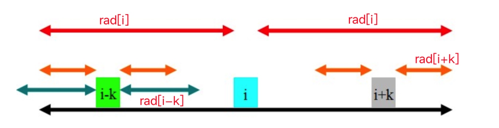
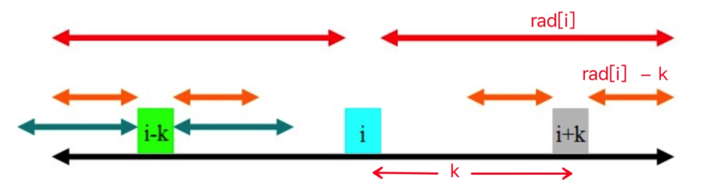
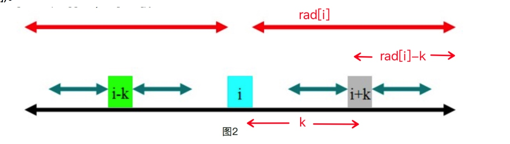
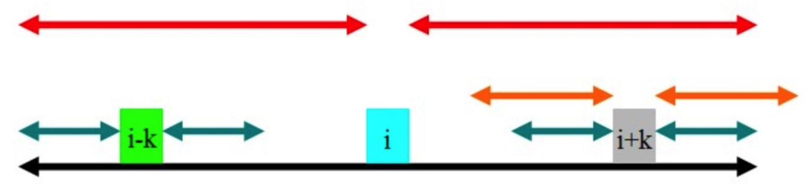

# 最大回文串
## 一. 描述
**Manacher算法**，其时间复杂度为O(n),主要用于找出字符串S的最长回文子串S1. 首先用一个非常巧妙的方式,在每个字符的两边都插入一个特殊的符号，使得所有可能的奇数/偶数长度的回文子串都转换成了奇数长度．

**原串**： waabwswfd
**新串**： #w#a#a#b#w#s#w#f#d#
**辅助数组P**： 1 2 1 2 3 2 1 2 1 2 1 4 1 2 1 2 1 2 1
这里有一个很好的性质，P[i]-1就是该回文子串在原串中的长度（包括‘#’）。用rad[id]表示第i个字符的回文半径，rad[id]的最小值为1．

**假设现在求出了rad[1, ..., id]，现在要求后面的rad值，试图通过某些手段来求出[id + 1, i + rad[id] - 1]的rad值**.

rad[i]表示以i为中心的回文的最大半径，i至少为1，即该字符本身。如图1所示，黑色的部分是一个回文子串，两段红色的区间对称相等。因为之前已经求出了rad[i - k]，所以可以避免一些重复的查找和判断，有3种情况：



### 1) rad[i] - k < rad[i - k]

rad[i - k]的范围为青色。因为黑色的部分是回文的,且青色的部分超过了黑色的部分，所以rad[i + k]肯定至少为rad[i]-k,即橙色的部分。那橙色以外的部分就不是了吗?这是肯定的，因为如果橙色以外的部分也是回文的，那么根据青色和红色部分的关系，可以证明黑色部分再往外延伸一点也是一个回文子串,这肯定是不可能的，因此`rad[i + k] = rad[i] - k`。如图所示：



###  2) rad[i] - k > rad[i - k]
如图2，rad[i-k]的范围为青色，因为黑色的部分是回文的，且青色的部分在黑色的部分里面，根据定义，很容易得出:`rad[i + k] = rad[i - k]`。根据上面两种情况，可以得出结论:当rad[i] - k != rad[i - k]的时候,rad[i + k] = min(rad[i] - k, rad[i - k])。




### 3) rad[i] - k = rad[i - k]
如图，通过和第一种情况对比之后会发现，因为青色的部分没有超出黑色的部分，所以即使橙色的部分全等，也无法像第一种情况一样引出矛盾，因此橙色的部分是有可能全等的。但是，根据已知的信息，我们不知道橙色的部分是多长，**因此就需要再去尝试和判断了**。



## 二.实现
```
public static String getPalindrome(String str) {
   // 1.构造新的字符串
   // 为了避免奇数回文和偶数回文的不同处理问题，在原字符串中插入'#'，将所有回文变成奇数回文
   StringBuilder newStr = new StringBuilder();
   newStr.append('#');
   for (int i = 0; i < str.length(); i ++) {
       newStr.append(str.charAt(i));
       newStr.append('#');
   }
   // rad[i]表示以i为中心的回文的最大半径，i至少为1，即该字符本身
   int [] rad = new int[newStr.length()];
   // right表示已知的回文中，最右的边界的坐标
   int right = -1;
   // id表示已知的回文中，拥有最右边界的回文的中点坐标
   int id = -1;
   // 2.计算所有的rad
   // 这个算法是O(n)的，因为right只会随着里层while的迭代而增长，不会减少。
   for (int i = 0; i < newStr.length(); i ++) {
       // 2.1.确定一个最小的半径
       int r = 1;
       if (i <= right){
       	// rad[id] - i + id = mx - i    有可以看做是 rad[id] - k
       	// j = 2 * id - i  i的对称点，如图。   // 看做是rad[id-k]
           r = Math.min(rad[id] + id - i , rad[2 * id - i]);
       }
       // 2.2.尝试更大的半径
       while (i - r >= 0 && i + r < newStr.length() 
       		&& newStr.charAt(i - r) == newStr.charAt(i + r)) {
           r++;
       }
       // 2.3.更新边界和回文中心坐标
       if (i + r - 1 > right) {
           right = i + r - 1; // 为什么要减1？？  初始的是1了(对于#来说是多的)
           id = i;
       }
       rad[i] = r;
   }
   // 3.扫描一遍rad数组，找出最大的半径
   int maxLength = 0;
   int idx = 0;
   for (int i = 0; i < rad.length ; i++) {
       if (rad[i] > maxLength) {
           maxLength = rad[i];
           idx = i;
       }
   }
  maxLength --; // 关键，这个是最终的长度
   StringBuilder sb = new StringBuilder();
   for(int i = idx - maxLength; i <= idx + maxLength; i++){
   	if(newStr.charAt(i) != '#')
   		sb.append(newStr.charAt(i));
   }
   return sb.toString();
}
```


