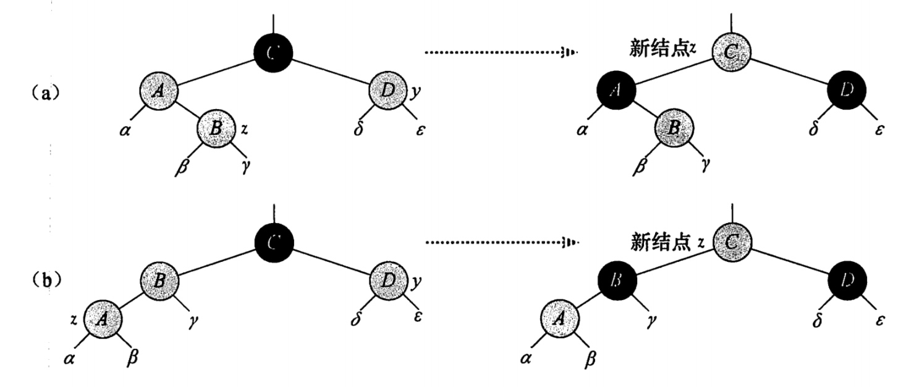
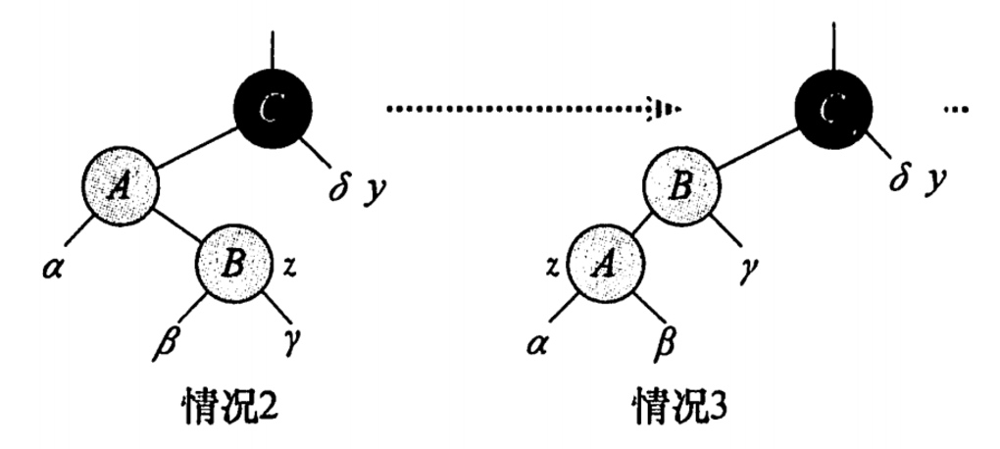
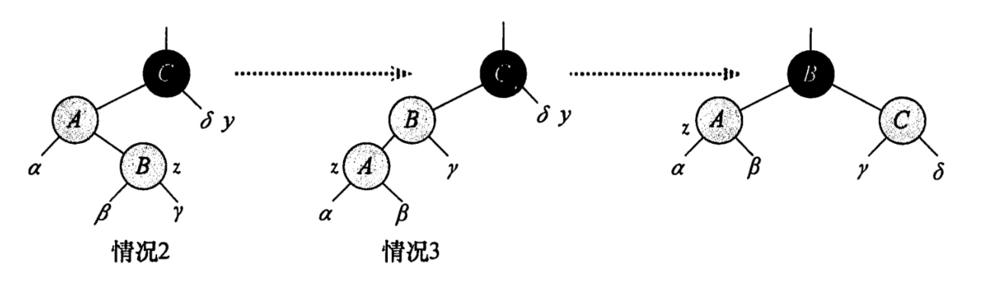

# 红黑树
## 一. 介绍
>红黑树是一颗二叉搜索树，它在每个节点上增加一个存储位来表示节点颜色，可以是RED或BLACK. 通过一条从根到叶子节点的简单路径上各个节点的>颜色进行约束，红黑树确保没有一条路径会比其他路径长出2倍，因而近似平衡。时间复杂度是 O(logN)

通过结点颜色的约束来维护树的平衡结构。

### 1.1 红黑树性质
红黑树是满足一下**红黑性质**的二叉树:

1. 每个结点或者是红色，或者是黑色。
2. 根节点是黑色。
3. 每个叶子结点(NIL)是黑色。
4. 如果一个结点是红色，则它的两个子节点都是黑色。
5. 对每个结点，从该结点到其所有后代叶结点的简单路径上，均包含相同的数目的黑色结点。

## 二. 插入
### 2.1 插入逻辑
### 2.3 插入情况分析
考虑每种情况为什么要变化？以及为什么要这样来变化? 

#### 1）z的叔结点y是红色


所以将z.p 和y都变为黑色，以解决z和z.p都是红色的问题。 将z.p.p 设置为黑色，保持性质5.

#### 2） z的叔节点y是黑色的且z是一个右孩子


通过左旋的变为情况3
#### 3）z的叔结点y是黑色的且z是一个左孩子


右旋，并改变z.p 和z.p.p 的颜色

### 2.4 实现
```
public void insert(int val) {
   RBNode z = new RBNode(val);
   RBNode y = null; // 表示要插入节点的父节点
   RBNode x = root;  // 遍历节点
   
   // 寻找插入的位置
   // 1. 将红黑树当作一颗二叉查找树，将节点添加到二叉查找树中。
   while (x != nil) {
       y = x;
       if (z.value < x.value) {
           x = x.left;
       } else {
           x = x.right;
       }
   }

   // 插入
   z.parent = y;
   if (y == null) {
       root = z;
   } else if (z.value < y.value) {
       y.left = z;
   } else {
       y.right = z;
   }

   // 默认就是null
   z.left = null;
   z.right = null;
   z.color = RED;

   // 调整
   insertFixUp(z);
}

// 调整颜色和结构，维护红黑树性质
private void insertFixUp(RBNode z) {
   while (z.parent.color == RED) {
       if (z.parent == z.parent.parent.left) {
           // 父节点是祖父的左孩子
           RBNode y = z.parent.parent.right; // 叔叔节点
           if (y.color == RED) {
               // 情况1  z的叔叔节点是红色. 通过变色来调整
               y.color = BLACK;
               z.parent.color = BLACK;
               z.parent.parent.color = RED;
               
               // 继续往上看看是否需要调整
               z = z.parent.parent;
           } else if (z == z.parent.right) {
               // 情况2 z的叔叔节点是黑色，并且z是右孩子, 进行左选择变为情况3
               z = z.parent;
               leftRotate(z);
           }
           // 情况三 ---- 情况一变化后为什么可以直接用情况三来操作？
           z.parent.color = BLACK;
           z.parent.parent.color = RED;
           rightRotate(z.parent.parent);
       } else {
          // .... 逻辑类似，反过来
       }
   }
   root.color = BLACK;
}

// 右旋转
public RBNode rightRotate(RBNode node) {
   if (null == node) {
       return null;
   }

   RBNode leftNode = node.left;
   node.left = leftNode.right;

   leftNode.parent = node.parent;
   if (node.parent == null) {
       this.root = leftNode;
   } else if (node.parent.left == node) {
       node.parent.left = leftNode;
   } else {
       node.parent.right = leftNode;
   }

   node.parent = leftNode; // 这个需要放在最后
   leftNode.right = node;
   return node;
}
```

## 三. 删除
### 3.1 删除的四种情况
#### 1) x的兄弟节点w是红色
x是删除节点的位置，通过对x.p进行左旋转, 并将x.p修改为红色，d后转为情况2、3、4处理。


#### 2）x的兄弟结点w的颜色是黑色，且w的两个子结点都是黑色

将w节点设置红色，并将x.p 作为x，继续观察和调整。


#### 3） x的兄弟结点w的颜色是黑色，w的左孩子是红色，右孩子是黑色


交换w和其左孩子颜色，然后对w进行右旋转，不违反红黑树的任何性质。

#### 4） x的兄弟结点w的颜色是黑色，w的左孩子是黑色，右孩子是红色


通过修改x.p、w和w的右孩子颜色，然后对x.p 进行一次左旋转。

### 3.2 实现
```
private void remove(RBNode rmNode) {
   RBNode node = rmNode;
   // 原来的颜色
   RBNode replace;
   boolean color = rmNode.color;
   if (rmNode.left == null) {
       // 左孩子不存在
       // 被删节点的后继节点。(称为"取代节点")
       // 用它来取代"被删节点"的位置，然后再将"被删节点"去掉。
       replace = rmNode.right;
       transplant(rmNode, replace);
   } else if (rmNode.right == null) {
       replace = rmNode.left;
       transplant(rmNode, replace);
   } else {
       node = min(root.right);
       color = node.color;
       replace = node.right;
       if (node.parent == rmNode) {
           replace.parent = node;
       } else {
           // 用y的右节点替换y，  然后在用y在替换当前删除的节点
           transplant(node, replace);
           node.right = rmNode.right;
           node.right.parent = node;
       }

       // 替换节点
       transplant(rmNode, node);
       node.left = rmNode.left;
       node.left.parent = node;
       node.color = rmNode.color; // 一样的颜色
   }

   // 如果是黑色，则需要调整
   if (color == BLACK)
       deleteFixUp(replace);

}

// 调整
private void deleteFixUp(RBNode x) {
   while(x != root && x.color == BLACK) {
       if (x == x.parent.left ) {
           // 左孩子节点
           RBNode w = x.parent.right;
           // case 1：兄弟节点的颜色为红色
           if (w.color == RED) {
               x.parent.color = RED;
               w.color = BLACK;
               leftRotate(x.parent);
               w = x.parent.right;
           }
           // case 2 兄弟节点的颜色为黑色，并且其两个子节点颜色都为黑色
           if (w.left.color == BLACK && w.right.color == BLACK) {
               w.color = RED;
               x = x.parent;
           } else if (w.right.color ==  BLACK) {
              // case 3: x的兄弟节点w颜色为黑色，并且w的左结点是红色，右结点是黑色
              w.color = RED;
              w.left.color = BLACK;
              rightRotate(w);
              w = x.parent.right;
            }
           // case 4: x的兄弟节点w颜色是黑色，并且w的左节点是黑色，右孩子是红色
           x.parent.color = BLACK;
           w.color = RED;
           w.right.color = BLACK;
           leftRotate(x.parent);
           x = root;  // ?
       } else {
           // 是右孩子, 逻辑一致
           ... 
       }
   }
    root.color = BLACK;
}

// 移植 
private void transplant(RBNode parent, RBNode replace) {
   if (parent.parent == null) {
       root = replace;
   } else if (parent == parent.parent.left) {
       parent.parent.left = replace;
   } else {
       parent.parent.right = replace;
   }
}
    
 // 左旋
public RBNode leftRotate(RBNode node) {
   if (null == node) {
       return null;
   }

   RBNode rightNode = node.right;
   node.right = rightNode.left;

   // 设置父节点
   if (rightNode.left != null) {
       rightNode.left.parent = node;
   }

   rightNode.parent = node.parent;
   // 为父节点的父节点设置左右节点
   if (node.parent == null) {
       this.root = rightNode;
   } else if (node.parent.left == node) { // 如果是左节点
       node.parent.left = rightNode;
   } else {
       node.parent.right = rightNode;
   }

   rightNode.left = node;
   node.parent = rightNode;
   return rightNode;
}
```


## 四. 完整实现
```
public class RBTree {
    private class RBNode {
        private int value; // 值
        private RBNode left, right; // 指向子树的链接:左子树和右子树.
        private RBNode parent;
        boolean color;//由其父结点指向它的链接的颜色也就是结点颜色.

        public RBNode(int val) {
            this.value = val;
        }
    }

    private RBNode nil;
    {
        nil = new RBNode(0);
        nil.color = BLACK;
    }

    private RBNode root;
    // 红
    private static final boolean RED = false;
    // 黑
    private static final boolean BLACK = true;

    // 左旋
    public RBNode leftRotate(RBNode node) {
        if (null == node) {
            return null;
        }

        RBNode rightNode = node.right;
        node.right = rightNode.left;

        // 设置父节点
        if (rightNode.left != null) {
            rightNode.left.parent = node;
        }

        rightNode.parent = node.parent;
        // 为父节点的父节点设置左右节点
        if (node.parent == null) {
            this.root = rightNode;
        } else if (node.parent.left == node) { // 如果是左节点
            node.parent.left = rightNode;
        } else {
            node.parent.right = rightNode;
        }

        rightNode.left = node;
        node.parent = rightNode;
        return rightNode;
    }

    // 右旋转
    public RBNode rightRotate(RBNode node) {
        if (null == node) {
            return null;
        }

        RBNode leftNode = node.left;
        node.left = leftNode.right;

        leftNode.parent = node.parent;
        if (node.parent == null) {
            this.root = leftNode;
        } else if (node.parent.left == node) {
            node.parent.left = leftNode;
        } else {
            node.parent.right = leftNode;
        }

        node.parent = leftNode; // 这个需要放在最后
        leftNode.right = node;
        return node;
    }

    public void insert(int val) {
        RBNode z = new RBNode(val);
        RBNode y = null; // 表示要插入节点的父节点
        RBNode x = root;  // 遍历节点
        
        // 寻找插入的位置
        // 1. 将红黑树当作一颗二叉查找树，将节点添加到二叉查找树中。
        while (x != nil) {
            y = x;
            if (z.value < x.value) {
                x = x.left;
            } else {
                x = x.right;
            }
        }

        // 插入
        z.parent = y;
        if (y == null) {
            root = z;
        } else if (z.value < y.value) {
            y.left = z;
        } else {
            y.right = z;
        }

        // 默认就是null
        z.left = null;
        z.right = null;

        z.color = RED;

        // 调整
        insertFixUp(z);
    }

    // 调整颜色和结构，维护红黑树性质
    private void insertFixUp(RBNode z) {
        while (z.parent.color == RED) {
            if (z.parent == z.parent.parent.left) {
                // 父节点是祖父的左孩子
                RBNode y = z.parent.parent.right; // 叔叔节点
                if (y.color == RED) {
                    /**
                     * 情况1  z的叔叔节点是红色
                     * 通过变色来调整
                     */
                    y.color = BLACK;
                    z.parent.color = BLACK;
                    z.parent.parent.color = RED;

                    // 继续往上看看是否需要调整
                    z = z.parent.parent;
                } else if (z == z.parent.right) {
                    /**
                     * 情况2 z的叔叔节点是黑色，并且z是右孩子
                     * 进行左选择变为情况3
                     */
                    z = z.parent;
                    leftRotate(z);
                }
                /**
                 * 情况三
                 */
                z.parent.color = BLACK;
                z.parent.parent.color = RED;
                rightRotate(z.parent.parent);
            } else {
                // 若“z的父节点”是“z的祖父节点的右孩子”
                RBNode y = z.parent.parent.left;
                if (y.color == RED) {
                    // Case 1条件：叔叔节点是红色
                    y.color = BLACK;
                    z.parent.color = BLACK;
                    // 往上继续看看
                    z = z.parent.parent;
                } else if (z == z.parent.right) {
                    // case 2： 是左孩子节点
                    z = z.parent;
                    //!!! 这边是右旋
                    rightRotate(z);
                }

                // case3
                z.parent.parent.color = RED;
                z.parent.color = BLACK;
                // 左旋转
                leftRotate(z.parent.parent);
            }
        }
        root.color = BLACK;
    }


    /**
     * 删除节点
     * @param rmNode
     */
    private void remove(RBNode rmNode) {
        RBNode node = rmNode;
        // 原来的颜色
        RBNode replace;
        boolean color = rmNode.color;
        if (rmNode.left == null) {
            // 左孩子不存在
            // 被删节点的后继节点。(称为"取代节点")
            // 用它来取代"被删节点"的位置，然后再将"被删节点"去掉。
            replace = rmNode.right;
            transplant(rmNode, replace);
        } else if (rmNode.right == null) {
            replace = rmNode.left;
            transplant(rmNode, replace);
        } else {
            node = min(root.right);
            color = node.color;
            replace = node.right;
            if (node.parent == rmNode) {
                replace.parent = node;
            } else {
                // 用y的右节点替换y，  然后在用y在替换当前删除的节点
                transplant(node, replace);
                node.right = rmNode.right;
                node.right.parent = node;
            }

            // 替换节点
            transplant(rmNode, node);
            node.left = rmNode.left;
            node.left.parent = node;
            node.color = rmNode.color; // 一样的颜色
        }

        // 如果是黑色，则需要调整
        if (color == BLACK)
            deleteFixUp(replace);

    }

    /**
     * 调整
     * @param x
     */
    private void deleteFixUp(RBNode x) {
        while(x != root && x.color == BLACK) {
            if (x == x.parent.left ) {
                // 左孩子节点
                RBNode w = x.parent.right;
                /**
                 * case 1：兄弟节点的颜色为红色
                 */
                if (w.color == RED) {
                    x.parent.color = RED;
                    w.color = BLACK;
                    leftRotate(x.parent);
                    w = x.parent.right;
                }
                /**
                 * case 2 兄弟节点的颜色为黑色，并且其两个子节点颜色都为黑色
                 */
                if (w.left.color == BLACK && w.right.color == BLACK) {
                    w.color = RED;
                    x = x.parent;
                } else if (w.right.color ==  BLACK) {
                    /**
                     * case 3: x的兄弟节点w颜色为黑色，并且w的左结点是红色，右结点是黑色
                     */
                   w.color = RED;
                   w.left.color = BLACK;
                   rightRotate(w);
                   w = x.parent.right;
                 }

                /**
                 * case 4: x的兄弟节点w颜色是黑色，并且w的左节点是黑色，右孩子是红色
                 */
                x.parent.color = BLACK;
                w.color = RED;
                w.right.color = BLACK;
                leftRotate(x.parent);
                x = root;  // ?
            } else {
                // 是右孩子

                RBNode w = x.parent.left;
                if (w.color == RED) {
                    /**
                     * case 1: 兄弟节点颜色是红色
                     */
                    w.color = BLACK;
                    x.parent.color = RED;
                    rightRotate(x.parent);
                    w = x.parent.left;
                }

                if (w.left.color == BLACK && w.right.color == BLACK) {
                    /**
                     * case 2: 兄弟结点是黑色，且其两个子结点也是黑色
                     */
                    w.color = RED;
                    x = x.parent;
                } else if(x.left.color == BLACK) {
                    /**
                     * case 3：
                     */
                    w.color = RED;
                    w.left.color = BLACK;
                    leftRotate(w);
                    w = x.parent.left;
                }

                /**
                 * case 4
                 */
                x.parent.color = BLACK;
                w.color = RED;
                w.left.color = BLACK;
                rightRotate(x.parent;
                x = root;
            }
        }
         root.color = BLACK;
    }


    /**
     * 调整的过程
     * @param parent 父节点
     * @param replace 被删除位置，新的替换元素
     */
    private void transplant(RBNode parent, RBNode replace) {
        if (parent.parent == null) {
            root = replace;
        } else if (parent == parent.parent.left) {
            parent.parent.left = replace;
        } else {
            parent.parent.right = replace;
        }
    }

    /**
     * 最小元素
     * @param root
     * @return
     */
    private RBNode min(RBNode root) {
        if (root == null) {
            return null;
        }
        RBNode node = root;
        while (node.left != null) {
            node = node.left;
        }
        return node;
    }

}
```


