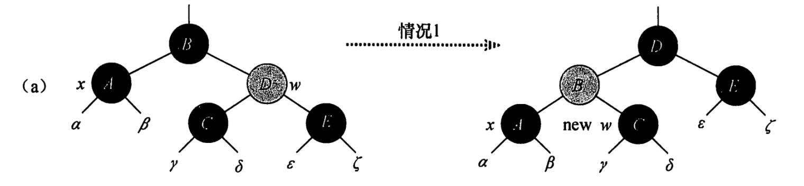
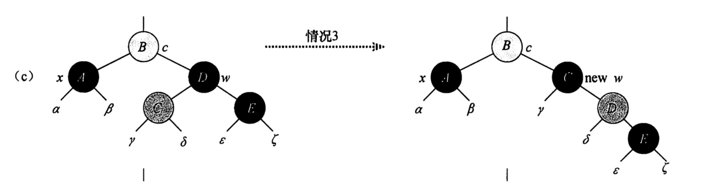
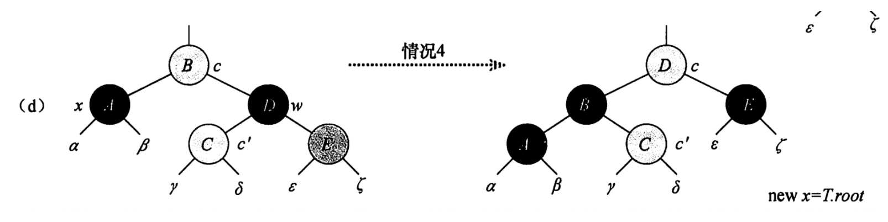

### 红黑树删除
#### 1. 删除的四种情况
##### 1) x的兄弟节点w是红色
x是删除节点的位置，通过对x.p进行左旋转, 并将x.p修改为红色，d后转为情况2、3、4处理。



##### 2）x的兄弟结点w的颜色是黑色，且w的两个子结点都是黑色

将w节点设置红色，并将x.p 作为x，继续观察和调整。


##### 3） x的兄弟结点w的颜色是黑色，w的左孩子是红色，右孩子是黑色


交换w和其左孩子颜色，然后对w进行右旋转，不违反红黑树的任何性质。

##### 4） x的兄弟结点w的颜色是黑色，w的左孩子是黑色，右孩子是红色



通过修改x.p、w和w的右孩子颜色，然后对x.p 进行一次左旋转。

#### 2. 实现
```
private void remove(RBNode rmNode) {
   RBNode node = rmNode;
   // 原来的颜色
   RBNode replace;
   boolean color = rmNode.color;
   if (rmNode.left == null) {
       // 左孩子不存在
       // 被删节点的后继节点。(称为"取代节点")
       // 用它来取代"被删节点"的位置，然后再将"被删节点"去掉。
       replace = rmNode.right;
       transplant(rmNode, replace);
   } else if (rmNode.right == null) {
       replace = rmNode.left;
       transplant(rmNode, replace);
   } else {
       node = min(root.right);
       color = node.color;
       replace = node.right;
       if (node.parent == rmNode) {
           replace.parent = node;
       } else {
           // 用y的右节点替换y，  然后在用y在替换当前删除的节点
           transplant(node, replace);
           node.right = rmNode.right;
           node.right.parent = node;
       }

       // 替换节点
       transplant(rmNode, node);
       node.left = rmNode.left;
       node.left.parent = node;
       node.color = rmNode.color; // 一样的颜色
   }

   // 如果是黑色，则需要调整
   if (color == BLACK)
       deleteFixUp(replace);

}

// 调整
private void deleteFixUp(RBNode x) {
   while(x != root && x.color == BLACK) {
       if (x == x.parent.left ) {
           // 左孩子节点
           RBNode w = x.parent.right;
           // case 1：兄弟节点的颜色为红色
           if (w.color == RED) {
               x.parent.color = RED;
               w.color = BLACK;
               leftRotate(x.parent);
               w = x.parent.right;
           }
           // case 2 兄弟节点的颜色为黑色，并且其两个子节点颜色都为黑色
           if (w.left.color == BLACK && w.right.color == BLACK) {
               w.color = RED;
               x = x.parent;
           } else if (w.right.color ==  BLACK) {
              // case 3: x的兄弟节点w颜色为黑色，并且w的左结点是红色，右结点是黑色
              w.color = RED;
              w.left.color = BLACK;
              rightRotate(w);
              w = x.parent.right;
            }
           // case 4: x的兄弟节点w颜色是黑色，并且w的左节点是黑色，右孩子是红色
           x.parent.color = BLACK;
           w.color = RED;
           w.right.color = BLACK;
           leftRotate(x.parent);
           x = root;  // ?
       } else {
           // 是右孩子, 逻辑一致
           ... 
       }
   }
    root.color = BLACK;
}

// 移植 
private void transplant(RBNode parent, RBNode replace) {
   if (parent.parent == null) {
       root = replace;
   } else if (parent == parent.parent.left) {
       parent.parent.left = replace;
   } else {
       parent.parent.right = replace;
   }
}
    
 // 左旋
public RBNode leftRotate(RBNode node) {
   if (null == node) {
       return null;
   }

   RBNode rightNode = node.right;
   node.right = rightNode.left;

   // 设置父节点
   if (rightNode.left != null) {
       rightNode.left.parent = node;
   }

   rightNode.parent = node.parent;
   // 为父节点的父节点设置左右节点
   if (node.parent == null) {
       this.root = rightNode;
   } else if (node.parent.left == node) { // 如果是左节点
       node.parent.left = rightNode;
   } else {
       node.parent.right = rightNode;
   }

   rightNode.left = node;
   node.parent = rightNode;
   return rightNode;
}
```


