# Java NIO
## 一. Java NIO 概述
### 流与块的比较
原来的 I/O 库(在 java.io.*中) 与 NIO 最重要的区别是数据打包和传输的方式。正如前面提到的，原来的 I/O 以流的方式处理数据，而 NIO 以块的方式处理数据。

面向流 的 I/O 系统一次一个字节地处理数据。一个输入流产生一个字节的数据，一个输出流消费一个字节的数据。为流式数据创建过滤器非常容易。链接几个过滤器，以便每个过滤器只负责单个复杂处理机制的一部分，这样也是相对简单的。不利的一面是面向流的 I/O 通常相当慢。

一个 面向块 的 I/O 系统以块的形式处理数据。每一个操作都在一步中产生或者消费一个数据块。按块处理数据比按(流式的)字节处理数据要快得多。但是面向块的 I/O 缺少一些面向流的 I/O 所具有的优雅性和简单性。

### 组成
Java NIO 由以下几个核心部分组成：

 - **Buffers**：它包含一些要写入或者刚读出的数据。可以理解为一个数组，作为数据缓存。
 - **Channels**：是一个对象，可以通过它读取和写入数据。拿NIO与原来的I/O做个比较，通道就像是流。
 - **Selectors**：Selector允许单线程处理多个 Channel。

## 二. Channel和Buffer
### 2.1 Channel

Channel是一个对象，可以通过它读取和写入数据。拿NIO与原来的I/O做个比较，通道就像是流。Java NIO的通道类似流，但又有些不同：

 - 既可以从通道中读取数据，又可以写数据到通道。但流的读写通常是单向的。
 - 通道可以异步地读写。
 - 通道中的数据总是要先读到一个Buffer，或者总是要从一个Buffer中写入。

从通道读取数据到缓冲区，从缓冲区写入数据到通道，如图所示：

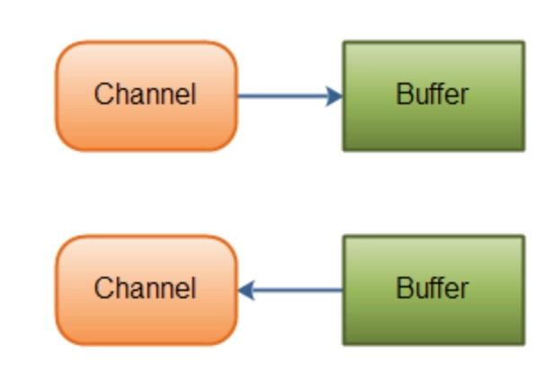

下面是JAVA NIO中的一些主要Channel的实现：

 - **FileChannel**： 从文件中读写数据。
 - **DatagramChannel**： 能通过UDP读写网络中的数据。
 - **SocketChannel**： 能通过TCP读写网络中的数据。
 - **ServerSocketChannel**：可以监听新进来的TCP连接，像Web服务器那样。对每一个新进来的连接都会创建一个SocketChannel。

这些通道涵盖了UDP 和 TCP 网络IO，以及文件IO. **在从通道读取数据时，数据被放入到缓冲区。在有些情况下，可以将这个缓冲区直接写入另一个通道**, kafka就是利用这种通道之间copy的方式提高性能。

参考： 

 - http://ifeve.com/overview/
 - [NIO 入门](https://www.ibm.com/developerworks/cn/education/java/j-nio/j-nio.html)

### 2.2 Buffer

 - [Java NIO系列教程（三） Buffer](http://ifeve.com/tag/nio/)

Buffer 是一个对象， 它包含一些要写入或者刚读出的数据。 在 NIO 中加入 Buffer 对象，体现了新库与原 I/O 的一个重要区别。在面向流的 I/O 中，您将数据直接写入或者将数据直接读到 Stream 对象中。

在 NIO 库中，所有数据都是用缓冲区处理的。在读取数据时，它是直接读到缓冲区中的。在写入数据时，它是写入到缓冲区中的。任何时候访问 NIO 中的数据，您都是将它放到缓冲区中。

缓冲区实质上是一个数组。通常它是一个字节数组，但是也可以使用其他种类的数组。但是一个缓冲区不 仅仅 是一个数组。缓冲区提供了对数据的结构化访问，而且还可以跟踪系统的读/写进程。

以下是Java NIO里关键的Buffer实现：

 - **ByteBuffer**
 - **CharBuffer**
 - **DoubleBuffer**
 - **FloatBuffer**
 - **IntBuffer**
 - **LongBuffer**
 - **ShortBuffer**

这些Buffer覆盖了你能通过IO发送的基本数据类型：byte, short, int, long, float, double 和 char。

使用Buffer读写数据一般遵循以下四个步骤：

 - 写入数据到Buffer
 - 调用flip()方法. 用于设置读的位置和limit位置。
 - 从Buffer中读取数据
 - 调用clear()方法或者compact()方法。 clear进行重置状态变量。

#### 2.2.1 状态变量
可以用三个值指定缓冲区在任意时刻的状态：

 - **position**: 从通道读取时, position变量跟踪**已经写了多少数据**(写到缓冲区多少数据)。在写入通道时，您是从缓冲区中获取数据。position值跟踪从缓冲区中**获取了多少数据**。
 - **limit**：表明还有多少数据需要取出(在从缓冲区写入通道时)，或者还有多少空间可以放入数据(在从通道读入缓冲区时)。position 总是小于或者等于 limit。
 - **capacity**：缓冲区的 capacity 表明可以储存在缓冲区中的**最大数据容量**。实际上，它指定了底层数组的大小 ―- 或者至少是指定了准许我们使用的底层数组的容量。limit 决不能大于 capacity。


这三个变量一起可以跟踪缓冲区的状态和它所包含的数据。

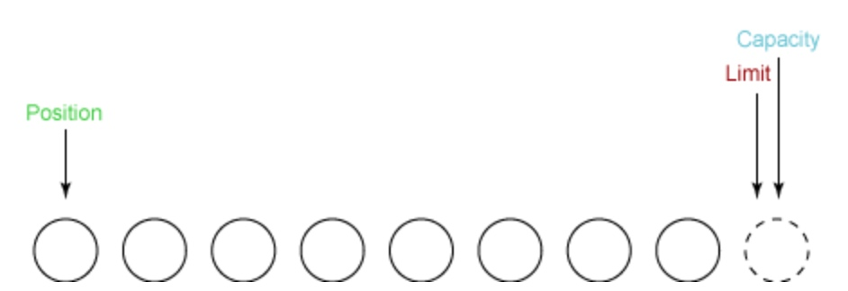

#### 2.2.2 Buffer的分配
https://blog.csdn.net/seebetpro/article/details/49184305

一般是操作数据的字节（byte）形式，这时经常会用到ByteBuffer这样一个类。ByteBuffer提供了两种静态实例方式： 

```
public static ByteBuffer allocate(int capacity)  
public static ByteBuffer allocateDirect(int capacity) 
```

- **allocate**: 产生的内存开销是在JVM中的. 当Java程序接收到外部传来的数据时，首先是被系统内存所获取，然后在由系统内存复制复制到JVM内存中供Java程序使用。

- **allocateDirect**: 分配方式产生的开销在JVM之外，以就是系统级的内存分配，即直接内存。这块内存不受虚拟机管理。能够省去系统内存复制到JVM内存复制这一步操作，效率上会有所提高。但系统级内存的分配比起JVM内存的分配要耗时得多。

> 给定一个直接字节缓冲区，Java 虚拟机将尽最大努力直接对它执行本机 I/O 操作。也就是说，它会在每一次调用底层操作系统的本机 I/O 操作之前(或之后)，尝试避免将缓冲区的内容拷贝到一个中间缓冲区中(或者从一个中间缓冲区中拷贝数据)。

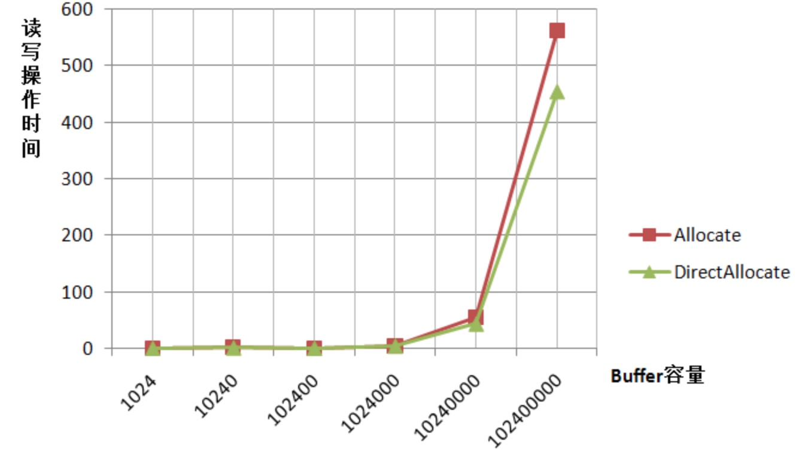


还可以将一个现有的数组转换为缓冲区，如下所示:

```
byte array[] = new byte[1024];
ByteBuffer buffer = ByteBuffer.wrap( array );
```


#### 2.2.3 读数据
首先从输入通道中读一些数据到缓冲区中。第一次读取得到三个字节。它们被放到数组中从 position 开始的位置，这时 position 被设置为 0。读完之后，position 就增加到 3：

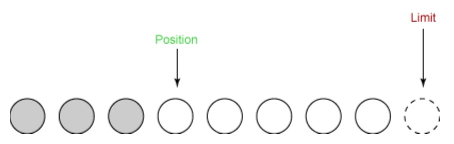

在第二次读取时，我们从输入通道读取另外两个字节到缓冲区中。这两个字节储存在由 position 所指定的位置上， position 因而增加 2：

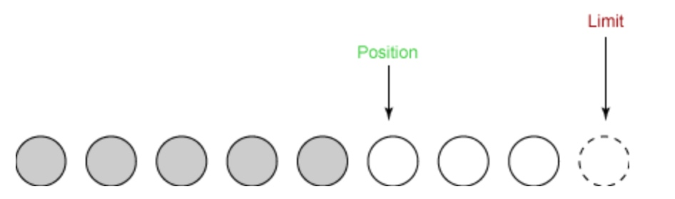

#### 2.2.4 flip
flip操作是用于将读转换为写操作，即(从通道读取的数据写入到缓存区转换为从缓冲区读数据写入到通道)。如读入数据后执行flig()，这个方法做两件非常重要的事：

1. 它将 limit 设置为当前 position。表示后续可以从缓冲区中读取的数据最大长度。
2. 它将 position 设置为 0。 表示从缓冲区读取数据的位置。

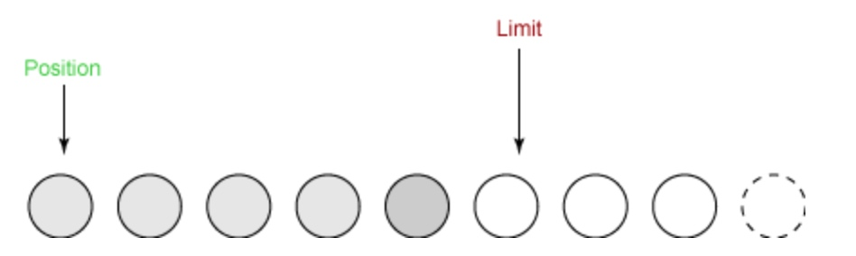

#### 2.2.4 写入

在第一次写入时，我们从缓冲区中取四个字节并将它们写入输出通道。这使得 position 增加到 4，而 limit 不变，如下所示：


#### 2.4.5 clear
这个方法重设缓冲区以便接收更多的字节。是将写操作转换为读操作(从缓冲区读取数据写入通道转换为从通道读取数据写入缓冲区) Clear 做两种非常重要的事情：

1. 它将 limit 设置为与 capacity 相同。
2. 它设置 position 为 0。

这时候和原始结构一样：

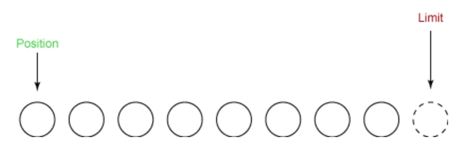

### 2.3 FileChannel实践
读和写是 I/O 的基本过程。从一个通道中读取很简单：只需创建一个缓冲区，然后让通道将数据读到这个缓冲区中。写入也相当简单：创建一个缓冲区，用数据填充它，然后让通道用这些数据来执行写入操作。


#### 2.3.1 从文件中读取
如果使用原来的 I/O，那么我们只需创建一个 FileInputStream 并从它那里读取。而在 NIO 中，情况稍有不同：我们首先从 FileInputStream 获取一个 Channel 对象，然后使用这个通道来读取数据。

在 NIO 系统中，任何时候执行一个读操作，您都是从通道中读取，但是您不是 直接 从通道读取。因为所有数据最终都驻留在缓冲区中，所以您是从通道读到缓冲区中。

因此读取文件涉及三个步骤：

 - (1) 从 FileInputStream 获取 Channel.
 - (2) 创建 Buffer
 - (3) 将数据从 Channel 读到 Buffer 中。


```
public void read(String path) throws IOException{
   // FileOutputStream 也可以
   RandomAccessFile file = new RandomAccessFile(getClass().getClassLoader().getResource(path).getPath(), "rw");

   // (1) 从 FileInputStream 获取 Channel
   FileChannel fileChannel = file.getChannel();

   // (2) 创建 Buffer
   ByteBuffer buffer = ByteBuffer.allocate(48);

   // (3) 将数据从 Channel 读到 Buffer 中
   int bytesRead = fileChannel.read(buffer);
   System.out.println(bytesRead);
   while (bytesRead != -1) {
       System.out.println("Read " + bytesRead);
       buffer.flip();

       while (buffer.hasRemaining()) {
           System.out.println((char) buffer.get());
       }

       buffer.clear();
       bytesRead = fileChannel.read(buffer);
   }

   file.close();
}
```

#### 2.3.2 文件写入

具体步骤:
 
 - 首先从 FileOutputStream 获取一个通道
 - 创建一个缓冲区并在其中放入一些数据 
 - 最后一步是写入缓冲区中


```
private void write(String path, byte[] content) throws IOException {
   // 1. 获取通道
   FileOutputStream out = new FileOutputStream(path);
   FileChannel channel = out.getChannel();

   // 2. 创建buffer, 并存入数据
   ByteBuffer buffer = ByteBuffer.allocate(1024);
   for (int i = 0; i < content.length; ++i) {
       buffer.put(content[i]);
   }
   buffer.flip();  // 关键

   // 3. 写入缓冲区
   channel.write(buffer);

   out.close();
}
```

#### 2.3.3 读写结合
```
 public void copy(String inPath, String outPath) throws IOException {
   FileInputStream in = new FileInputStream(inPath);
   FileOutputStream out = new FileOutputStream(outPath);

   FileChannel inChannel = in.getChannel();
   FileChannel outChannel = out.getChannel();

   ByteBuffer buffer = ByteBuffer.allocate(1024);

   int readBytes = inChannel.read(buffer);
   while (readBytes != -1) {
       // 关键
       buffer.flip();
       outChannel.write(buffer);

       // 重设缓冲区
       buffer.clear();
       readBytes = inChannel.read(buffer);
   }
}
```

### 2.4 Scatter/Gather
Java NIO开始支持scatter/gather，scatter/gather用于描述从Channel中读取或者写入到Channel的操作。

#### 2.4.1 Scatter

分散（scatter）从Channel中**读取**是指在读操作时将读取的数据写入多个buffer中。因此，Channel将从Channel中读取的数据“分散（scatter）”到多个Buffer中。

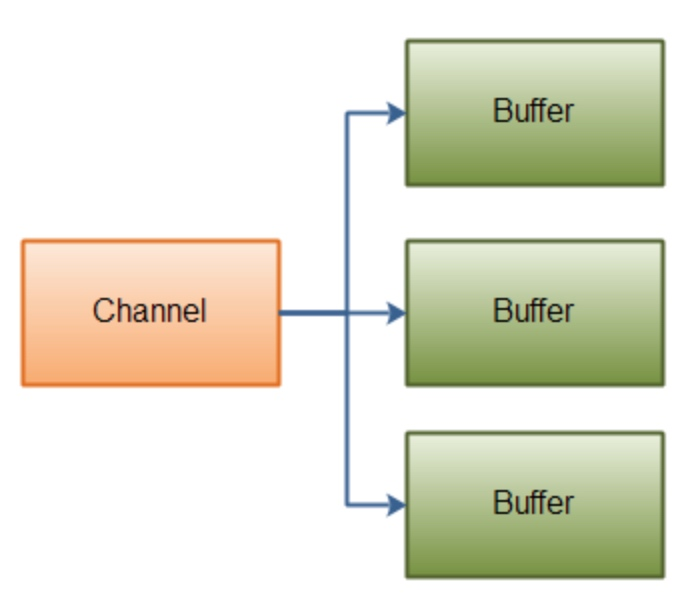

```
ByteBuffer header = ByteBuffer.allocate(128);
ByteBuffer body   = ByteBuffer.allocate(1024);

ByteBuffer[] bufferArray = { header, body};
channel.read(bufferArray);
```

注意buffer首先被插入到数组，然后再将数组作为channel.read() 的输入参数。read()方法按照buffer在数组中的顺序将从channel中读取的数据写入到buffer，当一个buffer被写满后，channel紧接着向另一个buffer中写。

#### 2.4.2 gather
聚集（gather）**写入**Channel是指在写操作时将多个buffer的数据写入同一个Channel，因此，Channel 将多个Buffer中的数据“聚集（gather）”后发送到Channel。

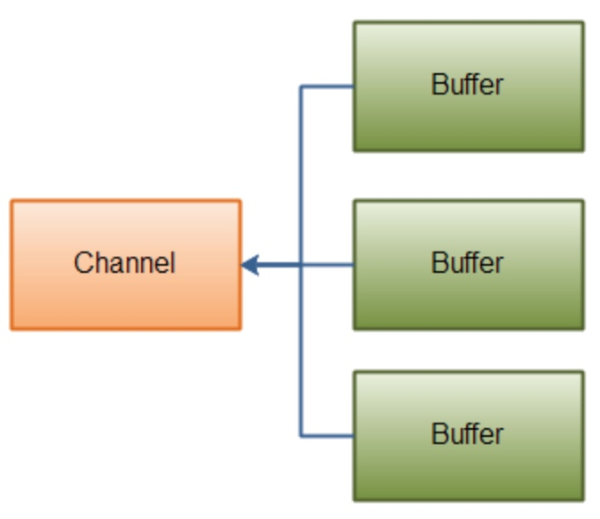

```
ByteBuffer header = ByteBuffer.allocate(128);
ByteBuffer body   = ByteBuffer.allocate(1024);

//write data into buffers
ByteBuffer[] bufferArray = { header, body };
channel.write(bufferArray);
```


### 2.5 通道之间的数据传输
#### 2.5.1 transferFrom
FileChannel的transferFrom()方法可以将数据从源通道传输到FileChannel中.

```
RandomAccessFile fromFile = new RandomAccessFile("fromFile.txt", "rw");
FileChannel      fromChannel = fromFile.getChannel();

RandomAccessFile toFile = new RandomAccessFile("toFile.txt", "rw");
FileChannel      toChannel = toFile.getChannel();

long position = 0;
long count = fromChannel.size();

toChannel.transferFrom(position, count, fromChannel);
```

#### 2.5.2 transferTo
transferTo()方法将数据从FileChannel传输到其他的channel中。下面是一个简单的例子:
```
RandomAccessFile fromFile = new RandomAccessFile("fromFile.txt", "rw");
FileChannel      fromChannel = fromFile.getChannel();

RandomAccessFile toFile = new RandomAccessFile("toFile.txt", "rw");
FileChannel      toChannel = toFile.getChannel();

long position = 0;
long count = fromChannel.size();

fromChannel.transferTo(position, count, toChannel);
```

### 2.6. Pipe
Java NIO 管道是2个线程之间的单向数据连接。Pipe有一个source通道和一个sink通道。数据会被写到sink通道，从source通道读取。

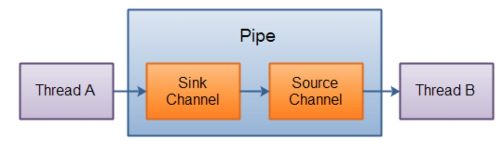

```
public class PipeDemo {

    ExecutorService exec = Executors.newFixedThreadPool(2);
    // 1. 创建pipe
    Pipe pipe;

    public PipeDemo() throws Exception {
        pipe = Pipe.open();
    }

    /**
     * 向管道写数据，将数据传给另一个线程
     */
    private void sink() {
        exec.submit(new Callable<Object>() {
            @Override
            public Object call() throws Exception {
                Pipe.SinkChannel sinkChannel = pipe.sink(); // 向通道中写数据
                while (true) {
                    TimeUnit.SECONDS.sleep(1);
                    String newData = "Pipe Test At Time " + System.currentTimeMillis();
                    ByteBuffer buf = ByteBuffer.allocate(1024);
                    buf.clear();
                    buf.put(newData.getBytes());
                    buf.flip();

                    while (buf.hasRemaining()) {
                        System.out.println(buf);
                        sinkChannel.write(buf);
                    }
                }
            }
        });
    }

    /**
     * 从管道读取数据
     */
    private void source() {
        exec.submit(new Callable<Object>() {
            @Override
            public Object call() throws Exception {
                Pipe.SourceChannel sourceChannel = pipe.source(); // 向通道中读数据
                while (true) {
                    TimeUnit.SECONDS.sleep(1);
                    ByteBuffer buf = ByteBuffer.allocate(1024);
                    buf.clear();
                    int bytesRead = sourceChannel.read(buf);
                    System.out.println("bytesRead=" + bytesRead);
                    while (bytesRead > 0) {
                        buf.flip();
                        byte b[] = new byte[bytesRead];
                        int i = 0;
                        while (buf.hasRemaining()) {
                            b[i] = buf.get();
                            System.out.printf("%X", b[i]);
                            i++;
                        }
                        String s = new String(b);
                        System.out.println("=================||" + s);
                        bytesRead = sourceChannel.read(buf);
                    }
                }
            }
        });
    }

    public static void main(String[] args) throws Exception {
        PipeDemo demo = new PipeDemo();
        demo.sink();
        demo.source();
    }
}
```

## 三. Selector
Selector（选择器）是Java NIO中能够检测一到多个NIO通道，并能够知晓通道是否为诸如读写事件做好准备的组件。这样，一个单独的线程可以管理多个channel，从而管理多个网络连接。

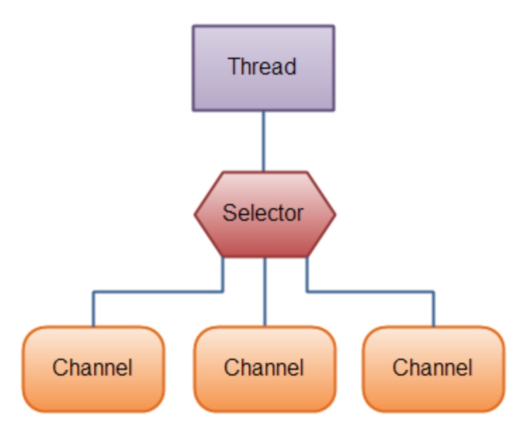


### 3.1 为什么使用Selector?
仅用单个线程来处理多个Channels的好处是，只需要更少的线程来处理通道。事实上，可以只用一个线程处理所有的通道。对于操作系统来说，线程之间上下文切换的开销很大，而且每个线程都要占用系统的一些资源（如内存）。因此，使用的线程越少越好。

### 3.2 使用
使用步骤：

 1. 创建Selector
 2. 将Channel注册到Selector选择器中
 3. 通过Selector选择通道
 4. 获取可操作的 Channel
 
#### 1. 创建Selector
通过调用Selector.open()方法创建一个Selector，如下：
```
Selector selector = Selector.open();
```

#### 2. 将Channel注册到选择器中
```
channel.configureBlocking(false);
SelectionKey key = channel.register(selector, SelectionKey.OP_READ);
```

> 注意：与Selector一起使用时，Channel必须处于非阻塞模式下。这意味着不能将FileChannel与Selector一起使用，因为FileChannel不能切换到非阻塞模式。而套接字通道都可以。


注意到, 在使用 Channel.register()方法时, 第二个参数指定了我们对 Channel 的什么类型的事件感兴趣, 这些事件有:

 - **Connect**, 即连接事件(TCP 连接), 对应于SelectionKey.OP_CONNECT
 - **Accept**, 即确认事件, 对应于SelectionKey.OP_ACCEPT
 - **Read**, 即读事件, 对应于SelectionKey.OP_READ, 表示 buffer 可读.
 - **Write**, 即写事件, 对应于SelectionKey.OP_WRITE, 表示 buffer 可写.

#### 3. 通过 Selector 选择Channel
一旦向Selector注册了一或多个通道，就可以调用几个重载的select()方法。这些方法返回你所感兴趣的事件（如连接、接受、读或写）已经准备就绪的那些通道。换句话说，如果你对“读就绪”的通道感兴趣，select()方法会返回读事件已经就绪的那些通道。

下面是select()方法：

 - **int select()**: 阻塞到至少有一个通道在你注册的事件上就绪了。
 - **int select(long timeout)**: 和select()一样，除了最长会阻塞timeout毫秒(参数)
 - **int selectNow()**: 不会阻塞，不管什么通道就绪都立刻返回
 
#### 4. 获取可操作的 Channel
如果 select()方法返回值表示有多个 Channel 准备好了, 那么我们可以通过 Selected key set 访问这个 Channel:

```
Set<SelectionKey> selectedKeys = selector.selectedKeys();
Iterator<SelectionKey> keyIterator = selectedKeys.iterator();
while(keyIterator.hasNext()) {

    SelectionKey key = keyIterator.next();
    if(key.isAcceptable()) {
        // a connection was accepted by a ServerSocketChannel.

    } else if (key.isConnectable()) {
        // a connection was established with a remote server.

    } else if (key.isReadable()) {
        // a channel is ready for reading

    } else if (key.isWritable()) {
        // a channel is ready for writing
    }

    keyIterator.remove();
}
```

注意, 在每次迭代时, 我们都调用 "keyIterator.remove()" 将这个 key 从迭代器中删除, 因为 select() 方法仅仅是简单地将就绪的 IO 操作放到 selectedKeys 集合中, 因此如果我们从 selectedKeys 获取到一个 key, 但是没有将它删除, 那么下一次 select 时, 这个 key 所对应的 IO 事件还在 selectedKeys 中.

### 3.2 完整的例子
```
public class ServerSocketSelectorDemo {

    /**
     * 服务端
     *
     * @throws Exception
     */
    public void server() throws Exception {
        // 1. 获取服务端通道
        ServerSocketChannel ssChannel = ServerSocketChannel.open();
        ssChannel.bind(new InetSocketAddress(9898));
        // 2. 设置为非阻塞模式
        ssChannel.configureBlocking(false);

        // 3. 打开一个监听器
        Selector selector = Selector.open();
        // 4. 向监听器注册接收事件
        ssChannel.register(selector, SelectionKey.OP_ACCEPT);

        while (selector.select() > 0) {
            // 5. 获取监听器上所有的监听事件值
            Iterator<SelectionKey> it = selector.selectedKeys().iterator();

            // 6. 如果有值
            while (it.hasNext()) {
                // 7. 取到SelectionKey
                SelectionKey key = it.next();

                // 8. 根据key值判断对应的事件
                if (key.isAcceptable()) {
                    // 9. 接入处理, 一个新的客户端接入
                    SocketChannel socketChannel = ssChannel.accept();
                    socketChannel.configureBlocking(false);
                    // 注册该客户端的读事件
                    socketChannel.register(selector, SelectionKey.OP_READ);
                } else if (key.isReadable()) {
                    // 10. 可读事件处理
                    SocketChannel channel = (SocketChannel) key.channel();
                    readMsg(channel);
                }
                // 11. 移除当前key
                it.remove();
            }
        }
    }

    private void readMsg(SocketChannel channel) throws IOException {
        ByteBuffer buf = ByteBuffer.allocate(1024);
        int len;
        while ((len = channel.read(buf)) > 0) {
            buf.flip();
            byte[] bytes = new byte[1024];
            buf.get(bytes, 0, len);
            System.out.println(new String(bytes, 0, len));
        }
    }

    /**
     * 客户端
     *
     * @throws Exception
     */
    public void client() throws Exception {
        // 1. 获取socketChannel
        SocketChannel sChannel = SocketChannel.open();
        // 2. 创建连接
        sChannel.connect(new InetSocketAddress("127.0.0.1", 9898));
        ByteBuffer buf = ByteBuffer.allocate(1024);
        // 3. 设置通道为非阻塞
        sChannel.configureBlocking(false);

        @SuppressWarnings("resource")
        Scanner scanner = new Scanner(System.in);
        while (scanner.hasNext()) {
            String msg = scanner.nextLine();

            buf.put((new Date() + "：" + msg).getBytes());
            buf.flip();
            //4. 向通道写数据
            sChannel.write(buf);
            buf.clear();
        }
    }

    public static void main(String[] args) {
        ExecutorService service = Executors.newFixedThreadPool(2);
        final ServerSocketSelectorDemo demo = new ServerSocketSelectorDemo();

        // 启动服务端
        service.submit(new Runnable() {
            @Override
            public void run() {
                try {
                    demo.server();
                } catch (Exception e) {
                    e.printStackTrace();
                }
            }
        });

        // 启动客户端
        service.submit(new Runnable() {
            @Override
            public void run() {
                try {
                    demo.client();
                } catch (Exception e) {
                    e.printStackTrace();
                }
            }
        });

    }
}
```

### 3.3 SelectionKey
当我们使用 register 注册一个 Channel 时, 会返回一个 SelectionKey 对象, 这个对象包含了如下内容:

 - **interest set**: 即我们感兴趣的事件集, 即在调用register注册channel时所设置的 interest set.
 - **ready set**: 代表了 Channel 所准备好了的操作.
 - channel
 - selector
 - attached object, 可选的附加对象

#### 3.3.1 interest set
我们可以通过如下方式获取 interest set:

```
int interestSet = selectionKey.interestOps();

boolean isInterestedInAccept  = interestSet & SelectionKey.OP_ACCEPT;
boolean isInterestedInConnect = interestSet & SelectionKey.OP_CONNECT;
boolean isInterestedInRead    = interestSet & SelectionKey.OP_READ;
boolean isInterestedInWrite   = interestSet & SelectionKey.OP_WRITE;    
```

#### 3.3.2 ready set

代表了 Channel 所准备好了的操作.
我们可以像判断 interest set 一样操作 Ready set, 但是我们还可以使用如下方法进行判断:

```
int readySet = selectionKey.readyOps();
selectionKey.isAcceptable();
selectionKey.isConnectable();
selectionKey.isReadable();
selectionKey.isWritable();
```

#### 3.3.3 Channel 和 Selector
我们可以通过 SelectionKey 获取相对应的 Channel 和 Selector:

```
Channel  channel  = selectionKey.channel();
Selector selector = selectionKey.selector(); 
```

#### 3.3.4 Attaching Object
我们可以在selectionKey中附加一个对象:

```
selectionKey.attach(theObject);
Object attachedObj = selectionKey.attachment();
```

或者在注册时直接附加:

```
SelectionKey key = channel.register(selector, SelectionKey.OP_READ, theObject);
```


## 四. Java NIO和IO的主要区别
主要区别：

```
IO                NIO
面向流            面向缓冲
阻塞IO            非阻塞IO
无                选择器
```


### 面向流与面向缓冲
IO是面向流的，NIO是面向缓冲区的。 Java IO面向流意味着每次从流中读一个或多个字节，直至读取所有字节，它们没有被缓存在任何地方。此外，它不能前后移动流中的数据。如果需要前后移动从流中读取的数据，需要先将它缓存到一个缓冲区。 


Java NIO的缓冲导向方法略有不同。数据读取到一个它稍后处理的缓冲区，需要时可在缓冲区中前后移动。这就增加了处理过程中的灵活性。但是，还需要检查是否该缓冲区中包含所有您需要处理的数据。而且，需确保当更多的数据读入缓冲区时，不要覆盖缓冲区里尚未处理的数据。

### 阻塞与非阻塞IO
java IO的各种流是阻塞的。这意味着，当一个线程调用read() 或 write()时，该线程被阻塞，直到有一些数据被读取，或数据完全写入。该线程在此期间不能再干任何事情了。

 Java NIO的非阻塞模式，使一个线程从某通道发送请求读取数据，但是它仅能得到目前可用的数据，如果目前没有数据可用时，就什么都不会获取。而不是保持线程阻塞，所以直至数据变的可以读取之前，该线程可以继续做其他的事情。 非阻塞写也是如此。一个线程请求写入一些数据到某通道，但不需要等待它完全写入，这个线程同时可以去做别的事情。 线程通常将非阻塞IO的空闲时间用于在其它通道上执行IO操作，所以一个单独的线程现在可以管理多个输入和输出通道（channel）。
 
### 选择器（Selectors）
Java NIO的选择器允许一个单独的线程来监视多个输入通道，你可以注册多个通道使用一个选择器，然后使用一个单独的线程来“选择”通道：这些通道里已经有可以处理的输入，或者选择已准备写入的通道。这种选择机制，使得一个单独的线程很容易来管理多个通道。


- [Java进阶（五）Java I/O模型从BIO到NIO和Reactor模式](http://www.jasongj.com/java/nio_reactor/)
- [Java Network Programming](https://doc.lagout.org/programmation/Java/Java%20Network%20Programming.pdf)
- [Java Socket编程基础及深入讲解](https://www.cnblogs.com/yiwangzhibujian/p/7107785.html)
- [Java NIO](https://my.oschina.net/u/3761681/blog/1648431)

