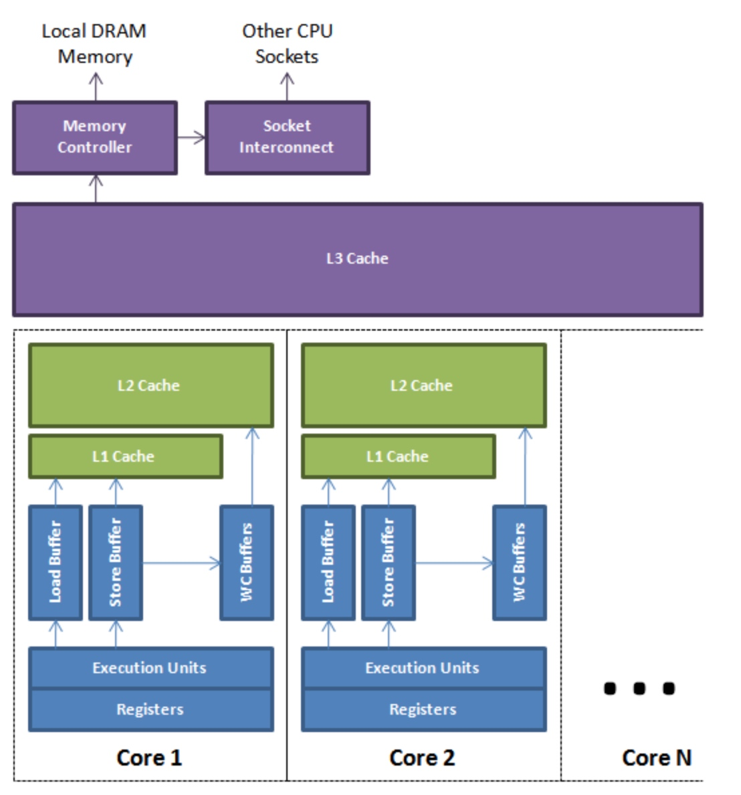
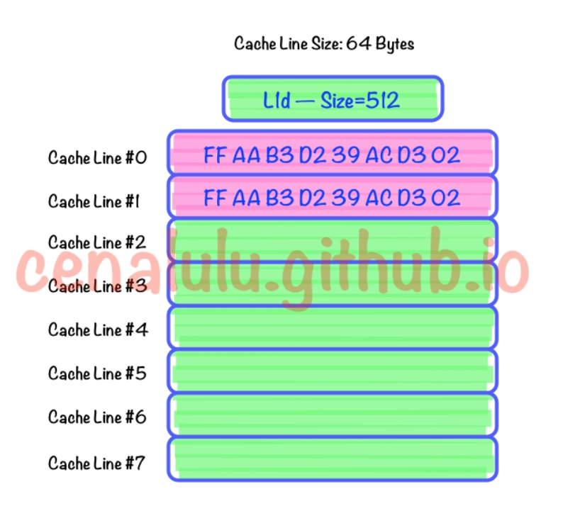
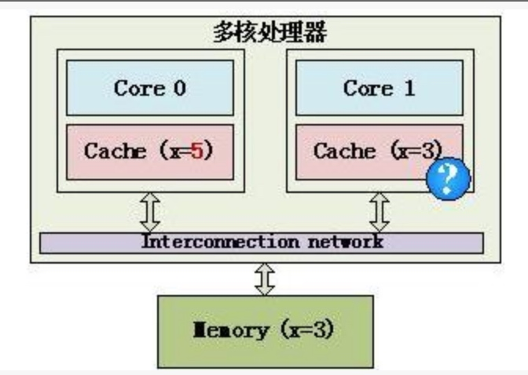
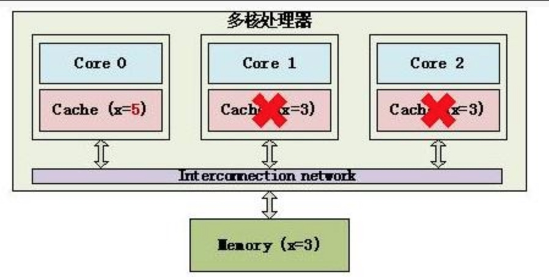
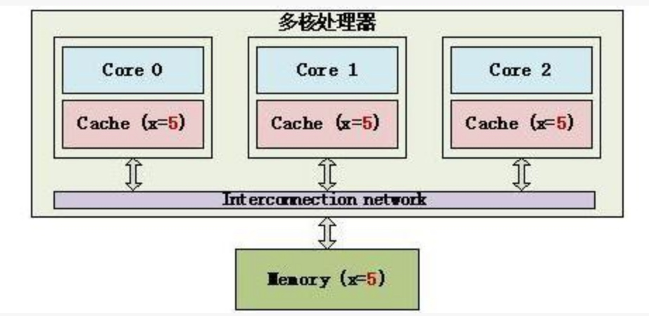
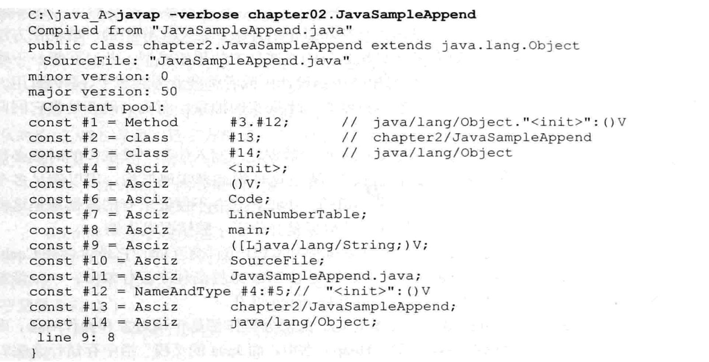

# 
我们不仅要学会面对成功，而且要学会面对失败和困难，这样才能进步。
学习方法：

 - 多看：
   - 看别人的代码是如何解决问题
   - 看身边同事如何解决问题

 - 多练
   - 在练习的基础上采用理性的思考

 - 多思考、多练习
   - 思考技术的缺点
   - 我们用它可以解决什么核心问题
   - 相关技术有哪些、它们有什么区别
   - 为什么这么设计，有没有更好的设计
 - 多总结
   - 周总结、月总结、季度总结、年总结。
   - 总结感悟、遇到的问题、思考
   - 思考如何做的更好
   - 当你学到问题的本质、看到了以前看不到的东西时、应该总结这些东西。长期坚持积累是厚积薄发的基础。

# 二. java底层计算机工作原理      
## 2.1 CPU缓存
参考：

 - [关于CPU Cache -- 程序猿需要知道的那些事](http://cenalulu.github.io/linux/all-about-cpu-cache/)
 - [从缓存行出发理解volatile变量、伪共享False sharing、disruptor](https://blog.csdn.net/opensure/article/details/46669337)
 - [七个例子帮你更好地理解 CPU 缓存](http://blog.jobbole.com/89759/)
 - [缓存一致性（Cache Coherency）入门](http://www.infoq.com/cn/articles/cache-coherency-primer/) | InfoQ
 
### 2.1.1 为什么有缓存
随着工艺的提升最近几十年CPU的频率不断提升，而受制于制造工艺和成本限制，目前计算机的内存主要是DRAM并且在访问速度上没有质的突破。因此，CPU的处理速度和内存的访问速度差距越来越大，甚至可以达到上万倍。这种情况下传统的CPU通过FSB直连内存的方式显然就会因为内存访问的等待，导致计算资源大量闲置，降低CPU整体吞吐量。同时又由于内存数据访问的热点集中性，在CPU和内存之间用较为快速而成本较高的SDRAM做一层缓存，就显得性价比极高了。**在cpu中引入缓存主要是解决cpu和内存速度不匹配问题，提高cpu处理速度。**

### 2.1.2 为什么要有多级CPU Cache
热点数据的体积越来越大，单纯的增加一级缓存大小的性价比已经很低了。因此，就慢慢出现了在一级缓存(L1 Cache)和内存之间又增加一层访问速度和成本都介于两者之间的二级缓存(L2 Cache)。

### 2.1.3 什么是Cache Line
**Cache Line(缓存行)可以简单的理解为CPU Cache中的最小缓存单位**。目前主流的CPU Cache的Cache Line大小都是**64Bytes**。假设我们有一个512字节的一级缓存，那么按照64B的缓存单位大小来算，这个一级缓存所能存放的缓存个数就是512/64 = 8个。具体参见下图：

### 2.1.4 缓存到内存映射方案
把缓存槽映射到内存块，有 3 种可选方案：

#### 1.直接映射缓存（Direct mapped cache）

每个内存块只能存储到一个Cache Line。一个简单方案是通过块索引把内存块映射到Cache Line（块索引 % Cache Line数量（即取余数操作））。映射到同一个Cache Line的内存块不能同时存储在缓存中。

直接映射会遭遇**冲突的问题**——当多个块同时竞争缓存的同一个槽时，它们不停地将对方踢出缓存，这将**降低命中率**。

#### 2.完全关联缓存（Fully associative cache）

每个内存块可以被映射到任意一个Cache Line。事实上，缓存操作和哈希表很像。

完全关联过于复杂，很难在硬件层面实现。

#### 3.N路关联缓存（N-way set associative cache）

每个内存块映射到N个特定Cache Line的任意一个。例如一个16路缓存，任何一个内存块能够被映射到16个不同的Cache Line。通常，具有相同低bit位地址的内存块共享相同的16个Cache Line。

 以下图为例，内存地址为0、8、16、24的内存块共享相同的N个cache line. 如使用2路组相联，内存地址为0、8、16、24均可被置于缓存第0组中两个数据块的任意一个；如果使用4路组相联，内存地址为0、8、16、24的数据均可被置于缓存第0组中四个数据块的任意一个。
 
 

**N路关联是典型的处理器缓存设计方案，因为它在实现难度和提高命中率之间做了良好的折衷。**

### 2.1.5 缓存替换策略
对于组相联缓存，当一个组的全部缓存块都被占满后，如果再次发生缓存失效，就必须选择一个缓存块来替换掉。存在多种策略决定哪个块被替换。

 - **先进先出算法（FIFO）**替换掉进入组内时间最长的缓存块。
 - **最久未使用算法（LRU）**则跟踪各个缓存块的使用状况，并根据统计比较出哪个块已经最长时间未被访问。对于2路以上相联，这个算法的时间代价会非常高。

### 2.1.6 缓存一致性策略
现实生活中常常会出现因为沟通不畅而导致的扯皮，一方改了某些东西，又没有及时通知到另一方，导致两方掌握的信息不一致，这就是一致性问题。

现在的的多处理器的计算机，每个CPU都有自己的寄存器和缓存。在多核处理器中，执行多线程的程序就会出现这个问题。两个线程分布在不同的CPU上执行，这两线程都使用了同一块内存地址的值并缓存在自己的cpu缓存中，当一个线程A更改了缓存值没有写入内存，也没有通知线程B，导致AB线程同一个内存值不同，这个就是缓存一致性的问题了。

在下面这个简单的多核处理器示例中，内存中有一个数据x，它的值为3，它被缓存到Core 0和Core 1中，不过Core 0将x改为5，如果Core 1不知道x已经被修改了，还在使用旧的值，就会导致程序出错，这就是Cache的不一致

 

缓存一致性协议有多种，但是你日常处理的大多数计算机设备使用的都属于“窥探（snooping）”协议，这也是我这里要讲的。（还有一种叫“基于目录的（directory-based）”协议，这种协议的延迟性较大，但是在拥有很多个处理器的系统中，它有更好的可扩展性。）

“**窥探**”背后的基本思想是：所有内存传输都发生在一条共享的总线上，而所有的处理器都能看到这条总线，缓存本身是独立的，但是内存是共享资源，所有的内存访问都要经过仲裁（arbitrate）。同一个指令周期中，只有一个缓存可以读写内存。

**窥探**协议的思想是：**CPU缓存不仅仅在做内存传输的时候才和总线打交道，而是不停地在窥探总线上发生的数据交换，跟踪其他CPU缓存在做什么。所以当一个缓存代表它所属的处理器去读写内存时，其他处理器都会得到通知，它们以此来使自己的缓存保持同步。只要某个处理器一写内存，其他处理器马上就知道这块内存在它们自己的缓存中对应的段已经失效**。 

当线程A修改了内存变量x的值，就会向处理器发送一条LOCK前缀的指令，这个变量所在缓存行的数据**回写**到内存中:

 1. 为了保证各缓存中的数据是一致的，实现了缓存一致性协议，每个处理器通过**窥探**(或称为**嗅探**)总线传播的数据来检查自己缓存的值是否过期。当发现自己缓存行的对应的内存地址数据被修改，就会将当前处理器缓存行设置成无效状态。

 

2. 当其他处理器对这个数据进行修改操作的时候，会重新从内存中把数据读到处理器缓存中。
 

缓存中的鞋存在两种模式：

 - 在**直写模式**下，这是很直接的，因为写操作一旦发生，它的效果马上会被“公布”出去。
 - 但是如果混着**回写模式**，就有问题了。因为有可能在写指令执行过后很久，数据才会被真正回写到物理内存中——在这段时间内，其他处理器的缓存也可能会傻乎乎地去写同一块内存地址，导致冲突。在回写模型中，简单把内存写操作的信息广播给其他处理器是不够的，我们需要做的是，在修改本地缓存之前，就要告知其他处理器。搞懂了细节，就找到了处理回写模式这个问题的最简单方案，我们通常叫做MESI协议（译者注：MESI是Modified、Exclusive、Shared、Invalid的首字母缩写，代表四种缓存状态）

### 2.1.7 MESI协议
MESI协议是一种缓存一致性协议，MESI是四种缓存段状态的首字母缩写，任何多核系统中的缓存段都处于这四种状态之一：

 - **失效（Invalid）缓存段**，要么已经不在缓存中，要么它的内容已经过时。为了达到缓存的目的，这种状态的段将会被忽略。一旦缓存段被标记为失效，那效果就等同于它从来没被加载到缓存中。
 - **共享（Shared）缓存段**，它是和主内存内容保持一致的一份拷贝，在这种状态下的缓存段只能被读取，不能被写入。多组缓存可以同时拥有针对同一内存地址的共享缓存段，这就是名称的由来。
 - **独占（Exclusive）缓存段**，和S状态一样，也是和主内存内容保持一致的一份拷贝。区别在于，如果一个处理器持有了某个E状态的缓存段，那其他处理器就不能同时持有它，所以叫“独占”。这意味着，如果其他处理器原本也持有同一缓存段，那么它会马上变成“失效”状态。
 - **已修改（Modified）缓存段**，属于脏段，它们已经被所属的处理器修改了。如果一个段处于已修改状态，那么它在其他处理器缓存中的拷贝马上会变成失效状态，这个规律和E状态一样。此外，已修改缓存段如果被丢弃或标记为失效，那么先要把它的内容回写到内存中——这和回写模式下常规的脏段处理方式一样。

只有当缓存段处于E或M状态时，处理器才能去写它，也就是说只有这两种状态下，处理器是独占这个缓存段的。当处理器想写某个缓存段时，如果它没有独占权，它必须先发送一条“我要独占权”的请求给总线，这会通知其他处理器，把它们拥有的同一缓存段的拷贝失效（如果它们有的话）。只有在获得独占权后，处理器才能开始修改数据——并且此时，这个处理器知道，这个缓存段只有一份拷贝，在我自己的缓存里，所以不会有任何冲突。

作为一个软件开发者，你只要理解以下两点，就大有可为：

 - 第一，在多核系统中，读取某个缓存段，实际上会牵涉到和其他处理器的通讯，并且可能导致它们发生内存传输。写某个缓存段需要多个步骤：在你写任何东西之前，你首先要获得独占权，以及所请求的缓存段的当前内容的拷贝（所谓的“带权限获取的读（Read For Ownership）”请求）。

 - 第二，尽管我们为了一致性问题做了额外的工作，但是最终结果还是非常有保证的。即它遵守以下定理，我称之为：

>MESI定律：在所有的脏缓存段（M状态）被回写后，任意缓存级别的所有缓存段中的内容，和它们对应的内存中的内容一致。此外，在任意时刻，当某个位置的内存被一个处理器加载入独占缓存段时（E状态），那它就不会再出现在其他任何处理器的缓存中。

## 2.2 内存

 - **物理地址**：指的是现在CPU外部地址总线上的寻址物理内存的地址信号，是地址变换的最终结果，即给内存单元分配的实际地址。
 - **虚拟地址**：从CPU到MMU的地址称为虚拟地址（Virtual Address），而MMU将这个地址翻译成另一个地址发到CPU芯片的外部地址引脚上，也就是将虚拟地址映射成物理地址。
 - **逻辑地址**：指由程序产生的与段相关的偏移地址部分，偏移量指明了从段开始的地方到指定地址之间的距离。不过有些资料是直接把逻辑地址当成虚拟地址，两者并没有明确的界限。
 - **线性地址**：段中的偏移地址加上相应段的基地址就生成了一个线性地址。

## 参考
 - [原子操作和竞争](http://www.infoq.com/cn/articles/atomic-operations-and-contention) | InfoQ
 
## 其他

CPU在执行任务时，首先将内存中的数据读入，进行处理，处理完成后再将结果写会到内存区域。因为CPU是高速设备，内存读取效率相对降低，为了减少CPU与内存之间的速度不匹配问题，在CPU处理器中引入了多级缓存(一级缓存、二级缓存、三级缓存)。通过缓存加快数据读入和写出效率。

但是在多核CPU中，每个机器都有自己的缓存设置，导致内存数据和缓存数据不一致。 为了保证数据的一致性。 CPU引入了**缓存一致性协议**

**cache line（缓存行）**：是缓存中的内存单元，它将连续的一段内存区域进行缓存，通常采用64字节作为基本单位进行cache操作。这里考虑了double是64字节，不应该拆分为多个。

**javap**: 可以看java编译后的字节码对应的执行指令

