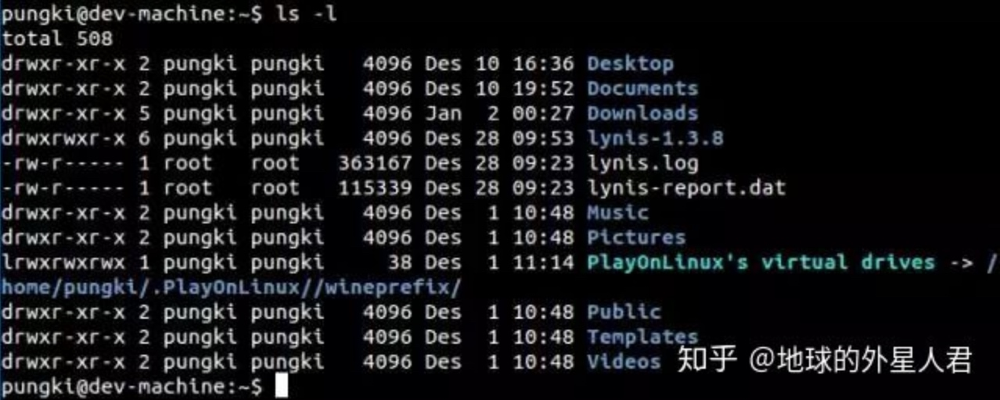
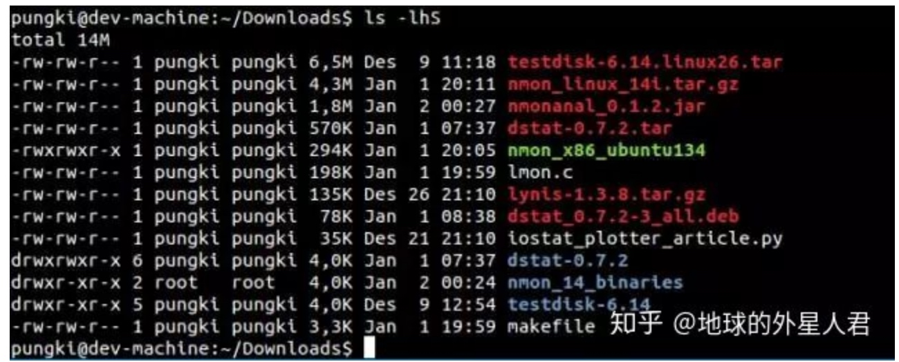

# ls命令还能这么玩
ls命令用于列出文件和目录。默认上，他会列出当前目录的内容。带上参数后，我们可以用ls做更多的事情。这里是一些在日常操作中使用到的ls用法的示例。

目录:

- [1. 不带参数运行ls](# 1. 不带参数运行ls)
- [2. 使用长清单模式](# 2. 使用长清单模式)
- [3. 显示文件大小](# 3. 显示文件大小)
- [4. 排序文件大小](# 4. 排序文件大小)


### 1. 不带参数运行ls
不带参数运行ls会只列出文件或者目录。看不到其他信息输出

### 2. 使用长清单模式
使用-l字符(小写L字符),会显示当前目录内容的长列表。在接下来的例子中，我们会结合-l参数(这个参数经常使用)来得到更好的结果。



这里是如何读取输出 :

- 第1列
    - 第一个字母d意味着内容是目录或者文件。在上面的截图中，Desktop、 Documents、 Downloads 和 lynis-1.3.8是目录。如果是’-‘(减号)，这意味着它的内容是文件。当它是l(小写l字符)，意味这内容是链接文件。
    - 下面的9个字符是关于文件权限。前3个rwx字符是文件的拥有者的权限，第二组3rwx是文件的所有组的权限，最后的rwx是对其他人访问文件的权限。
- 第2列 这行告诉我们有多少链接指向这个文件。
- 第3列 这行告诉我们谁是这个文件/文件夹的所有者。
- 第4列 这行告诉我们谁是这个文件/文件夹的所有组。
- 第5列 这行告诉我们这个文件/文件夹的以字节为单位的大小。 目录的大小总是4096字节。
- 第6列 这告诉我们文件最后的修改时间。
- 第7列 这告诉我们文件名或者目录名。


### 3. 显示文件大小
以字节为单位看大小可能会不方便。6.5M读起来比6727680字节更简单。要这么做，我们可以使用-h与-l结合的参数。-h参数意味着便于人识别。

```
ls -lh
```

另外一个可以这么做的参数是–si。这个参数和-h参数类似，但是**-si以1000为单位**，而-h以1024为单位。

```
ls -si
```

### 4. 排序文件大小
在我们可以显示文件大小之后，我们希望以文件大小排序。我们可以使用-S参数来这么做。这列表会从大到校排序。

```
ls -lhS
```




### 5. 测量大小

ls可以通过使用-block-size=SIZE改单位大小。这里的SIZE是：

```
K = Kilobyte
M = Megabyte
G = Gigabyte
T = Terabyte
P = Petabyte
E = Exabyte
Z = Zettabyte
Y = Yottabyte
```

比如，我们希望使用MB作为单位大小。所以语法就会像这样:

```
$ ls -l –block-size=M
```

### 6. 显示隐藏文件
在Linux中，以”.”(点号)开头的文件是隐藏文件。为了在ls命令中显示它，我们可以使用-a选项。

```
ls -a
```

### 7. 只列出目录条目
如果我们希望只列出目录，我们可以使用-d选项。

```
ls -d */
```

### 8. 不打印所有者信息
这个感觉平时用的还是比较少的，什么场景会使用呢？

```
$ ls -g
```

### 9. 不打印组信息
-g隐藏了拥有者信息，—G会隐藏组信息。

```
ls -lG
```


## 参考
- https://zhuanlan.zhihu.com/p/37228550
- [视频教程](https://ke.qq.com/course/119808#tuin=a7ad455e)


