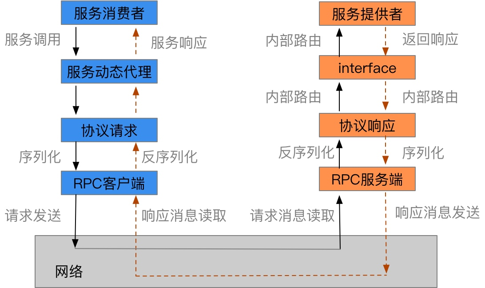

# 深入浅出gRpc
## 一. gRPC入门
### 1.1 RPC框架原理
**RPC的目标是更加简单、透明地调用远程服务，服务调用者可以像调用本地接口一样调用远程的服务提供者，而不关心底层通讯细节和调用过程。**RCP框架负责屏蔽底层的**传输协议**(TCP、UDP或HTTP)、**序列化方式**(XML/Json/二进制)和**通讯细节**(nio/bio)。

调用过程如图所示

### 1.2 业内主流的RPC框架
业内主流的RPC框架整体上分为三类：

1. **支持多语言的RPC框架**: 比如比较成熟的有Google的gRPC框架、Apchae(Facebook)的Thrift；
2. **支持特定语言的RPC框架**: 例如新浪微博的Motan;
3. **支持服务治理等服务化特性的分布式服务框架**：这种框架内核仍然是RPC框架，例如阿里的Dubbo.

**随着微服务的发展，基于语言中立性原则构建微服务，逐渐成为一种主流模式，因此基于多语言的RPC框架来构建微服务是一种比较好的技术选择**。

### 1.3 gRPC简介
gRpc是google开源一种语言中立的RPC框架，当前支持c、Java和Go语言，其中c版本支持C、C++、Node.js、C#等。

### 1.3.2 gRPC特点
1. 基于语言中立，支持多种语言
2. 基于IDL文件定义服务，通过proto3工具生成指定文件的数据结构、服务端接口以及客户端stub.
3. **通信协议基于标准的Http/2设计，支持双向流、消息头压缩、单TCP的多路复用、服务端推送等特性**，这些特性使得gRPC在移动端设备上更加省电和节省网络。
4. 序列化支持PB(Protocol Buffer)和JSON. PB是一种语言无关的高性能序列化框架，基于HTTP/2 + PB， 保障了RPC调用的高性能。

## 一. gRPC入门及服务端创建和调用原理

