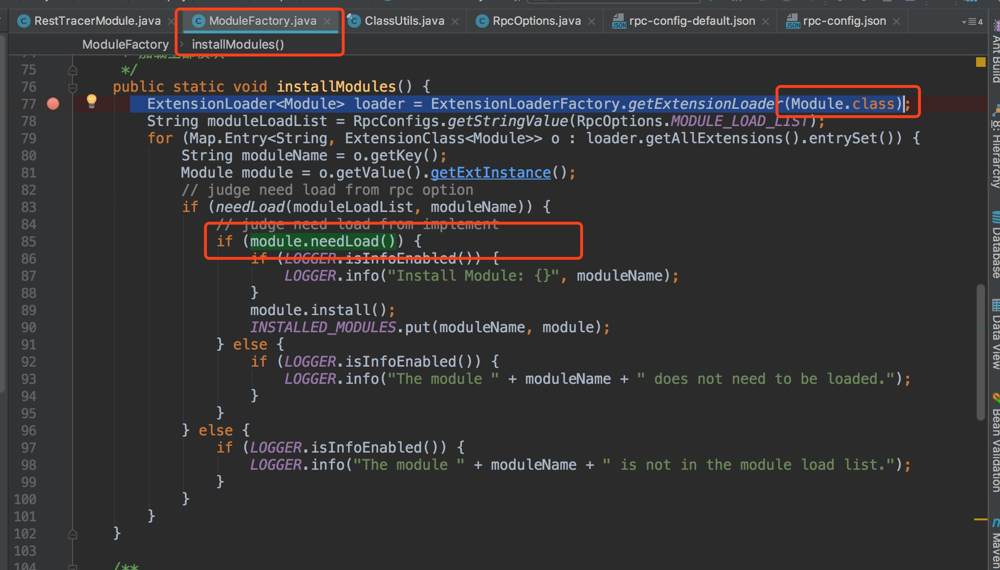
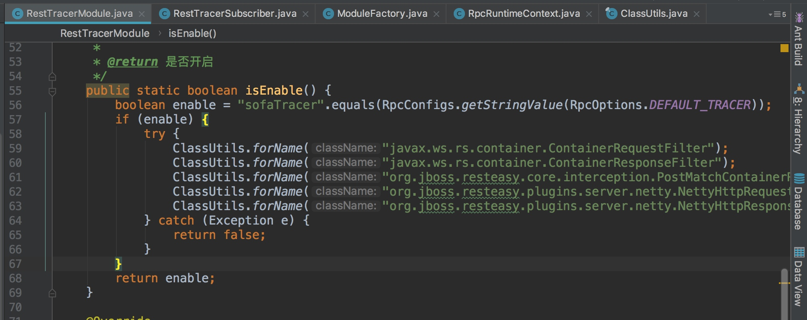
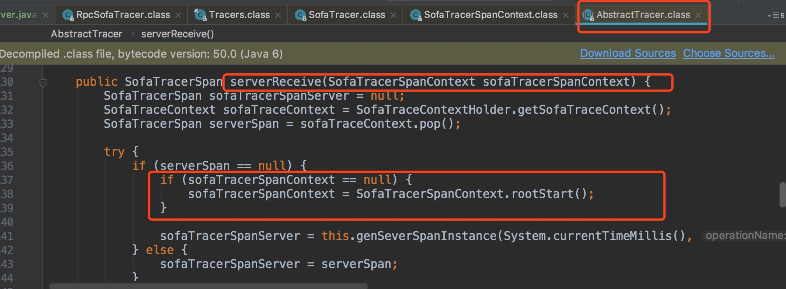

# SOFA-RPC源码学习之链路追踪


RestTracerModule
该模块有两个作用：

 - 加载sofaTracer 
 - 订阅事件

 
加载模块：




首先尝试去加载 tracer 包，如果能获取不到 包中对应的类就不会做 trace操作


ContainerRequestFilter 等类都在 sofa-tracer 包中


* 客户端：startRpc ——> filter --> beforeSend --> 存入tracer信息 --> clientReceived
 * 服务端：serverReceived --> filter --> serverSend


事件：
ClientStartInvokeEvent.class
ClientBeforeSendEvent.class
ClientAfterSendEvent.class
ServerReceiveEvent.class
ServerSendEvent.class
ServerEndHandleEvent.class
ClientSyncReceiveEvent.class
ClientAsyncReceiveEvent.class
ClientEndInvokeEvent.class


SofaTracerSubscriber 订阅各种事件  
总线设计，各种订阅者 ，默认都是同步执行的。  SofaTracerSubscriber是采用同步执行模式


RpcSofaTracer  处理订阅事件


SofaTracerSubscriber


需要确认：

1. trace 的数据如何发送给下一个节点
    - 在请求中加入 特殊拓展信息 
    
```    
// new_rpc_trace_context
// 客户端
request.addRequestProp(RemotingConstants.NEW_RPC_TRACE_NAME, serializedSpanContext);

// 服务端
 String spanStrs = (String) request.getRequestProp(RemotingConstants.NEW_RPC_TRACE_NAME);
 // 反向序列化
 spanContext = SofaTracerSpanContext.deserializeFromString(spanStrs);
```

传输的数据有:

```
tcid=0a2c7e3f1533812677021100116644&spid=0&pspid=&sample=false&
```
    
2. 这些数据的获取是同步还是异步
3. 日志记录的性能问题
    - 采用异步方式记录 AsyncCommonDigestAppenderManager
4. 如何和 zipkin 打通
5. traceId 生成：TraceIdGenerator.generate
5. spanId 序号是如何生成的
6. 并发环境下 spanId 是否会重？
7. 是否支持采样


服务方式收到请求



BatchEventProcessor 包装了  consumer


# 参考

http://bigbully.github.io/Dapper-translation/

