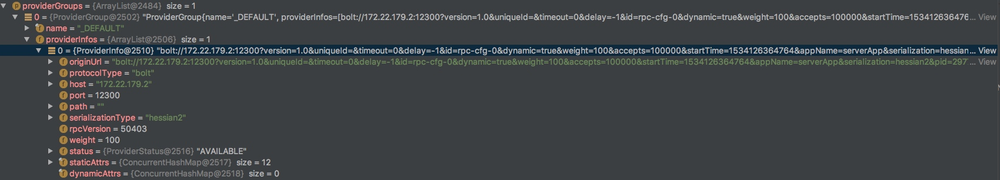

# SOFARPC 注册中心剖析

首先向注册中心注册监听事件，如果获取数据后就更新 addressHoder， 在服务调用时 router 从addressHolder 获取数据

细节记录：

-  zookeeper 注册中心 实现 ZookeeperRegistry
-  订阅方法  subscribe

WrapperClusterProviderInfoListener 负责监听变化，如果节点变化则更新本地的 地址管理器addressHolder和连接管理器connectionHolder等。

## Group
默认情况下 注册到 _DEFAULT 组里

ProviderInfo 包含:

