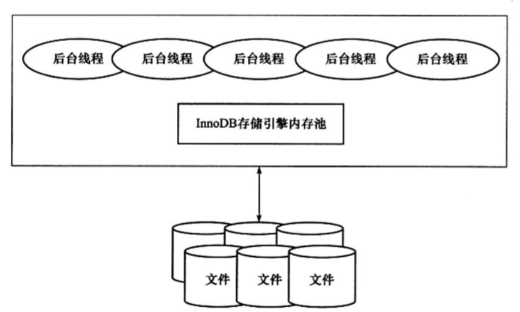
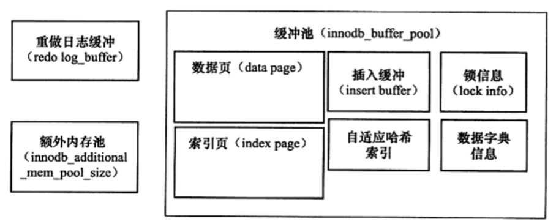

# InnoDB存储引擎
## 一. InnoDB存储引擎体系架构

  

InnoDB包含以下几个部分：

- **后台线程**: InnoDB存储引擎是多线程的模型，因此其后台有多个不同的后台线程，负责处理不同的任务。
- **内存池**: 

### 1）后台线程
有多种后台线程，负责不同的处理任务

#### 1. Master Thread
核心后台线程，主要负责将缓冲池中的数据异步刷新到磁盘，保证数据的一致性，包括脏页的刷新、合并插入缓冲、UNDO页的回收等。

#### 2. IO Thread
InnoDB存储引擎中大量使用AIO来处理写IO请求，这样可以极大提高数据库的性能，IO Thread 的主要工作是负责这些IO请求的回调处理。

IO Thread 有以下几种：

- write  4个
- read 4个
- insert buffer 1个
- log IO thread 1个

#### 3. Purge Thread
事务被提交后，其所使用的undolog可能不再需要，因此需要PurgeThread来回收已经使用并分配的undo页。InnoDB支持多个Purge Thread，这样做的目的是为了进一步加快undo页的回收。

#### 4. Page Cleaner Thread
其作用是将之前版本中脏页刷新操作都放到单独的线程中来完成，其目的是为了减轻原Master Thread的工作及对于用户查询线程的阻塞，进一步提高InnoDB存储引擎的性能。

### 内存池
**内存池**，InnoDB存储引擎有多个内存块，可以认为将这些内存块组成一个大的内存池。 主要有以下功能：

  - 维护所有进程/线程需要访问的多个内部数据结构
  - 缓存磁盘上的数据，方便快速读取，同时对硬盘文件的数据修改之前在这里缓存
  - 重做日志(redo log)缓冲

#### 缓冲池
CPU速度和磁盘速度之间存在鸿沟，基于磁盘的数据库存储通常使用系统缓冲池技术来提高数据库的整体性能。

  

缓冲池中缓存的数据页类型有： 索引页、数据页、undo页、插入缓冲(insert buffer)、自适应哈希索引、InnoDB存储的锁信息、数据字典信息等。

缓冲页刷新会磁盘的操作并不是在每次页发生更新时触发，而是通过一种称为Checkpoint的机制刷新回磁盘。

#### LRU List、Free List和Flush List

- LRU List: 改进后的LRU算法，每次插入时插入到midpoint，采用了midpoint insertion strategy。 
- Free List: 空闲页，保存了 2KB、4KB、8KB、16KB的页
- Flush List: 存放脏页，待刷新到磁盘中

#### 重做日志缓冲
InnoDB存储引擎首先将重做日志信息放入到缓冲区，然后按一定频率将其刷新到重做日志文件。

有三种情况会将重做日志缓冲中的内容刷新到外部磁盘的重做日志文件中：

- Master Thread 每一秒将重做日志缓冲刷新到重做日志文件。
- 每个事务提交时会将重做日志缓冲刷新到重做日志文件。
- 当重做日志缓冲池剩余空间小于1/2时，重做日志缓冲区刷新到重做日志文件。

#### 额外的内存池
在InnoDB存储引擎中，对内存的管理是通过一种称为内存堆的方式进行。在对一些数据结构本身的内存进行时，需要从额外的内存池中进行申请，当区域的内存不够时，会从缓虫池中进行申请。

## 二. Checkpoint 技术

  checkpoint技术主要解决以下几个问题：
  
  1. 缩短数据库的恢复时间
  2. 缓冲池不够用时，将脏页刷新到磁盘。
  3. 重做日志不可用时，刷新脏页。当前数据库对重做日志的设计都是循环使用的，并不是无限增大，因此会出现重做日志不可用情况。
  
## 三. InnoDB的关键特性
  

