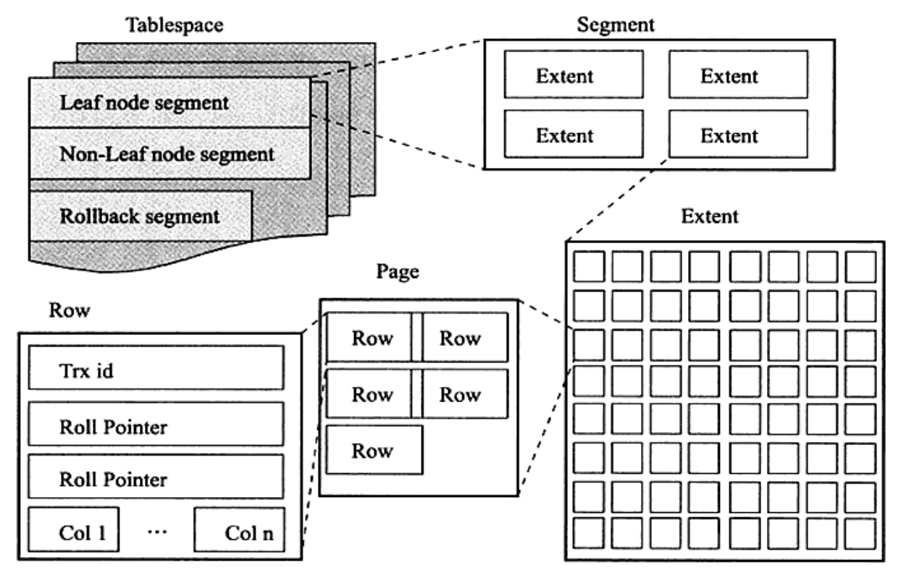
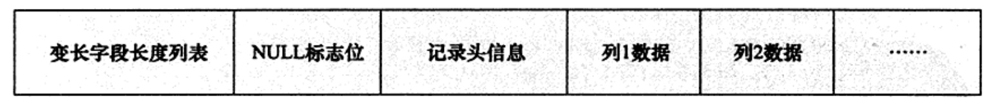

# MySQL 表结构
表都是按主键顺序组织存放的，这种存储方式的表称为**索引组织表**。 在InnoDB存储引擎中，每张表都有个主键(Primary Key), 如果创建时没有指定主键，InnoDB会按如下规则选择或创建：

- 首先判断表是否有非空的唯一索引，如果有则该列即为主键。
- 如果不符合上述要求，InnoDB存储引擎自动创建一个6字节大小的指针。

## InnoDB 表存储结构

  

所有的数据都被逻辑的存放到一个**表空间**，表空间包含：段(segment)、区(extent)、页(page)组成，页有时也称为块。

### 表空间
表空间： 表空间是InnoDB存储引擎逻辑结构的最高层，所有的数据都存放在表空间中。

- 每个表空间只存放**数据、索引和插入缓冲bitmap**, 其他类型的数据如回滚(undo)信息、插入缓冲索引页、系统事务信息、二次读写缓冲等还是存放在原来的共享表中。

### 段
常见的段有：数据段、索引段、回滚段等。

InnoDB存储引擎表是按索引组织的，因此数据即索引，索引即数据。

- 那么**数据段**即为B+树的叶子节点，如上图的leaf node segment
- 索引段即B+树的非叶子节点, Non-leaf node segment

### 区
区是连续页组成的空间，在任何情况下每个区大小都为1MB。 默认每个区的存储引擎页大小为16KB，一个区有64个连续的页。

InnoDB支持压缩页，即每个页大小可以通过参数KEY_BLOCK设置为2KB、4KB、8KB.

分区是将一个表或索引分解为多个更小、更可管理的部分。每个分区都是独立的对象，可独自处理，也可以作为一个更大对象的一部分进行处理。

- Mysql支持水平分区，不支持垂直分区。
- 数据库的分区是局部分区索引，一个分区既可以存放数据也可以存放索引
- 全局分区是数据存放在各个分区，而数据索引放在一个对象中。

### 页
页是InnoDB 磁盘管理的最小单位，默认每个页大小为16KB，可支持设置每个页大小：4KB、8KB、16KB. 

InnoDB中常见的页有：

- 数据页(B-tree Node)
- undo页(undo log page)
- 系统页(System Page)
- 事务数据页(Transaction system Page)
- 插入缓冲位图页(Insert Buffer Bitmap)
- 插入缓冲空闲列表页(Insert Buffer Free List)
- 未压缩的二进制大对象页(Uncompressed BLOB Page)
- 压缩的二进制大对象页(compressed BLOB Page)

### 行
InnoDB存储引起是面向列的，也就是说数据是按行进行存放的。每个页最多存放的行数是16KB/2 - 200 行的记录，即7992. 

InnoDB存储提供了Compact和Redundant两种格式来存放行记录数据，默认支持Compact。

Compact 记录格式：

- **变长字段长度列表**： 
  - 若列长度小于255，则用1个字节
  - 如果大于255，则用两个字节
- **NULL标志位**： 表示该行是否存在null值，有则用1表示
- **记录头信息**：固定长度为5字节(40位)
- **存储列数据**： 注意以下几点
  - 是null不占任何空间，即只除占有NULL标志位，实际存储不占有任何空间
  - 每行除了用户自定义的数据外，还有两个隐藏的列，即事务ID列(transactionId, 6字节)和回滚指针列(7字节), rowId(6字节)。
  - 变长字段长度列表是逆序存放
  

