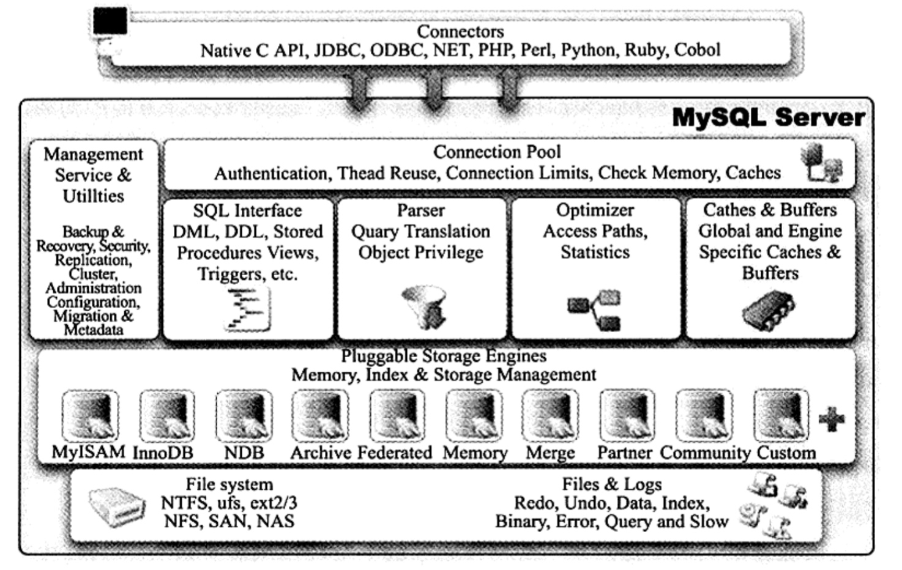

# Mysql体系结构和存储引擎

## 一. 体系结构

  

Mysql 主要由以下几个部分组成：

- 连接池组件
- 管理服务和工具组件
- SQL接口组件
- 查询分析器组件
- 优化器组件
- 缓冲组件
- 插件式存储引擎
- 物理文件

MySQL区别与其他数据库的最大特点是其插件式的表存储引擎，存储引擎是底层物理结构的实现，每个开发者可以根据自己的意愿进行开发。**存储引擎是基于表，而不是数据库**。

## 二. 存储引擎
存储引擎的好处是，每个存储引擎都有各自的特点，能够根据具体的应用建立不同存储引擎表。

### 1. InnoDB

 - InnoDB引擎是**支持事务**的，其设计目标主要是面向在线事务处理(OLTP)的应用。
 - 其特点是**行锁设计**、支持外键，并支持一致性非锁定读，即默认情况下读取操作不会产生锁．
 - 是默认的**存储引擎** 
 - InnoDB通过使用多版本并发控制(MVCC)来获得高并发行，并实现了SQL标准的4种隔离级别，默认是REPEATABLE级别。
 - 使用next-key locking的策略来避免幻读现象的产生。
 - 还提供了插入缓冲、二次写、自适应哈希索引、预读等高性能和高可用的功能．
 - InnoDB引擎的数据存储采用聚集方式，每张表存储都是按主键的顺序进行存放。

### 2. MyISAM

- 不支持事务，是表锁设计和支持全文索引，主要面向一些OLAP的数据库应用.
- **它的缓冲池只缓冲索引文件，而不缓冲数据文件**。这点和大多数据库都非常不同。
- MyISAM存储引擎表由MYD和MYI组成，MYD用来存储数据文件，MYI用来存储索引文件。
- 该存储引擎表由MYD和MYI组成，MYD用来存放数据文件，MYI用来存放索引文件.
- MyISAM默认支持256T的表数据

### 3. NDB
- 是一个**集群存储引擎**，其特点是数据全部放在内存中，因此主键查找速度极快
- 并通过添加NDB数据库存储节点可以线性提高数据库性能，是高可用，高性能的集群系统．
- NDB存储引擎的连接操作JOIN是在MySQL数据库层完成的，而不是在存储引擎层完成的。

### 4. Memory
- 将表中的数据存放在内存中，如果数据库重启或发生崩溃，表中的数据库都将消失，它非常适合存储临时数据的临时表．默认采用**哈希索引**．
- 只支持表锁、并发性能较差，并且不支持TEXT和BLOB列类型。
- 存储变长字段varchar时是安装定长字段char的方式进行的，因此会浪费内存。
- MySQL数据库使用Memory存储引擎作为临时表来存放查询的中间结果集。如果结果集大于Memory存储引擎表的容量，或者中间结果含有TEXT或BLOB列类型字段，则MySQL数据库会把其转换到MyISAM存储引擎表而存放到磁盘中。

### 5. Archive
- 只支持INSERT和SELECT操作
- 使用zlib算法将数据行进行压缩，压缩比可以达到1:10，非常适合存储归档数据，如日志信息。
- Archive存储引擎使用行锁来实现高并发的插入操作，但其本身不是事务安全的存储引擎，其设计目标是提供高速的插入和压缩功能．

### 6. Federated
Federated存储引擎并不存放数据，它只是指向一台远程MySQL数据库服务器上的表.

### 7. Maria存储引擎
- 设计目标主要是用来取代原有的MyISAM存储引擎，而称为MySQL默认的存储引擎
- 支持缓存数据和索引文件
- 应用了行锁设计
- 提供了MVCC功能，支持事务和非事务安全的选项
- 更好的BLOB字符类型的处理性能

