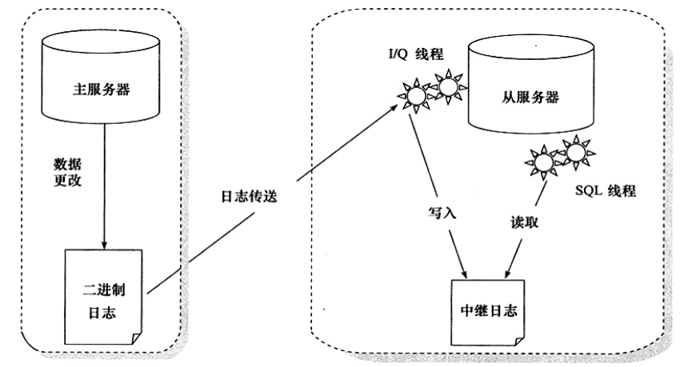
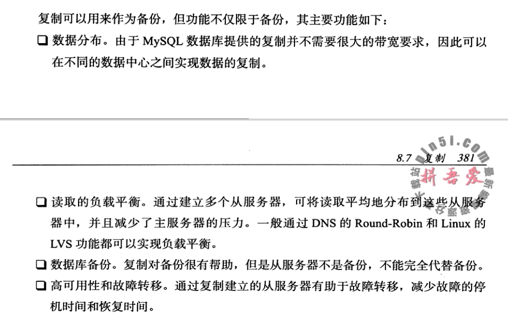
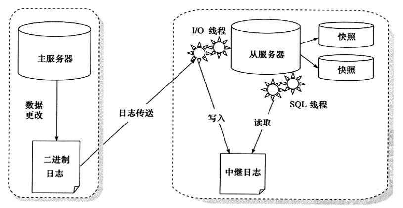

# 备份和恢复

可以根据不同的类型来划分备份的方法：

- **Hot Backup（热备）**: 指数据库运行中直接备份，对正在运行的数据库操作没有任何影响，也叫在线备份。
- **Cold Backup (冷备)**: 备份操作是在数据库停止的情况下，一般只需要复制相关的数据库物理文件即可，也叫离线备份。 
- **Warm Backup (温备)**: 同样是在数据库运行是进行，但是对当前数据库操作有所影响，如加入全局读锁以保障备份数据的一致性。


按照备份后文件的内容，备份又可以分为:

- **逻辑备份**: 备份出的文件内容可读，一般是文本文件。内容一般是由一条条SQL语句，或者表内实际数据组成。如mysqldump 和 SELECT * INTO OUTFILE的方法。
  - 好处: 可以观察到处文件的内容，一般使用数据库迁移，升级工作。
  - 缺点: 恢复所需的时间往往比较长。    
- **裸文件备份**: 复制数据库的物理文件，既可以是在数据库运行中的复制, 也可以是在数据库停止运行时直接的数据库文件复制。


按照备份数据库的内容来分，备份又可以分为:

- 完全备份：进行一个完整的备份
- 增量备份：在上次完全备份的基础上，对于更改的数据进行备份
- 日志备份：指对MySQL数据库的point-in-time的恢复工作。

MySQL数据库复制(replication)的原理就是异步实时地将二进制日志重传送并应用到从(slave/standby)数据库。

## 1. 冷备
冷备比较简单，只需要备份 MySQL数据库的frm文件，共享表空间文件，独立表空间文件(*.ibd), 重做日志文件。

一般都是定期备份MySQL数据库的配置文件 my.cnf，这样有利于恢复的操作。


冷备的优点: 

- 备份简单，只要复制相关文件即可
- 备份文件易于在不同操作系统，不同MySQL版本上进行恢复。
- 恢复简单，只需要把文件恢复到指定位置即可。
- 恢复速度快，不需要执行任何SQL语句，也不需要重建索引。

冷备的缺点：

- InnoDB存储引擎冷备的文件通常比逻辑文件大很多，因为表空间中存放着很多其他数据，如undo段、插入缓冲等。
- 冷备也不总是可以轻易地跨平台。如操作系统、MySQL版本。
- 实时性比较差

## 2. 逻辑备份
- mysqldump 
- SELECT ... INTO 

恢复

- mysqldump导出的是sql语句，只需要执行这个文件就可以

```
mysql -uroot -p < test_backup.sql
```

- mysqlimport

## 3. 二进制备份
二进制日志非常关键，用户可以通过它完成point-in-time的恢复工作，数据库的replication同样也需要二进制日志。

- FLUSH LOGS 生成一个新的二进制日志文件
- mysqlbinlog 恢复二进制文件


## 4. 热备
### ibbackup
ibbackup 是InnoDB存储引擎官方提供的热备工具，可以同时备份MyISAM存储引擎和InnoDB存储引擎。 对InnoDB存储引起表备份工作原理如下：

- 记录备份开始时，InnoDB存储引擎重做日志文件检查点的LSN。
- 复制共享表空间文件以及独立表空间文件
- 记录复制完表空间文件后，InnoDB存储引擎重做日志文件检查点的LSN.
- 复制在备份时产生的重做日志。


恢复过程：

- 恢复表空间文件
- 应用重做日志文件


优点：

- 在线备份，不阻塞任何的SQL语句
- 备份性能好，备份的**实质是复制数据库文件和重做日志文件**。
- 支持压缩备份，通过选项，可以支持不同级别的压缩。
- 跨平台支持，ibbackup可以运行在Linux、Windows以及主流的UNIX系统平台上。

### XtraBackup
XtraBackup 实现了ibbackup的所有功能，还扩展支持了真正的增量备份功能，还是免费的，因此XtraBackup是一个更好的选择。


XtraBackup支持增量备份，其工作原理：

- 首选完成一个全备，并记录下此时检查点的LSN。
- 在进行增量备份时，比较表空间中每个页的LSN是否大于上次备份时的LSN，如果是，则备份该页，同时记录当前检查点的LSN。 

## 5. 复制
复制（replication）是Mysql数据库提供的一种高可用、高性能的解决方案，一般用来建立大型的应用。总体来说replication的工作原理可以分为以下3个步骤:

1. 主服务器(master)把数据更改记录到二进制日志binlog中
2. 从服务器(slave)把主服务器的二进制日志复制到自己的中继日志(relay log)中
3. 从服务器重做中继日志中的日志，把更改应用到自己的数据库上，以达到数据最终一致性。

<div align="center">  </div>


复制不是完全实时地进行同步，而是异步实时，如果主服务器压力很大，则可能导致主从服务器延迟较大。

从服务器有两个线程：

- 一个是IO线程，负责读取主服务器的二进制日志，并将其保存为中继日志。
- 另一个是SQL线程，复制执行中继日志。

### 快照+复制的备份架构



为了避免因为误操作导致主、从服务数据丢失。 一个比较好的方法是通过对从服务器上的数据所在分区做快照，以此来避免误操作对复制造成的影响。 当发生主服务器上的误操作时，只需要将从服务器上的快照进行恢复，然后再根据二进制日志进行point-in-time恢复即可。

<div align="center">  </div>


