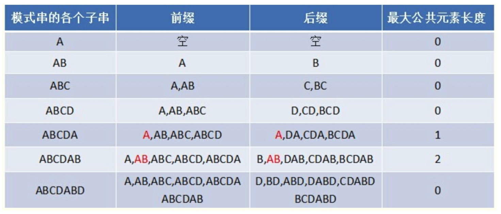

#### 1.1KMP算法
##### 思想
Knuth-Morris-Pratt 字符串查找算法，简称为 “KMP算法”，常用于在一个文本串S内查找一个模式串P 的出现位置。KMP算法的想法是，**设法利用匹配字符串的最大公共前缀后缀信息，不要把"搜索位置"移回已经比较过的位置，只要继续把它向后移和移动匹配词就可以，这样就提高了效率**。
 
可以针对搜索词，算出一张部分匹配表。通过查表查到最后一个匹配字符对应的部分匹配值，并利用以下公式计算匹配词向后移动的位数：`移动位数 = 已匹配的字符数 - 对应的部分匹配值`.

"**部分匹配值**"就是"前缀"和"后缀"的最长的共有元素的长度。以"ABCDABD"为例:




原模式串子串对应的各个前缀后缀的公共元素的最大长度表为：


##### 实现

```
// 计算部分匹配表
public void makeNext(char[] pattern, int next[]) {
    int pIdx, maxSuffixLen; // pIdx:模版字符串下标；maxSuffixLen:最大前后缀长度
    int m = pattern.length;  // 模版字符串长度
    next[0] = 0; //模版字符串的第一个字符的最大前后缀长度为0
    for (pIdx = 1, maxSuffixLen = 0; pIdx < m; ++pIdx) //for循环，从第二个字符开始，依次计算每一个字符对应的next值
    {
        // maxSuffixLen 大于0 表示前一个字符已经存在匹配
        while (maxSuffixLen > 0 && pattern[pIdx] != pattern[maxSuffixLen]) { 
            // 递归的求出P[0]···P[q]的最大的相同的前后缀长度k
            maxSuffixLen = next[maxSuffixLen - 1];
        }
        if (pattern[pIdx] == pattern[maxSuffixLen]) {
            // 如果相等，那么最大相同前后缀长度加1
            maxSuffixLen++;
        }
        next[pIdx] = maxSuffixLen;
    }
}

public int kmp(String str, String pattern) {
    int[] next = new int[str.length()];
    int strIdx, pIdx;
    makeNext(pattern.toCharArray(), next);

    for (strIdx = 0, pIdx = 0; strIdx < str.length(); ++strIdx) {
        while (pIdx > 0 && pattern.charAt(pIdx) != str.charAt(strIdx)) {
            // 移动匹配字符串位置
            pIdx = next[pIdx - 1];
        }
        if (pattern.charAt(pIdx) == str.charAt(strIdx)) {
            pIdx++;
        }
        if (pIdx == pattern.length()) {
            return strIdx - pattern.length() + 1;
        }
    }
    return -1;
}
```

