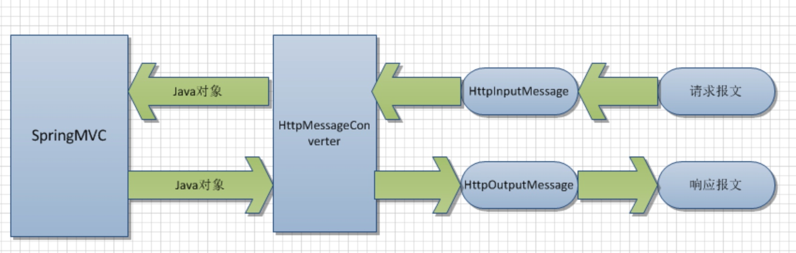

# 笔记
## ResponseBody 实现原理
使用@ResponseBody注解之后，Controller返回的对象 自动被转换成对应的json数据

底层依赖与jackson，因此需要增加以下配置:

```
<dependency>
  <groupId>org.codehaus.jackson</groupId>
  <artifactId>jackson-core-asl</artifactId>
  <version>1.9.13</version>
</dependency>
<dependency>
  <groupId>org.codehaus.jackson</groupId>
  <artifactId>jackson-mapper-asl</artifactId>
  <version>1.9.13</version>
</dependency>
```

@ResponseBody这个注解就是使用消息转换机制，最终通过json的转换器转换成json数据的。HttpMessageConverter接口就是Spring提供的http消息转换接口。




## spring security CSRF 问题
https://blog.csdn.net/u012373815/article/details/55047285

CSRF（Cross-site request forgery跨站请求伪造，也被称为“One Click Attack” 或者Session Riding，攻击方通过伪造用户请求访问受信任站点。


参考: 

[SpringMVC关于json、xml自动转换的原理研究附带源码分析](http://www.cnblogs.com/fangjian0423/p/springMVC-xml-json-convert.html)


