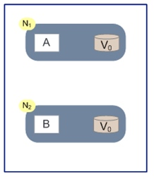
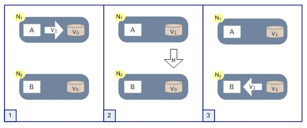
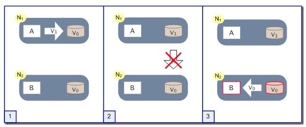

# 分布式系统的CAP理论
## 1.1 概念
> 2000年7月，加州大学伯克利分校的Eric Brewer教授在ACM PODC会议上提出CAP猜想。2年后，麻省理工学院的Seth Gilbert和Nancy Lynch从理论上证明了CAP。之后，CAP理论正式成为分布式计算领域的公认定理。

CAP原理认为，一个提供数据服务的存储系统**无法同时**满足**数据一致性(Consistency)、数据可用性(Availibility)、分区耐受性(Partition Tolerance, 系统具有跨网路分区的伸缩性)**， 最多只能满足其中的两项。

  

### 1）数据一致性(Consistency)
一致性指“**all nodes see the same data at the same time**”，即更新操作成功并返回客户端完成后，所有节点在同一时间的数据完全一致，所有应用程序都能访问得到相同的数据。

数据一致性可以分为一下几点：

- **数据强一致性**: 各个副本的数据在物理存储中总是一致的。数据更新操作结果和操作响应总是一致的，即操作系统响应通知更新失败，那么数据一定没有被更新，而不是处于不确定状态。
- **数据用户一致**: 即数据在物理存储中的各个副本数据可能不一致，但是终端用户访问时，通过纠错和校验机制，可以确定一个一致的且正确的数据返回给用户。
- **数据最终一致**: 物理存储的数据可能是不一致的，终端用户访问到的数据可能也是不一致的，但系统过段时间的自我修复和修正，数据最终达到一致。

怎样会导致数据不一致：

- 主从延迟: 现在数据都采用了主从热备，做到读写分离，主库写从库读，但主从之间存在一定的延迟，可能会导致数据不一致。
- 网络问题
- 不在一个事务里，异常原因导致不一致

### 2）数据可用性(Availibility)
可用性指“**Reads and writes always succeed**”，即服务一直可用，任何时候，任何应用程序都可以读写访问，而且是正常响应时间。

实现数据可用性的方式主要有**数据冗余和负载均衡**，例如采用一主多从的方式。很多中间件和服务都采用这种模式，例如redis、kafka(partition多个副本). 

### 3）分区耐受性(Partition Tolerance)
分区容错性指“**the system continues to operate despite arbitrary message loss or failure of part of the system**”，即分布式系统在遇到某节点或网络分区故障的时候，仍然能够对外提供满足一致性和可用性的服务，也可以理解是**系统可以跨网络分区线性伸缩，即系统的可伸缩**。

## 1.2 证明CAP

  

如上图，是我们证明CAP的基本场景，网络中有两个节点N1和N2，可以简单的理解N1和N2分别是两台计算机，他们之间网络可以连通，N1中有一个应用程序A，和一个数据库V，N2也有一个应用程序B2和一个数据库V。现在，A和B是分布式系统的两个部分，V是分布式系统的数据存储的两个子数据库。

在满足一致性的时候，N1和N2中的数据是一样的，V0=V0。在满足可用性的时候，用户不管是请求N1或者N2，都会得到立即响应。在满足分区容错性的情况下，N1和N2有任何一方宕机，或者网络不通的时候，都不会影响N1和N2彼此之间的正常运作。

  

如上图，是分布式系统正常运转的流程，用户向N1机器请求数据更新，程序A更新数据库Vo为V1，分布式系统将数据进行同步操作M，将V1同步的N2中V0，使得N2中的数据V0也更新为V1，N2中的数据再响应N2的请求。

这里，可以定义N1和N2的数据库V之间的数据是否一样为一致性；外部对N1和N2的请求响应为可用行；N1和N2之间的网络环境为分区容错性。这是正常运作的场景，也是理想的场景，然而现实是残酷的，当错误发生的时候，一致性和可用性还有分区容错性，是否能同时满足，还是说要进行取舍呢？

作为一个分布式系统，它和单机系统的最大区别，就在于网络，现在假设一种极端情况，N1和N2之间的网络断开了，我们要支持这种网络异常，相当于要满足分区容错性，能不能同时满足一致性和响应性呢？还是说要对他们进行取舍。

  

假设在N1和N2之间网络断开的时候，有用户向N1发送数据更新请求，那N1中的数据V0将被更新为V1，由于网络是断开的，所以分布式系统同步操作M，所以N2中的数据依旧是V0；这个时候，有用户向N2发送数据读取请求，由于数据还没有进行同步，应用程序没办法立即给用户返回最新的数据V1，怎么办呢？有二种选择，

- 第一，牺牲数据一致性，响应旧的数据V0给用户；
- 第二，牺牲可用性，阻塞等待，直到网络连接恢复，数据更新操作M完成之后，再给用户响应最新的数据V1。

这个过程，证明了要满足分区容错性的分布式系统，只能在一致性和可用性两者中，选择其中一个。

## 1.3 CAP权衡
通过CAP理论，我们知道无法同时满足一致性、可用性和分区容错性这三个特性，那要舍弃哪个呢？

- **CA without P**：如果不要求P（不允许分区），则C（强一致性）和A（可用性）是可以保证的。但其实分区不是你想不想的问题，而是始终会存在，因此CA的系统更多的是允许分区后各子系统依然保持CA。

- **CP without A**：如果不要求A（可用），相当于每个请求都需要在Server之间强一致，而P（分区）会导致同步时间无限延长，如此CP也是可以保证的。很多传统的数据库分布式事务都属于这种模式。

- **AP wihtout C**：要高可用并允许分区，则需放弃一致性。一旦分区发生，节点之间可能会失去联系，为了高可用，每个节点只能用本地数据提供服务，而这样会导致全局数据的不一致性。现在众多的NoSQL都属于此类。

在大型网站中，通常会选择强化分布式存储系统的可用性A和伸缩性P，而在某种程度上放弃一致性(C)，保证收最终一致。

数据不一致通常出现在系统高并发写操作或者集群状态不稳（故障恢复、集群扩容。。。）的情况下，应用系统需要对分布式数据处理系统的数据不一致有所了解并进行某种意义上的补偿和纠错，以避免出现应用系统数据不正确。（补单系统也是完成状态不一致的一种补救措施）

# 参考

- [分布式系统的CAP理论](http://www.hollischuang.com/archives/666)

