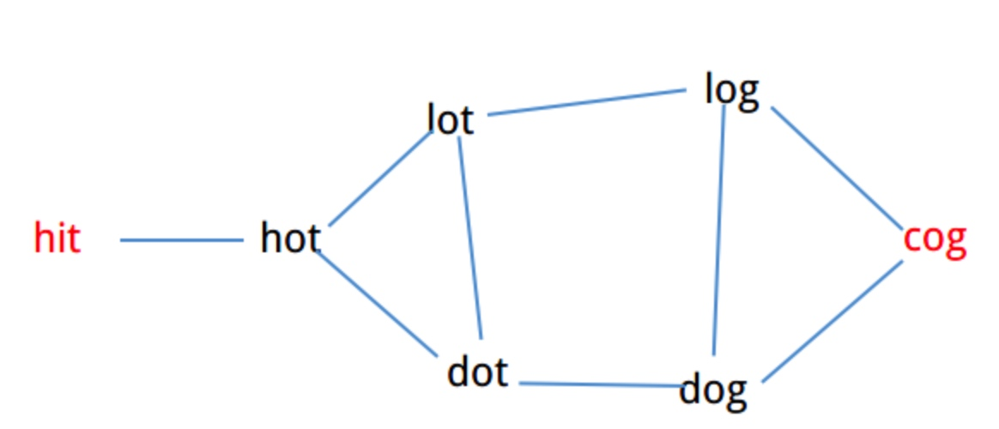

# LeetCode算法题汇总

刷题顺序:

- https://blog.csdn.net/lnho2015/article/details/50962989
- [leetcode难度及面试频率](https://blog.csdn.net/yutianzuijin/article/details/11477603)
- [leetcode面试频率](https://blog.csdn.net/alpaca12/article/details/51647261)

## 1. 两数之和(Two Sum)
地址： 

- [英文](https://leetcode.com/problems/two-sum/description/)
- [中文](https://leetcode-cn.com/problems/two-sum/description/)

### 1.1. 算法描述
Given an array of integers, return indices of the two numbers such that they add up to a specific target.You may assume that each input would have exactly one solution, and you may not use the same element twice.

> Example:
Given nums = [2, 7, 11, 15], target = 9,
Because nums[0] + nums[1] = 2 + 7 = 9,
return [0, 1].

### 1.2. 算法思路
1.  暴力求解。 时间复杂度为n(O^2)
2.  先排序，然后再使用两个指针左右左右夹逼(转换为剑指offer中那道题)。 复杂度是O(nlogn)
3.  使用hash表，先将数值保存在hash表中，hash表保存数值和下标的映射关系。遍历每个值，看到目标的差值是否在hash中，如果在表示找到。 复杂度为O(n)

### 1.3. 实现
#### java

```<java>
class Solution {
    public int[] twoSum(int[] nums, int target) {
        int[] result = new int[2];
        if (nums == null || nums.length < 2) {
            return result;
        }
        
        Map<Integer, Integer> map = new HashMap<Integer, Integer>();
        for (int i = 0; i < nums.length; i++ ) {
            if (map.get(target - nums[i]) != null) {
                result[0] = map.get(target - nums[i]);
                result[1] = i;
            } else {
                map.put(nums[i], i);
            }
        }
        return result;
    }
}
```

## 2. 两数相加(Add Two Numbers)
- [中文版本地址](https://leetcode-cn.com/problems/add-two-numbers/description/)
- [英文版本地址](https://leetcode.com/problems/add-two-numbers/description/)

### 2.1 算法描述
给定两个非空链表来表示两个非负整数。位数按照逆序方式存储，它们的每个节点只存储单个数字。将两数相加返回一个新的链表。

你可以假设除了数字 0 之外，这两个数字都不会以零开头。

### 2.2 算法思路
1. 定义两个针织，分别指向两个链表的当前节点
2. 用sum记录前面两个节点的计算之和，用来做进位
3. 不断遍历两个链表，计算两节点、及进位数之和
4. 构建新节点采用尾插入

### 2.3 算法实现

```<java>
/**
 * Definition for singly-linked list.
 * public class ListNode {
 *     int val;
 *     ListNode next;
 *     ListNode(int x) { val = x; }
 * }
 */
class Solution {
    public ListNode addTwoNumbers(ListNode l1, ListNode l2) {
        ListNode c1 = l1;
        ListNode c2 = l2;
        ListNode head = new ListNode(0);
        ListNode p = head;
        int sum = 0;
        while (c1 != null || c2 != null) {
            sum /= 10; // 得到进位
            if (c1 != null ) {
                sum += c1.val;
                c1 = c1.next;
            }
            if (c2 != null) {
                sum += c2.val;
                c2 = c2.next;
            }
            p.next = new ListNode(sum % 10);
            p = p.next;
        }
        if (sum / 10 == 1) p.next = new ListNode(1);
        return head.next;
    }
}
```


## 8. String to Integer (atoi)
https://leetcode.com/problems/string-to-integer-atoi/description/

### 算法描述
### 算法思路
这道题就是要考虑一些特殊的情况：

1. 去除空格
2. 数字前出现多余的字符
3. 数字中有空格或非数字字符
4. 越界
5. 正负号问题

### 算法实现
https://www.cnblogs.com/springfor/p/3896499.html

```<java>
class Solution {
    public int myAtoi(String str) {
        // 1. null or empty string  
        if (str == null || str.length() == 0) return 0;  
          
        // 2. whitespaces  
        str = str.trim();  
        if (str.length() == 0) return 0;
          
        // 3. +/- sign  
        boolean positive = true;  
        int i = 0;  
        
        if (str.charAt(0) == '+') {  
            i++;  
        } else if (str.charAt(0) == '-') {  
            positive = false;  
            i++;  
        }  
          
        // 4. calculate real value  
        long tmp = 0;  
        for ( ; i < str.length(); i++) {  
            int digit = str.charAt(i) - '0';  
            if (digit < 0 || digit > 9) break;  
              
            // 5. handle min & max  
            if (positive) {  
                tmp = 10 * tmp + digit;  
                if (tmp > Integer.MAX_VALUE) return Integer.MAX_VALUE;  
            } else {  
                tmp = 10 * tmp - digit;  
                if (tmp < Integer.MIN_VALUE) return Integer.MIN_VALUE;  
            }  
        }  
          
        int ret = (int)tmp;  
        return ret; 
    }
}
```

## 12. 整数转罗马数字(Integer to Roman)
- [英文版本地址](https://leetcode.com/problems/integer-to-roman/description/)
- [中文版本地址](https://leetcode-cn.com/problems/integer-to-roman/description/)

### 12.1 算法描述

### 12.2 算法思路
参考： https://blog.csdn.net/makuiyu/article/details/43267973

1. 相同的数字连写，所表示的数等于这些数字相加得到的数，如：III = 3；
2. 小的数字在大的数字的右边，所表示的数等于这些数字相加得到的数， 如：VIII = 8；XII = 12；
3. 小的数字，（限于I、X 和C）在大的数字的左边，所表示的数等于大数减小数得到的数，如：IV= 4；IX= 9；
4. 正常使用时，连写的数字重复不得超过三次。（表盘上的四点钟“IIII”例外）
5. 在一个数的上面画一条横线，表示这个数扩大1000倍。（本题用不到这点）

有几条须注意掌握：

1. 基本数字I、X、C中的任何一个，自身连用构成数目，或者放在大数的右边连用构成数目，都不能超过三个；放在大数的左边只能用一个。
2. 不能把基本数字V、L、D中的任何一个作为小数放在大数的左边采用相减的方法构成数目；放在大数的右边采用相加的方式构成数目，只能使用一个。
3. V和X左边的小数字只能用I，且只能有1个。
4. L和C左边的小数字只能用X，且只能有1个。
5. D和M左边的小数字只能用C，且只能有1个。

看懂了上面的规则后，就可以对数字的每位逐个判断即可。可以归纳出如下4种情形：

- 如果该位数字是9，则说明是上面3、4、5这三种情况中的一种，即把I、X、C中的一个放到了大数字的左侧；
- 如果该位数字是5~8，则说明是上面1这种情况，即I、X、C中的一个，自身连用或者放在大数的右边连用；
- 如果该位数字是4，则说明同样是上面3、4、5这三种情况中的一种，即把I、X、C中的一个放到了大数字的左侧；
- 如果该位数字是0~3，则同样说明是上面1这种情况，即I、X、C中的一个，自身连用或者放在大数的右边连用。

进一步，可以看到，罗马数字可以分为1、4、5、9这四种构成方式，而1-3999中，共有1000, 900, 500, 400, 100, 90, 50, 40, 10, 9, 5, 4, 1，共计13种，依次分别对应"M", "CM", "D", "CD", "C", "XC", "L", "XL", "X", "IX", "V", "IV", "I"，即：

整数数字  1000 900 500 400 100 90 50 40 10 9  5 4  1
罗马数字  M    CM  D   CD  C   XC L  XL X  IX V IV I

### 12.3 算法实现

```<java>
class Solution {
    public String intToRoman(int num) {
        int[]  values = new int[]{1000, 900, 500, 400, 100, 90, 50, 40, 10, 9, 5, 4, 1};
        String[] strs = new String[]{"M", "CM", "D", "CD", "C", "XC", "L", "XL", "X", "IX", "V", "IV", "I"};
        StringBuilder sb = new StringBuilder();
        for (int i = 0; i < values.length; i++ ) {
            while(num >= values[i]) { // 等于
                num -= values[i];
                sb.append(strs[i]);
            }
        }
        return sb.toString();
    }
}
```

## 13. 罗马数字转整数（Roman to Integer）
- [英文版本地址](https://leetcode.com/problems/roman-to-integer/description/)
- [中文版本地址](https://leetcode-cn.com/problems/roman-to-integer/description/)

### 13.1 算法描述

### 13.2 算法思路
参考： https://www.cnblogs.com/grandyang/p/4120857.html

方法一：

我们需要用到map数据结构，来将罗马数字的字母转化为对应的整数值，因为输入的一定是罗马数字，那么我们只要考虑两种情况即可：

- 第一，如果当前数字是最后一个数字，或者之后的数字比它小的话，则加上当前数字
- 第二，其他情况则减去这个数字


方法二： 

我们也可以每次跟前面的数字比较，如果小于等于前面的数字，我们先加上当前的数字，如果大于的前面的数字，我们加上当前的数字减去二倍前面的数字，这样可以把在上一个循环多加数减掉

方法三：

每次和后面的数字比较，如果小于后面的数字，则减去当前的值，如果大于后面的值则加上当前值。最后加上剩下的最后一个数字。


### 13.3 算法实现
方法三:

```<java>
class Solution {
    public int romanToInt(String s) {
        Map<Character, Integer> map = new HashMap<>();
        map.put('I', 1);
        map.put('V', 5);
        map.put('X', 10);
        map.put('L', 50);
        map.put('C', 100);
        map.put('D', 500);
        map.put('M', 1000);
        char[] chars = s.toCharArray();
        int result = 0;
        // i 当前位置，j后一位
        int i = 0, j = 1;
        for(; j < chars.length; i++, j++) {
            if (map.get(chars[i]) >= map.get(chars[j])) {
                result += map.get(chars[i]);
            } else {
                result -= map.get(chars[i]);
            }
        }
        result += map.get(chars[i]);
        return result;
    }
}
```


## 15. 3Sum 
https://leetcode.com/problems/3sum/description/
### 算法描述
Given an array nums of n integers, are there elements a, b, c in nums such that a + b + c = 0? Find all unique triplets in the array which gives the sum of zero.

Note:
The solution set must not contain duplicate triplets.

>Example:
>Given array nums = [-1, 0, 1, 2, -1, -4],
>A solution set is:
>[
>  [-1, 0, 1],
>  [-1, -1, 2]
>]


### 算法思路
1. 先排序，然后左右夹逼，排序之后，我们就可以对数组用两个指针分别从前后两端向中间扫描了，如果是 2Sum，我们找到两个指针之和为target就OK了，那 3Sum 类似，我们可以先固定一个数，然后找另外两个数之和为第一个数的相反数就可以了。 复杂度O(n^2)

2. 从头遍历数组，每次固定一个值x，去剩余部分找到另外两个数，使得他们的值刚好是当前值的相反数 -x。这个地方可以使用Two sum的思路，从里面找到一个和为特定值的数。 复杂度为O(n^2) 

这里采用第一种方式，第二种可以参考Two Sum， 只是外面多加一个for循环就可以了。

### 算法实现

```<java>
class Solution {
     public List<List<Integer>> threeSum(int[] nums) {
        List<List<Integer>> resultList = new ArrayList<>();
        if (null == nums || nums.length < 3) {
            return resultList;
        }

        // 排序
        quickSort(nums, 0, nums.length -1); // 或者使用 Arrays.sort(nums);

        // 两边夹逼
        int last = nums.length - 1;
        for (int i = 0; i <= last - 2; i++) {
            if (i > 0 && nums[i] == nums[i-1]) continue;
            find(nums, i + 1, last, nums[i], resultList); // 其实有点类似转为 2sum思路。
        }

        return resultList;
    }

    /**
     * 寻找两个数与num[i]的和为0
     */
    public void find(int[] nums, int begin, int end, int target, List<List<Integer>> resultList) {
        int l = begin, r = end;
        while (l < r) {
            if (nums[l] + nums[r] + target == 0) {
                List<Integer> ans = new ArrayList<Integer>();
                ans.add(target);
                ans.add(nums[l]);
                ans.add(nums[r]);
                resultList.add(ans); //放入结果集中
                while (l < r && nums[l] == nums[l+1]) l++;
                while (l < r && nums[r] == nums[r-1]) r--;
                l++;
                r--;
            } else if (nums[l] + nums[r] + target < 0) {
                l++;
            } else {
                r--;
            }
        }
    }

    private void quickSort(int[] array, int low, int high) {
        if (high < low) {
            return;
        }
        int lt = low, gt = high, i = low + 1;
        int val = array[low];
        while (i <= gt) {
            if (array[i] < val) {
                swap(array, i++, lt++);
            } else if (array[i] > val) {
                swap(array, i, gt--);
            } else {
                i ++;
            }
        }
        array[i - 1] = val;
        quickSort(array, low, lt -1);
        quickSort(array, gt + 1, high);
    }

    private void swap(int[] array, int i, int j) {
        int temp = array[i];
        array[i] = array[j];
        array[j] = temp;
    }
}
```


方法二(解决不了重复数值问题)：-----还有问题没解决

```
class Solution {
     public List<List<Integer>> threeSum(int[] nums) {
         List<List<Integer>> result = new ArrayList<List<Integer>>();
         
         if (nums == null || nums.length < 3) return result;
         Map<Integer, Integer> map = new HashMap<Integer, Integer>();
         Arrays.sort(nums);
         for (int i = 0; i < nums.length; i++) {
             map.put(nums[i], i);
         }
         
          for (int i = 0; i <= nums.length - 2; i++) {
              if (i > 0 && nums[i] == nums[i-1] ) continue;
              findTwoSum(nums[i], i + 1, nums, map, result);
         }
         return result;
    }
    
    public void findTwoSum(int target, int begin, int[] nums, Map<Integer, Integer> map,  List<List<Integer>> result) {
        int reVal = -1 * target;
        for (int i = begin; i < nums.length; i++) {
            if (nums[i] == nums[i-1])  continue;
            
            Integer val = map.get(reVal - nums[i]);
            if (val != null && val > i) {
                List<Integer> temp = new ArrayList<Integer>();
                temp.add(target);
                temp.add(nums[i]);
                temp.add(reVal - nums[i]);
                result.add(temp);
                
            } 
        }
    }
}
```

## 20.有效的括号(Valid Parentheses)
- [中文版本地址](https://leetcode-cn.com/problems/valid-parentheses/description/)
- [英文版本地址](https://leetcode.com/problems/valid-parentheses/description/)

### 算法描述
Given a string containing just the characters , determine if the input string is valid.

The brackets must close in the correct order, “()” and “()[]{}” are all valid but “(]” and “([)]” are not.

给定一个字符串，只包含’(‘, ‘)’, ‘{‘, ‘}’, ‘[’ 和’]’这些字符，检查它是否是“有效”的。 
括号必须以正确的顺序关闭，例如”()” 和”()[]{}”都是有效的，”(]” 和”([)]”是无效的。

### 算法思想
本题考查的是栈结构，具有后进先出的特性。有效包含2个方面，第一个是如果是关闭的括号，前一位一定要刚好有一个开启的括号；第二个是最终结果，需要把所有开启的括号都抵消完。一个比较容易出错的地方是，遇到关闭括号时，判断栈是否已经空或栈顶元素是对应的开启符号。

### 算法实现

```<java>
public class Solution {
    public boolean isValid(String s) {
        Map<Character,Character> pairs = new HashMap<Character,Character>();
        pairs.put('}','{');
        pairs.put(')','(');
        pairs.put(']','[');
        
        Stack<Character> stack = new Stack<Character>();
        char[] charArray = s.toCharArray();
        for(char cVal : charArray){
            if(pairs.containsKey(cVal)){
                if(stack.isEmpty() || pairs.get(cVal) != stack.pop())
                    return false;
            }else if(!pairs.containsKey(cVal) ){
                stack.push(cVal);
            }
        }
        return  stack.isEmpty();
    }
}
```

## 21. 合并两个有序链表(Merge Two Sorted Lists)
地址:

- [英文](https://leetcode.com/problems/merge-two-sorted-lists/description/)
- [中文](https://leetcode-cn.com/problems/merge-two-sorted-lists/description/)


### 21.1 算法描述
#### 英文
Merge two sorted linked lists and return it as a new list. The new list should be made by splicing together the nodes of the first two lists.

Example:

Input: 1->2->4, 1->3->4
Output: 1->1->2->3->4->4
#### 中文
将两个有序链表合并为一个新的有序链表并返回。新链表是通过拼接给定的两个链表的所有节点组成的。 

示例：

输入：1->2->4, 1->3->4
输出：1->1->2->3->4->4

### 21.2 算法思路

合并算法

### 21.3 算法实现

```<java>
public class Solution {
    public ListNode mergeTwoLists(ListNode l1, ListNode l2) {
        if(l1 == null) return l2;
        if(l2 == null) return l1;
        ListNode head;
        if(l1.val < l2.val){
            head = l1;
            head.next = mergeTwoLists(l1.next,l2);
        }else{
            head = l2;
            head.next = mergeTwoLists(l1,l2.next);
        }
        return head;
    }
}
```

## 22. 括号生成(Generate Parentheses)
- [英文版地址](https://leetcode.com/problems/generate-parentheses/description/)
- [中文版地址](https://leetcode-cn.com/problems/generate-parentheses/description/)

### 22.1 算法描述
给出 n 代表生成括号的对数，请你写出一个函数，使其能够生成所有可能的并且有效的括号组合。

例如，给出 n = 3，生成结果为：

[
  "((()))",
  "(()())",
  "(())()",
  "()(())",
  "()()()"
]

### 22.2 算法思路
采用递归方式, 不是先生成所有组合，而是用递归回溯的方法生成所有合法的组合。已知左括号先出现，且个数为0~n，因此先对左括号进行递归到底，条件为left < n（用left记录左括号数）。然后对右括号递归，条件为右括号数（用right记录）比左括号数少，即right < left。 
递归出口为生成的串A长度增长到2n时。

递归需要满足以下两个条件：

- 可以插入 "）" 的前提是 "(" 的数量大于 "）"
- 插入数量不超过n

### 22.3 算法实现

```
class Solution {
    public List<String> generateParenthesis(int n) {
        List<String> result = new ArrayList<String>();
        backtrack(result, "", 0, 0, n);
        return result;
    }
    
    private void backtrack(List<String> result, String str, int openNum, int closeNum, int max) {
        if (str.length() == max * 2) {
            result.add(str);
            return;
        }
        
        if (openNum < max) 
            backtrack(result, str + "(", openNum + 1, closeNum, max);
        
        // close个数必须要小于open，才能加") "
        if (closeNum < openNum)
            backtrack(result, str + ")", openNum, closeNum + 1, max);
    }
}
```

## 23. 合并K个排序链表(Merge k Sorted Lists)
- [英文版地址](https://leetcode.com/problems/merge-k-sorted-lists/description/)
- [中文版地址](https://leetcode-cn.com/problems/merge-k-sorted-lists/description/)

### 23.1 算法描述
合并 k 个排序链表，返回合并后的排序链表。请分析和描述算法的复杂度。


### 23.2 算法思路
算法思路和K路归并排序类似。 首先定义一个最小堆，存放各个链表的头节点。 取出堆顶元素插入到新链表后面， 同时再从该堆顶元素对应的链表中获取一个新的值，插入堆里，重新调整堆。

因为这个是一个链表，每个节点都存放了该链表的下一个元素。因此只要去next节点再插入到堆中就可以。

java中的优先队列PriorityQueue底层采用堆实现，可以直接使用。


拓展：

- 如果对应的不是链表列表，而是数组，这个地方处理处理。 ---定义一个类，存放值、位置、对应的数组。

### 23.3 算法实现

```<java>
/**
 * Definition for singly-linked list.
 * public class ListNode {
 *     int val;
 *     ListNode next;
 *     ListNode(int x) { val = x; }
 * }
 */
class Solution {
    public ListNode mergeKLists(ListNode[] lists) {
        if (lists == null || lists.length == 0) return null;
        
        // 升序排序，底层采用堆实现。 可以看做是最小堆。 指定堆大小和排序规则
        PriorityQueue<ListNode> queue= new PriorityQueue<ListNode>(lists.length, new Comparator<ListNode>(){
            @Override
            public int compare(ListNode o1, ListNode o2){
                return o1.val - o2.val;
            }
        });
        
        // 新链表
        ListNode head = new ListNode(0);
        ListNode tail= head;
        
        // 将每个链表的头节点加入堆中，构建最小堆
        for (ListNode node:lists)
            if (node!=null)
                queue.add(node);
            
        // 依次从最小堆获取最小值，插入到新链表尾部。 然后将最小值所在链表的下一个节点加入到堆中，并调整对(内部自动调整)
        while (!queue.isEmpty()){
            // 插入到新链表尾部
            tail.next = queue.poll();
            tail = tail.next;
            
            // 将最小值所在链表的下一个节点加入到堆中，并调整对(内部自动调整)
            if (tail.next!=null)
                queue.add(tail.next);
        }
        return head.next;
    }
}
```


## 28. 实现strStr()(Implement strStr())---字符串匹配
- [英文版地址](https://leetcode.com/problems/implement-strstr/description/)
- [中文版地址](https://leetcode-cn.com/problems/implement-strstr/description/)

### 28.1 算法描述
实现 strStr() 函数。

给定一个 haystack 字符串和一个 needle 字符串，在 haystack 字符串中找出 needle 字符串出现的第一个位置 (从0开始)。如果不存在，则返回  -1。

示例 1:

>输入: haystack = "hello", needle = "ll"
>输出: 2

示例 2:

>输入: haystack = "aaaaa", needle = "bba"
>输出: -1

说明:

当 needle 是空字符串时，我们应当返回什么值呢？这是一个在面试中很好的问题。

对于本题而言，当 needle 是空字符串时我们应当返回 0 。这与C语言的 strstr() 以及 Java的 indexOf() 定义相符。

### 28.2 算法思路
采用KMP算法

需要注意特殊输入：

- “”和“”
- “dda”有值和无值 “”

### 28.3 算法实现

```<java>
class Solution {
    public int strStr(String haystack, String needle) {
        if (haystack == null || needle == null) return -1;
        if (needle.length() == 0) return 0;
    
        char[] pattern = needle.toCharArray();
        char[] str = haystack.toCharArray();
        int[] next = makeNext(pattern);
        for (int strIdx = 0, pIdx = 0; strIdx < str.length; ++strIdx) {
            while (pIdx > 0 && pattern[pIdx] != str[strIdx]) {
                // 移动匹配字符串， 这边需要-1。  
                pIdx = next[pIdx - 1];
            }
            if (pattern[pIdx] == str[strIdx]) {
                pIdx ++;
            }
            if (pIdx == pattern.length) {
                return strIdx - pattern.length + 1;
            }
        }
        return -1;
    }
         
    // 计算部分匹配表
    public int[] makeNext(char[] pattern) {
        int[] next = new int[pattern.length];
        int maxSuffixLen = 0;  // maxSuffixLen 最大前后缀长度
        next[0] = 0; // 模板字符串的第一个字符的最大前缀长度为0
        
        // idx 模板字符串下标，
        for (int idx = 1; idx < pattern.length; idx ++) {
            // maxSuffixLen 大于0 表示前一个字符已经存在匹配
            while(maxSuffixLen > 0 && pattern[idx] != pattern[maxSuffixLen]) {
                // 递归求出最大的相同前后缀长度
                maxSuffixLen = next[maxSuffixLen -1 ];
            }
            
            if (pattern[idx] == pattern[maxSuffixLen]) {
                // 如果相等，那么最大相同前后缀长度加1
                maxSuffixLen++;
            }
            next[idx] = maxSuffixLen;
        }
        return next;
    }
}
```

## 50. Pow(x, n)
- [中文版本地址](https://leetcode-cn.com/problems/powx-n/description/)
- [英文版本地址](https://leetcode.com/problems/powx-n/description/)

### 50.1 算法描述
实现 pow(x, n) ，即计算 x 的 n 次幂函数。

### 50.2 算法思路
注意细节：

- n需要考虑负数情况
- x可能存在为0的情况


### 50.3 算法实现

```<java>
class Solution {
    public double myPow(double x, int n) {
        if(x == 0 && n < 0) 
            throw new IllegalArgumentException("参数非法");
        
        boolean flag = false;
        if (n < 0) {
            flag = true;
        }
        double result = doPower(x, n);
        if (flag) return 1.0 / result;
        else return result;
    }
    
    private double doPower(double base, int exp) {
        if (exp == 0 )
            return 1;
        if (exp % 2 == 0) {
            double r1 = doPower(base, exp / 2);
            return r1 * r1;
        } else {
            double r1 = doPower(base, exp/2);
            return r1 * r1 * base;
        }
    }
}
```

## 56. 合并区间（Merge Intervals）
- [英文版本地址](https://leetcode.com/problems/merge-intervals/description/)
- [中文版本地址](https://leetcode-cn.com/problems/merge-intervals/description/)

### 56.1 算法描述

给出一个区间的集合，请合并所有重叠的区间。

示例 1:

>输入: [[1,3],[2,6],[8,10],[15,18]]
>输出: [[1,6],[8,10],[15,18]]
>解释: 区间 [1,3] 和 [2,6] 重叠, 将它们合并为 [1,6].

示例 2:

>输入: [[1,4],[4,5]]
>输出: [[1,5]]
>解释: 区间 [1,4] 和 [4,5] 可被视为重叠区间。


### 56.2 算法思路
这道题目给了我们一个区间的list，让我们返回一个list，是合并了所有有重叠的区间之后的list。这道题目的关键在于如何判断两个区间有重叠，根据原题给的例子可以看出，在按照每个区间的start排序之后很容易判断出是否相邻的两个区间有交集。我们看第一个区间[1,3] 中的end 3 > 第二个区间[2,6] 的start 2。在排序完之后，只要前面一个区间的end 大于等于 后面一个区间的start，它们就是重叠的。


那么为了merge 这两个区间，保留第一个区间的start， 在两个end里面拿大的。设一个temp 等于第一个区间，遍历剩下的区间。然后每次拿temp 和这个区间比较，要注意的是，如果遇到了重叠的，把temp 更新为merge 后的区间，这时不需要加入list，因为还有可能继续和下一个区间重叠。当temp和这个区间不重叠的时候，把temp 加入list，再把这个区间设为新的temp。


### 56.3 算法实现

```<java>
/**
 * Definition for an interval.
 * public class Interval {
 *     int start;
 *     int end;
 *     Interval() { start = 0; end = 0; }
 *     Interval(int s, int e) { start = s; end = e; }
 * }
 */
class Solution {
    public List<Interval> merge(List<Interval> intervals) {
        if (intervals == null || intervals.size() == 0) return intervals;
        
        // Sort by ascending starting point using an anonymous Comparator
        Collections.sort(intervals, new Comparator<Interval>(){
              public int compare(Interval a, Interval b)
              {
                  return a.start - b.start;
              }
         });;
        //  或者使用
        // intervals.sort((i1, i2) -> Integer.compare(i1.start, i2.start)); 
        
        List<Interval> result = new LinkedList<Interval>();
        // 当前的开始和结束位置
        int start = intervals.get(0).start;
        int end = intervals.get(0).end;
        
        for (int i = 1; i < intervals.size(); i++) {
            Interval interval = intervals.get(i);
            
            if (interval.start <= end) { // Overlapping intervals, move the end if needed
                end = Math.max(end, interval.end);
            } else {
                result.add(new Interval(start, end));  // Disjoint intervals, add the previous one and reset bounds
                start = interval.start;
                end = interval.end;
            }
        }
        
        // Add the last interval
        result.add(new Interval(start, end));
        return result;
    }
}
```

## 57. 插入区间（Insert Interval）
- [英文版本地址](https://leetcode.com/problems/insert-interval/description/)
- [中文版本地址](https://leetcode-cn.com/problems/insert-interval/description/)

### 57.1 算法描述
给出一个无重叠的 ，按照区间起始端点排序的区间列表。

在列表中插入一个新的区间，你需要确保列表中的区间仍然有序且不重叠（如果有必要的话，可以合并区间）。

示例 1:

>输入: intervals = [[1,3],[6,9]], newInterval = [2,5]
>输出: [[1,5],[6,9]]

示例 2:

>输入: intervals = [[1,2],[3,5],[6,7],[8,10],[12,16]], newInterval = [4,8]
>输出: [[1,2],[3,10],[12,16]]
>解释: 这是因为新的区间 [4,8] 与 [3,5],[6,7],[8,10] 重叠。


### 57.2 算法思路
题目中已经说已排序了，因此可以从头往下遍历。如果是无序的，还需要排序一次: 

1. 从头遍历区间列表，将所有结束值小于新插入区间的开始值的所有区间加入结果集。
2. 对重叠的区间进行合并
3. 将合并后的区间加入到结果集中
4. 将剩下的内容也加到结果集


### 57.3 算法实现

```<java>
/**
 * Definition for an interval.
 * public class Interval {
 *     int start;
 *     int end;
 *     Interval() { start = 0; end = 0; }
 *     Interval(int s, int e) { start = s; end = e; }
 * }
 */
class Solution {
    public List<Interval> insert(List<Interval> intervals, Interval newInterval) {
        if (intervals == null || newInterval == null ) return intervals;
        List<Interval> result = new LinkedList<>();
        int i = 0;
        // add all the intervals ending before newInterval starts
        while (i < intervals.size() && intervals.get(i).end < newInterval.start) {
            result.add(intervals.get(i));
            i++;
        }
        
        // merge all overlapping intervals to one considering newInterval, 注意等号
        while(i < intervals.size() && intervals.get(i).start <= newInterval.end) {
            newInterval = new Interval( // we could mutate newInterval here also
                    Math.min(newInterval.start, intervals.get(i).start),
                    Math.max(newInterval.end, intervals.get(i).end));
            i++;
        }
        
        // add the union of intervals we got
        result.add(newInterval);
         // add all the rest
        while (i < intervals.size()) result.add(intervals.get(i++)); 
        return result;
    }
}
```

## 65. 有效数字(Valid Number)

- [中文版地址](https://leetcode-cn.com/problems/valid-number/description/) 
- [英文版地址](https://leetcode.com/problems/valid-number/description/)
### 65.1 算法描述

### 65.2 算法思路
三种解法: [Leetcode: Valid Number的三种解法](http://lib.csdn.net/article/datastructure/13674)

有三种方法：

1. 根据正则表达式匹配，面试的时候恐怕不会允许简简单单的用正则表达式来解决这个问题， 所以还要掌握其他方法。
2. 采用有穷状态机 DFA： https://www.cnblogs.com/higerzhang/p/4086191.html
3. 设置一些标志变量来进行判断

### 65.3 算法实现
#### 方法三

```<java>
class Solution {
    public boolean isNumber(String s) {
        if (s == null || s.trim().length() == 0) return false;
        s = s.trim();
        boolean seenNum = false;
        boolean seenE = false;
        boolean seenDot = false;
        
        for (int i = 0; i < s.length(); i++) {
            char c = s.charAt(i);
            switch(c) {
                case '+':
                case '-':
                    if (i != 0 && s.charAt(i - 1) != 'e') return false; // 如果sign不是第一个字符，那么前面一定是e
                    seenNum = false; // 重要
                    break;
                case '.':
                    if (seenDot || seenE) return false; // 已经有小数点了，或存在e
                    seenDot = true;
                    break;
                case 'e':
                    if (seenE || !seenNum) return false; // e前面必须有数字
                    seenE = true;
                    seenNum = false; // 重要
                    break;
                default:
                    if (c - '0' < 0 || c - '0' > 9) return false; // 非数字
                    seenNum = true;
                    break;
            }
        }
        return seenNum;
    }
}
```


## 70. 爬楼梯(Climbing Stairs)
- [中文版地址](https://leetcode-cn.com/problems/climbing-stairs/description/)
- [英文版地址](https://leetcode.com/problems/climbing-stairs/description/)

### 70.1 算法描述
假设你正在爬楼梯。需要 n 步你才能到达楼顶。每次你可以爬 1 或 2 个台阶。你有多少种不同的方法可以爬到楼顶呢？

注意：给定 n 是一个正整数。

### 70.2 算法思路
和斐波那契数列一样，采用动态规划的方式记录前一步和前两步

### 70.3 算法实现
```
class Solution {
    public int climbStairs(int n) {
        if (n <= 0 ) return 0;
        if (n == 1) return 1;
        if (n == 2) return 2;
        int preOne = 2; 
        int preTwo = 1;
        for (int i = 3; i <= n; i++) {
            int temp = preOne;
            preOne = preOne + preTwo;
            preTwo = temp;
        }
        return preOne;
    }
}
```

## 73. 矩阵置零（Set Matrix Zeroes）

- [中文版本地址](https://leetcode-cn.com/problems/set-matrix-zeroes/description/)
- [英文版本地址](https://leetcode.com/problems/set-matrix-zeroes/description/)
### 73.1 算法描述
给定一个 m x n 的矩阵，如果一个元素为 0，则将其所在行和列的所有元素都设为 0。请使用原地算法。
### 73.2 算法思路
方法：

1. 这道题中说的空间复杂度为O(mn)的解法自不用多说，直接新建一个和matrix等大小的矩阵，然后一行一行的扫，只要有0，就将新建的矩阵的对应行全赋0，行扫完再扫列，然后把更新完的矩阵赋给matrix即可，这个算法的空间复杂度太高。
1. 牺牲空间，遍历矩阵有一个map或set记录需要设置为0的行和列。 然后再遍历一次，将这些行和列都设置为0；但是空间复杂度较大。空间复杂度O(m+n)
2. O(1)空间复杂度解法.我们考虑就用原数组的第一行第一列来记录各行各列是否有0.
    - 扫描整个数组，如果有0，则将对应的第一行和第一列的数字赋0
    - 再次遍历除去第一行第一列的整个数组，如果对应的第一行和第一列的数字有一个为0，则将当前值赋0
    - 最后根据第一行第一列的flag来更新第一行第一列


### 73.3 算法实现
方法三：

```<java>
class Solution {
    public void setZeroes(int[][] matrix) {
        // 用于记录第一行和第一列列是否需要被更新
        boolean fr = false, fc = false;
        
        // 遍历整个数组，用原数组的第一行第一列来记录各行各列是否有0.
        for(int i = 0; i < matrix.length; i++) {
            for(int j = 0; j < matrix[0].length; j++) {
                if(matrix[i][j] == 0) {
                    if(i == 0) fr = true;
                    if(j == 0) fc = true;
                    matrix[0][j] = 0;
                    matrix[i][0] = 0;
                }
            }
        }
        
        // 再次遍历除去第一行第一列的整个数组，如果对应的第一行和第一列的数字有一个为0，则将当前值赋0
        for(int i = 1; i < matrix.length; i++) {
            for(int j = 1; j < matrix[0].length; j++) {
                if(matrix[i][0] == 0 || matrix[0][j] == 0) {
                    matrix[i][j] = 0;
                }
            }
        }
        
        // 第一行需要更新，则全部更新 
        if(fr) {
            for(int j = 0; j < matrix[0].length; j++) {
                matrix[0][j] = 0;
            }
        }
        
        // 第一列需要更新，则全部更新
        if(fc) {
            for(int i = 0; i < matrix.length; i++) {
                matrix[i][0] = 0;
            }
        }
    }
}
```

## 88. 合并两个有序数组(Merge Sorted Array)
- [英文版本](https://leetcode-cn.com/problems/merge-sorted-array/description/)
- [中文版本](https://leetcode.com/problems/merge-sorted-array/description/)

### 88.1 算法描述
给定两个有序整数数组 nums1 和 nums2，将 nums2 合并到 nums1 中，使得 num1 成为一个有序数组。

说明:

- 初始化 nums1 和 nums2 的元素数量分别为 m 和 n。
- 你可以假设 nums1 有足够的空间（空间大小大于或等于 m + n）来保存 nums2 中的元素。

### 88.2 算法思路
因为不能开辟新的内存空间，所以需要从后往前遍历。

### 88.3 算法实现

```<java>
class Solution {
    public void merge(int[] nums1, int m, int[] nums2, int n) {
        int i = m - 1, j = n - 1, idx = m + n - 1;
        while (i >= 0 && j >= 0)
            nums1[idx--] = nums1[i] > nums2[j] ? nums1[i--] : nums2[j--];
        while (j >= 0)
            nums1[idx--] = nums2[j--];
    }
}
```


## 98. 验证二叉搜索树
 
- [中文版本地址](https://leetcode-cn.com/problems/validate-binary-search-tree/description/)
- [英文版本地址](https://leetcode.com/problems/validate-binary-search-tree/description/)

### 98.1 算法描述
给定一个二叉树，判断其是否是一个有效的二叉搜索树。

一个二叉搜索树具有如下特征：

- 如果左孩子不为空，则节点的左子树只包含小于当前节点的数。
- 如果由孩子不为空，则节点的右子树只包含大于当前节点的数。
- 所有左子树和右子树自身必须也是二叉搜索树。


### 98.2 算法思路
根据二叉排序树的性质，在进行中序遍历的时候，当前结点的值总是大于前驱结点的值，需要在遍历时保存前驱结点的值，这样有利于进行判断，基于这样的思路来进行解题。

### 98.3 算法实现

```<java>
/**
 * Definition for a binary tree node.
 * public class TreeNode {
 *     int val;
 *     TreeNode left;
 *     TreeNode right;
 *     TreeNode(int x) { val = x; }
 * }
 */
class Solution {
    private boolean flag = true;
    private TreeNode last = null; // 前驱
    
    public boolean isValidBST(TreeNode root) {
        if (root == null) {
            return true;
        }
        
        if (root.left != null && flag) 
            isValidBST(root.left);
        
        if (last != null && root.val <= last.val) { // 等于都不可以
            flag = false;
        }
    
        last = root;
        if (root.right != null && flag) 
            isValidBST(root.right);
        return flag;
    }
}
```

## 125. 验证回文串（Valid Palindrome）
### 125.1 算法描述

### 125.2 算法思路
验证回文字符串是比较常见的问题，所谓回文，就是一个正读和反读都一样的字符串，比如“level”或者“noon”等等就是回文串。但是这里，加入了空格和非字母数字的字符，增加了些难度，但其实原理还是很简单：只需要建立两个指针，left和right, 分别从字符的开头和结尾处开始遍历整个字符串，如果遇到非字母数字的字符就跳过，继续往下找，直到找到下一个字母数字或者结束遍历，如果遇到大写字母，就将其转为小写。等左右指针都找到字母数字时，比较这两个字符，若相等，则继续比较下面两个分别找到的字母数字，若不相等，直接返回false. 

时间复杂度为O(n)

### 125.3 算法实现

```<java>
class Solution {
    public boolean isPalindrome(String s) {
        if (s.isEmpty()) {
        	return true;
        }
        int head = 0, tail = s.length() - 1;
        while(head <= tail) {
            // 过滤掉特殊符号， isLetterOrDigit 有坑，如果是中文会默认返回true
        	while (head < s.length() && !valid(s.charAt(head))) head++;
            while(tail > 0 && !valid(s.charAt(tail))) tail--;
            
            if (head < tail && Character.toLowerCase(s.charAt(head)) != Character.toLowerCase(s.charAt(tail))) {
                return false;
            }
            head++;
            tail--;
        }
        return true;
    }
    
     public boolean valid(char c) {
        return (c >= 'a' && c <= 'z') || (c >= 'A' && c <= 'Z') || (c >= '0' && c <= '9');
    }
}
```

## 127. 单词接龙（Word Ladder）
- [英文版本地址](https://leetcode.com/problems/word-ladder/description/)
- [中文版本地址](https://leetcode-cn.com/problems/word-ladder/description/)

### 127.1 算法描述
给定两个单词（beginWord 和 endWord）和一个字典，找到从 beginWord 到 endWord 的最短转换序列的长度。转换需遵循如下规则：

- 每次转换只能改变一个字母。
- 转换过程中的中间单词必须是字典中的单词。

说明:

- 如果不存在这样的转换序列，返回 0。
- 所有单词具有相同的长度。
- 所有单词只由小写字母组成。
- 字典中不存在重复的单词。
- 你可以假设 beginWord 和 endWord 是非空的，且二者不相同。

### 127.2 算法思路
参考: https://www.jianshu.com/p/753bd585d57e

采用BSF（广度优先遍历）的方式一层层遍历, 以题目给出的例子为例，其实就是在所有路径的权重都为1的情况下求出下列无向图中从节点hit到节点cog的最短路径：




### 127.3 算法实现

```<java>
class Solution {
    public int ladderLength(String beginWord, String endWord, List<String> wordList) {
        // Use queue to help BFS
        Queue<String> queue = new LinkedList<String>();
        queue.add(beginWord);
        queue.add(null);

        // Mark visited word
        Set<String> visited = new HashSet<String>();
        visited.add(beginWord);
        
        // convert to set
        Set<String> wordDict = new HashSet<>(wordList);
        
        int level = 1;
        while (!queue.isEmpty()) {
            String str = queue.poll();
            if (str != null) {
                // Modify str's each character (so word distance is 1)
                for (int i = 0; i < str.length(); i++) {
                    char[] chars = str.toCharArray();
                    for (char c = 'a'; c <= 'z'; c++) {
                        chars[i] = c;
                        String word = new String(chars);

                        // Found the end word
                        if (wordDict.contains(word) && word.equals(endWord)) return level + 1;

                        // Put it to the queue
                        if (wordDict.contains(word) && !visited.contains(word)) {
                            queue.offer(word);
                            visited.add(word);
                        }
                    }
                }
            } else {
                // 一层已经遍历完成
                level++;
                if (!queue.isEmpty()) { 
                    // 作为下一层标志，用来计算level
                    queue.add(null);
                }
            }
        }
       return 0;
    }
}
```


