# 剑指offer
* [1. 二维数组中的查找](#1-二维数组中的查找)
* [2. 替换空格](#2-替换空格)
* [3. 从尾到头打印链表](#3-从尾到头打印链表)

## 1. 二维数组中的查找
### 1.1 算法描述
[牛客网地址](https://www.nowcoder.com/practice/abc3fe2ce8e146608e868a70efebf62e?tpId=13&tqId=11154&tPage=1&rp=1&ru=/ta/coding-interviews&qru=/ta/coding-interviews/question-ranking)

在一个二维数组中，每一行都按照从左到右递增的顺序排序，每一列都按照从上到下递增的顺序排序。请完成一个函数，输入这样的一个二维数组和一个整数，判断数组中是否含有该整数。

### 1.2 解决思路
如果采用二分查找法，将原问题分解为多个区域。导致的问题是查找的数值可能会在多个区域出现，增加了查找复杂度。

因为已经是一个有序的数组了，可以选择右上角的数值(在当前行是最大，在当前列是最小)，通过移动这个左边使得查找数值在一个确定的区间内。

 - 如果相等直接返回
 - 如果小于查找值，增加行号，往下移动。(原来那一行肯定不存在小于查找值的数值)
 - 如果大于查找值，减少列号，向左移动。（右边得值都大于查找值，故不存在）

### 1.3 算法实现
```
public class Solution {
    public boolean Find(int target, int [][] array) {
        if (array == null || array.length == 0 || array[0].length == 0)  {
            return false;
        }
        
        int row = 0, col = array[0].length - 1;
        while (row < array.length && col >= 0) {
            if (array[row][col] == target) {
                return true;
            } else if (array[row][col] < target) {
                row ++;
            } else {
                col --;
            }
        }
        return false;
    }
}
```

## 2. 替换空格
### 2.1 算法描述
[牛客网地址](https://www.nowcoder.com/practice/4060ac7e3e404ad1a894ef3e17650423?tpId=13&tqId=11155&tPage=1&rp=1&ru=%2Fta%2Fcoding-interviews&qru=%2Fta%2Fcoding-interviews%2Fquestion-ranking)

请实现一个函数，将一个字符串中的空格替换成“%20”。例如，当字符串为We Are Happy.则经过替换之后的字符串为We%20Are%20Happy。

### 2.2 算法思路
1. 首先计算原数组中需要替换的内容数量，并得出新字符串长度。
2. 从头遍历原字符串，将其copy到新字符串中。如果遇到空格则用“%20”替换。
3. 返回新字符串

### 2.3 算法实现
```
public class Solution {
    public String replaceSpace(StringBuffer str) {
        // 第一件重要的事
        if( str == null || str.length() == 0)
            return str.toString();
        // 长度计算
        int newlength = newLength(str);
        char[] newChar = new char[newlength];
        int idx = 0;
        for (int i = 0; i < str.length(); i++) {
            if (str.charAt(i) == ' ') {
                newChar[idx++] = '%';
                newChar[idx++] = '2';
                newChar[idx++] = '0';
            } else {
                newChar[idx++] = str.charAt(i);
            }
        }
        return new String(newChar);
    }
    private int newLength(StringBuffer str) {
        int spaceNum = 0;
        for (int i = 0; i < str.length(); i ++) {
            if (str.charAt(i) == ' ') {
                spaceNum++;
            }
        }    
        return str.length()  + spaceNum * 2;
    } 
}
```

## 3. 从尾到头打印链表
### 3.1 算法描述
[牛客网](https://www.nowcoder.com/practice/d0267f7f55b3412ba93bd35cfa8e8035?tpId=13&tqId=11156&tPage=1&rp=1&ru=%2Fta%2Fcoding-interviews&qru=%2Fta%2Fcoding-interviews%2Fquestion-ranking)

输入一个链表，从尾到头打印链表每个节点的值。

### 3.2 算法思路
需要借助栈，栈是后进先出。先将内容存入栈中，然后一个个弹出，这样就形成从尾部到头遍历。

### 3.3 算法实现
```
import java.util.ArrayList;
import java.util.Stack;

public class Solution {
    public ArrayList<Integer> printListFromTailToHead(ListNode listNode) {
        ListNode node = listNode;
        Stack<Integer> stack = new Stack<Integer>();
        ArrayList<Integer> result = new ArrayList<Integer>();
        while (null != node) {
            stack.push(node.val);
            node = node.next;
        }
        
        while(!stack.isEmpty()) {
            result.add(stack.pop());
        }
        return result;
    }
}
```

## 4. 重建二叉树
### 4.1 算法描述
输入某二叉树的前序遍历和中序遍历的结果，请重建出该二叉树。假设输入的前序遍历和中序遍历的结果中都不含重复的数字。例如输入前序遍历序列{1,2,4,7,3,5,6,8}和中序遍历序列{4,7,2,1,5,3,8,6}，则重建二叉树并返回。


### 4.2 算法思路
前序遍历的是先出现根、然后左节点和右节点。中序遍历是先遍历左节点、再遍历根节点和右节点。 根据前序遍历的根节点就可以到中序遍历中确定左孩子树和右孩子树。左孩子和右孩子也按照相同的方式进行。

### 4.3 算法实现
```
/**
 * Definition for binary tree
 * public class TreeNode {
 *     int val;
 *     TreeNode left;
 *     TreeNode right;
 *     TreeNode(int x) { val = x; }
 * }
 */
public class Solution {
    public TreeNode reConstructBinaryTree(int [] pre,int [] in) {
        if (pre.length != in.length || pre.length == 0) {
            return null;
        }
        return build(pre, 0, pre.length - 1, in, 0, in.length -1);
    }
     
    private TreeNode build(int[] pre, int preStart, int preEnd, int[] in, int inStart, int inEnd) {
        // 保证长度相等，没有越界
        if (preEnd - preStart != inEnd - inStart || preStart > preEnd || inStart > inEnd ) {
            return null;
        }
        int root =  pre[preStart];    
        int idx = inStart;
        while ( idx <= inEnd && in[idx] != root) idx ++;
        if (idx > inEnd) {
            return null;
        }
        
        TreeNode treeNode = new TreeNode(root);
        int length = idx - inStart;
        if (length > 0)
            treeNode.left = build(pre, preStart + 1, preStart + length, in, inStart, idx -1);
         if (inEnd - idx > 0 )
            treeNode.right = build(pre, preStart + length + 1, preEnd, in, idx + 1, inEnd);
        return treeNode;
    }   
}

```

## 5. 用两个栈实现队列
### 5.1 算法描述
用两个栈来实现一个队列，完成队列的Push和Pop操作。 队列中的元素为int类型。

### 5.2 算法思路
1. 一个栈stack1专门负责push.
2. 另外stack2，存放从stack1 pop后的数值。因此stack2的pop操作维护了整体的先进先出顺序，因此队列的pop从stack2中弹出：

  - 每次pop的时候先判断stack2是否有值，有值则弹出。
  - 如果没有值，则从stack1中将当前的所有值弹出并压到stack2中。这样变成了一个逆序了。

### 5.3 算法实现 
```
import java.util.Stack;

public class Solution {
    Stack<Integer> stack1 = new Stack<Integer>();
    Stack<Integer> stack2 = new Stack<Integer>();
    
    public void push(int node) {
        stack1.push(node);
    }
    
    public int pop() {
        if (!stack2.isEmpty()) {
            return stack2.pop();
        } else {
            while(!stack1.isEmpty()) {
                stack2.push(stack1.pop());
            }
            return stack2.pop();
        }
    }
}
```

## 6. 旋转数组的最小数字
### 6.1 算法描述
[牛客网](https://www.nowcoder.com/practice/9f3231a991af4f55b95579b44b7a01ba?tpId=13&tqId=11159&tPage=1&rp=1&ru=%2Fta%2Fcoding-interviews&qru=%2Fta%2Fcoding-interviews%2Fquestion-ranking)

把一个数组最开始的若干个元素搬到数组的末尾，我们称之为数组的旋转。 输入一个非递减排序的数组的一个旋转，输出旋转数组的最小元素。 例如数组{3,4,5,1,2}为{1,2,3,4,5}的一个旋转，该数组的最小值为1。 NOTE：给出的所有元素都大于0，若数组大小为0，请返回0。

### 6.2 算法描述
整个数组基本有序，因此可以采用二分查找方式查找。 存在以下几种情况：

  - 如果mid的值大于左边的值，那么left=mid
  - 如果mid小于右边的值，那么right=mid
  - 如果mid=left=right，那么遍历查找
  - 如果查找范围只有两个数时，返回其中小的一个

### 6.3 算法实现
```
import java.util.ArrayList;
public class Solution {
    public int minNumberInRotateArray(int [] array) {
        if (null == array || array.length == 0) {
            return 0;
        }
       
        int left = 0, right = array.length - 1;
        while (left < right) {
            if (right - left == 1) {
                  if (array[left] < array[right]) {
                    return array[left];
                } else {
                    return array[right];
                }
            } 
            
            int mid = (left + right) >> 1;
            if (array[mid] == array[left] && array[mid] == array[right]) {
                int min = array[left];
                for (int i = left; i <= right; i++ ) {
                    if (array[i] < min) {
                        min = array[i];
                    }
                }
                return min;
            }else if (array[mid] >= array[left]) { // 这个等号很关键
                left = mid;
            } else {
                right = mid;
            } 
        }
        return array[left];
    }
}
```

## 7. 斐波那契数列
### 7.1 算法描述
大家都知道斐波那契数列，现在要求输入一个整数n，请你输出斐波那契数列的第n项。
n<=39

[newCode](https://www.nowcoder.com/practice/c6c7742f5ba7442aada113136ddea0c3?tpId=13&tqId=11160&tPage=1&rp=1&ru=%2Fta%2Fcoding-interviews&qru=%2Fta%2Fcoding-interviews%2Fquestion-ranking)

### 7.2 算法思路
用两个指针，一个记录倒数第一个，一个记录倒数第二个。
用这两个指针计算新的值，并重新更新这两个指针。复杂度 O(N)

### 7.3 算法实现
```
public class Solution {
    public int Fibonacci(int n) {
        if (n <= 0) {
            return 0;
        }
        if(n == 1) {
            return 1;
        }
        int preOne = 1, preTwo = 1;
        for(int i = 3; i <= n; i++){
            int temp = preOne;
            preOne = preOne + preTwo;
            preTwo = temp;
        }
        return preOne;
    }
}
```

## 8. 跳台阶
### 8.1 算法描述
一只青蛙一次可以跳上1级台阶，也可以跳上2级。求该青蛙跳上一个n级的台阶总共有多少种跳法。

[newCode](https://www.nowcoder.com/practice/8c82a5b80378478f9484d87d1c5f12a4?tpId=13&tqId=11161&tPage=1&rp=1&ru=%2Fta%2Fcoding-interviews&qru=%2Fta%2Fcoding-interviews%2Fquestion-ranking)

### 8.2 算法思路
类似斐波那契数列。

### 8.3 算法实现

```
public class Solution {
    public int JumpFloor(int target) {
       if(target <=0) return 0 ;
       if(target == 1) return 1;
        
        int preOne = 2, preTwo = 1;
        for(int i = 3; i <= target; i++) {
            int temp = preOne;
            preOne = preOne + preTwo;
            preTwo = temp;
        }   
        return preOne;
    }
}
```

## 9. 变态跳台阶
### 9.1 算法描述
一只青蛙一次可以跳上1级台阶，也可以跳上2级……它也可以跳上n级。求该青蛙跳上一个n级的台阶总共有多少种跳法。

### 9.2 算法思路
是2的n次方

### 9.3 算法实现

```
public class Solution {
    public int JumpFloorII(int target) {
        if (target <= 0) return 0;
        int result = 1;
        target --;
        while (target > 0) {
            result = result << 1;
            target--;
        }
         
        return result;
    }
}
```

## 10. 矩形覆盖
### 10.1 算法描述
我们可以用2*1的小矩形横着或者竖着去覆盖更大的矩形。请问用n个2*1的小矩形无重叠地覆盖一个2*n的大矩形，总共有多少种方法？

[newCode](https://www.nowcoder.com/practice/72a5a919508a4251859fb2cfb987a0e6?tpId=13&tqId=11163&tPage=1&rp=1&ru=%2Fta%2Fcoding-interviews&qru=%2Fta%2Fcoding-interviews%2Fquestion-ranking)

### 10.2 算法思路
和斐波那契数列一样

### 10.3 算法实现
```
public class Solution {
     public int RectCover(int target) {
        if (target <= 0) return 0;
        if (target == 1) return 1;
        if (target == 2) return 2;
        int temp;
        int preOne = 2;
        int preTwo = 1;
        for (int i = 3; i <= target; i++) {
            temp = preOne;
            preOne = preOne + preTwo;
            preTwo = temp;
        }
        return preOne;
    }
}
```

## 11. 二进制中1的个数---再看下书
### 11.1 算法描述
输入一个整数，输出该数二进制表示中1的个数。其中负数用补码表示。

[牛客网](https://www.nowcoder.com/practice/8ee967e43c2c4ec193b040ea7fbb10b8?tpId=13&tqId=11164&tPage=1&rp=1&ru=%2Fta%2Fcoding-interviews&qru=%2Fta%2Fcoding-interviews%2Fquestion-ranking)
### 11.2 算法思路
O(logM) 时间复杂度解法，其中M表示1的个数。


```
假如 n = 5
    n          0101   5 
    n - 1      0100   4
    n=n&(n-1)  0100   4
    n - 1      0011   3
    n=n&(n-1)  0000   0
    进行了两次&运算，得到二进制5中的1的个数2
```
    
### 11.3 算法实现
```
public class Solution {
    public int NumberOf1(int n) {
        int count = 0;
        while (n != 0 ) { // 注意，是不等于0
            count ++;
            n = n & (n -1);
        }
        return count;
    }
}
```

## 12. 数值的整数次方
### 12.1 算法描述
给定一个double类型的浮点数base和int类型的整数exponent。求base的exponent次方。

[牛客网](https://www.nowcoder.com/practice/1a834e5e3e1a4b7ba251417554e07c00?tpId=13&tqId=11165&rp=1&ru=/ta/coding-interviews&qru=/ta/coding-interviews/question-ranking)
### 12.2 算法思路
需要考虑的点：

 1. exponent的负数问题
 2. exponent为负数时，base不能为0

思路：将exponent转为正数，按整数方式处理，然后再求倒数。

### 12.3 算法实现
```
import java.lang.IllegalArgumentException;

public class Solution {
    public double Power(double base, int exponent) {
        if (base == 0 && exponent < 0) {
            throw new IllegalArgumentException("参数非法");
        }
        boolean flag = false;
        if (exponent < 0 ) {
            flag = true;
        }
        
        double result = doPower(base, exponent);
        if (flag) {
            return  1.0 / result;
        } else {
            return result;
        }
        
   }
    
    private double doPower(double base, int exp) {
        if (exp == 0)
            return 1;
        
        if (exp%2 == 0) {
            double r1 = doPower(base, exp/2);
            return r1 * r1;
        } else {
             double r1 = doPower(base, exp/2);
             return r1 * r1 * base;
        }
    }
}
```

## 13. 调整数组顺序使奇数位于偶数前面
### 13.1 算法描述
输入一个整数数组，实现一个函数来调整该数组中数字的顺序，使得所有的奇数位于数组的前半部分，所有的偶数位于位于数组的后半部分，并保证奇数和奇数，偶数和偶数之间的相对位置不变。

[牛客网](https://www.nowcoder.com/practice/beb5aa231adc45b2a5dcc5b62c93f593?tpId=13&tqId=11166&rp=1&ru=/ta/coding-interviews&qru=/ta/coding-interviews/question-ranking)

### 13.2 算法思想
如果要保证奇数和奇数，偶数和偶数之间的相对位置不变，那么需要开辟新的空间来保存奇数和偶数，方法有两种：

 1. 开辟一个新数组，遍历第一遍原数组，将奇数依次写入新数组，遍历第二遍原数组，将偶数依次写入新数组，返回新数组；

 2. 开辟两个数组，遍历一遍原数组，分别将奇数和偶数存入两个新数组，再将奇数数组和偶数数组分别写入原数组，返回原数组；

如果无需保证奇数和奇数，偶数和偶数之间的相对位置不变，那么可以通过前后遍历，奇偶对换的方法来实现：

维护两个指针，分别指向数组的首尾，然后一个向后一个向前，在两个指针相遇之前，如果第一个指针指向偶数，而第二个指针指向奇数，那么就交换这两个数。（无需开辟新空间）

**类似题目**：

 - 将题目改成将数组分成两部分，所有负数在非负数前面；
 - 将题目改成将数组分成两部分，能被3整除的在不能被3整除的前面；

### 13.3 算法实现
```
public class Solution {
    public void reOrderArray(int [] array) {
        if (array == null || array.length == 0) {
            return;
        }
        int[] newArray = new int[array.length];
        int idx = 0, nIdx = 0;
        for (int i = 0; i < array.length; i++) {
            if (array[i] % 2 == 0) {
                newArray[nIdx++] =  array[i];
            } else {
                array[idx++] = array[i];
            }
        }
        
        for (int i = 0; i < nIdx; i++) {
            array[idx++] = newArray[i];
        }
    }
}
```

## 14. 链表中倒数第k个结点
### 14.1 算法描述
输入一个链表，输出该链表中倒数第k个结点。

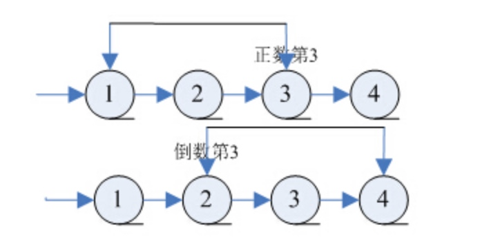

[牛客网](https://www.nowcoder.com/practice/529d3ae5a407492994ad2a246518148a?tpId=13&tqId=11167&rp=1&ru=%2Fta%2Fcoding-interviews&qru=%2Fta%2Fcoding-interviews%2Fquestion-ranking)


### 14.2 算法思路
参考： https://www.cnblogs.com/edisonchou/p/4769164.html
为了能够只遍历一次就能找到倒数第k个节点，可以定义两个指针：

  - 第一个指针从链表的头指针开始遍历向前走k-1，第二个指针保持不动；
  - 从第k步开始，第二个指针也开始从链表的头指针开始遍历；
  - 由于两个指针的距离保持在k-1，当第一个（走在前面的）指针到达链表的尾结点时，第二个指针（走在后面的）指针正好是倒数第k个结点。

　　下图展示了在有6个结点的链表上找倒数第3个结点的过程：
　　
　　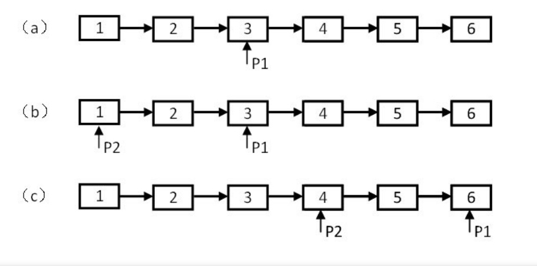


**注意点**：

 - 可能链长度小于k， 返回null
 - 链为空判断
 - k <= 0 判断。 如果是返回null

 **举一反三**：当我们用一个指针遍历链表不能解决问题的时候，可以尝试用两个指针来遍历链表。可以让其中一个指针遍历的速度快一些（比如一次在链表上走两步），或者让它先在链表上走若干步。

### 14.3 算法实现
```
/*
public class ListNode {
    int val;
    ListNode next = null;

    ListNode(int val) {
        this.val = val;
    }
}*/
public class Solution {
     public ListNode FindKthToTail(ListNode head, int k) {
        if (k <= 0 || head == null) {
            return null;
        }
             
        // 先走k-1步
        int count = 1;
        ListNode quick = head;
        while(quick.next != null && count < k) {
            quick = quick.next;
            count ++;
        }
        if (count < k) {
            return null;
        }
         
        // 两指针一起移动 
        ListNode slow = head;
        while(quick.next != null ) {
            quick = quick.next;
            slow = slow.next;
        }
        return slow;
    }
}
```

## 15. 反转链表
### 15.1 算法描述
输入一个链表，反转链表后，输出链表的所有元素。

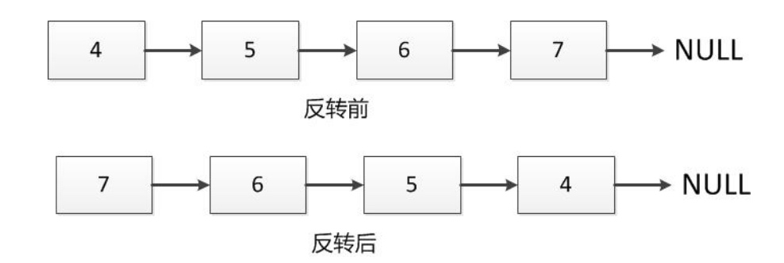

- [Edison Zhou](http://www.cnblogs.com/edisonchou/p/4769537.html)
- [牛客网](https://www.nowcoder.com/practice/75e878df47f24fdc9dc3e400ec6058ca?tpId=13&tqId=11168&rp=1&ru=%2Fta%2Fcoding-interviews&qru=%2Fta%2Fcoding-interviews%2Fquestion-ranking)

### 15.2 算法思路
采用头插入法， 定义3个指针，分别指向当前遍历到的结点cur、后一个结点next、nHead新链表的头结点。
 
 1. 用next记录cur的后一个节点，用于后面遍历。
 2. 插入到新表的头部：将cur.next = nHead；  nHead = cur
 4. 继续处理后续节点：cur = next；
 
### 15.3 算法实现
```
/*
public class ListNode {
    int val;
    ListNode next = null;

    ListNode(int val) {
        this.val = val;
    }
}*/
public class Solution {
    public ListNode ReverseList(ListNode head) {
        if (head == null) return null;
        
        ListNode cur = head;
        ListNode next = cur.next;
        head.next = null;
        ListNode nHead = head;
        
        while(next != null) {
            cur = next;
            next = cur.next;
            cur.next = nHead;
            nHead = cur;
        }
       return nHead;     
    }
}
```

## 16. 合并两个排序的链表
### 16.1 算法描述
输入两个单调递增的链表，输出两个链表合成后的链表，当然我们需要合成后的链表满足单调不减规则。


- [牛客网](https://www.nowcoder.com/practice/d8b6b4358f774294a89de2a6ac4d9337?tpId=13&tqId=11169&rp=1&ru=%2Fta%2Fcoding-interviews&qru=%2Fta%2Fcoding-interviews%2Fquestion-ranking)
- [Edison Zhou](http://www.cnblogs.com/edisonchou/p/4771515.html)

### 16.2 算法思路
Step1.定义一个指向新链表的指针，暂且让它指向NULL；

Step2.比较两个链表的头结点，让较小的头结点作为新链表的头结点；

Step3.递归比较两个链表的其余节点，让较小的节点作为上一个新节点的后一个节点；

### 16.3 算法实现
```
/*
public class ListNode {
    int val;
    ListNode next = null;

    ListNode(int val) {
        this.val = val;
    }
}*/
public class Solution {
    public ListNode Merge(ListNode list1, ListNode list2) {
        if (list1 == null) 
            return list2;
        if (list2 == null)
            return list1;
       
        ListNode head;
        if (list1.val < list2.val) {
            head = list1;
            head.next = Merge(list1.next, list2);
        } else {
            head = list2;
            head.next = Merge(list1, list2.next);
        }
        return head;
    }
}
```

## 17. 树的子结构
### 17.1 算法描述
输入两棵二叉树A，B，判断B是不是A的子结构。（ps：我们约定空树不是任意一个树的子结构）


- [牛客网](https://www.nowcoder.com/practice/6e196c44c7004d15b1610b9afca8bd88?tpId=13&tqId=11170&rp=1&ru=%2Fta%2Fcoding-interviews&qru=%2Fta%2Fcoding-interviews%2Fquestion-ranking)
- [Edison Zhou](http://www.cnblogs.com/edisonchou/p/4771939.html)

### 17.2 算法思想
要查找树A中是否存在和树B结构一样的子树，我们可以分成两步：

 - Step1.在树A中找到和B的根结点的值一样的结点R；
 - Step2.判断树A中以R为根结点的子树是不是包含和树B一样的结构。

很明显，这是一个递归的过程。

### 17.3 算法实现
```
/**
public class TreeNode {
    int val = 0;
    TreeNode left = null;
    TreeNode right = null;
    public TreeNode(int val) {
        this.val = val;
    }
}
*/
public class Solution {
    public boolean HasSubtree(TreeNode root,TreeNode subRoot) {
         if (root == null || subRoot == null) {
             return false;
         }
        
         boolean flag = false; // 关键，因为不是二叉搜索树，树中数据无规律，可能存在其左右孩子节点中
        if (root.val == subRoot.val) {
            flag = isSubTree(root, subRoot);
        }
        if (!flag) {
            flag = HasSubtree(root.left, subRoot);
        } 
        if (!flag) {
            flag = HasSubtree(root.right, subRoot);
        }
        return flag;
    }
    
    private boolean isSubTree(TreeNode root, TreeNode subRoot) {
        if (subRoot == null) {
            return true;
        }
        if (root == null) {
            return false;
        }
        
        if (root.val != subRoot.val) {
            return false;
        }
        return isSubTree(root.left, subRoot.left) && isSubTree(root.right, subRoot.right);
    }
}
```

## 18. 二叉树的镜像
### 18.1 算法描述
操作给定的二叉树，将其变换为源二叉树的镜像。
 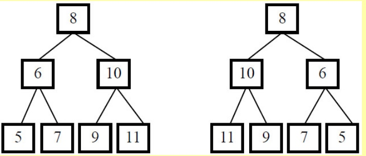
 
 - [牛客网](https://www.nowcoder.com/practice/564f4c26aa584921bc75623e48ca3011?tpId=13&tqId=11171&rp=1&ru=%2Fta%2Fcoding-interviews&qru=%2Fta%2Fcoding-interviews%2Fquestion-ranking)
 - [Edison Zhou](http://www.cnblogs.com/edisonchou/p/4774626.html)   
 
### 18.2 算法思路	  

- Step1.**先序遍历**原二叉树的每个节点，如果遍历到的结点有子结点，就交换它的两个子结点。或者按照**后序遍历**原二叉树的每个节点，先对它的每个结点做镜像变化，然后交互它的两个子结点。
- Step2.递归遍历每个节点的子节点，同样，如果遍历到的子节点有子节点，就交换它的两个子节点。

当交换完所有非叶子结点的左右子结点之后，就得到了树的镜像。下图展示了求二叉树的镜像的过程：


### 18.3 算法实现
```
/**
public class TreeNode {
    int val = 0;
    TreeNode left = null;
    TreeNode right = null;
    public TreeNode(int val) {
        this.val = val;

    }
}
*/
public class Solution {
    public void Mirror(TreeNode root) {
        if (root == null) return;
        
        TreeNode temp = root.left;
        root.left = root.right;
        root.right = temp;
        
        Mirror(root.left);
        Mirror(root.right);
    }
}
```

## 19. 顺时针打印矩阵---看书
### 19.1 算法描述
输入一个矩阵，按照从外向里以顺时针的顺序依次打印出每一个数字，例如，如果输入如下矩阵： 1 2 3 4 5 6 7 8 9 10 11 12 13 14 15 16 则依次打印出数字1,2,3,4,8,12,16,15,14,13,9,5,6,7,11,10.


### 19.2 算法思想

### 19.3 算法实现
```
import java.util.ArrayList;
public class Solution {
    public ArrayList<Integer> printMatrix(int [][] matrix) {
       ArrayList<Integer> result = new ArrayList<Integer>();
       if (null == matrix || matrix.length == 0 || matrix[0].length == 0) {
           return result;
       }
        int row = 0, col = 0;
        int min = Math.min(matrix.length, matrix[0].length);
        for (int level = 0; 2 * level < min; level ++) {
            int rowEnd = matrix.length - 1 - level;
            int colEnd = matrix[0].length - 1- level;
            // 上行
            for (int i = level; i <= colEnd; i++) {
                result.add(matrix[level][i]);
            }
            
            // 右列
            if (level < rowEnd) {
                for (int i = level + 1; i <= rowEnd; i++) {
                    result.add(matrix[i][colEnd]);
                }
            }
            
            // 下行
            if (level < rowEnd && level < colEnd) {
                for (int i = colEnd - 1; i >= level; i--) {
                    result.add(matrix[rowEnd][i]);
                }
            }
            
            // 左列
            if (level + 1 < rowEnd && level < colEnd) {
                 for (int i = rowEnd - 1; i > level; i--) {
                    result.add(matrix[i][level]);
                }
            }
        }
       return result;
    }
}
```

## 20. 包含min函数的栈
### 20.1 算法描述
定义栈的数据结构，请在该类型中实现一个能够得到栈最小元素的min函数。

### 20.2 算法思路
用一个辅助栈，栈顶元素记录当前压如栈的最小元素。 每次入栈的时候都需要将最小值压入辅助栈。只需要判断当前值和辅助栈的栈顶元素，如果小于辅助栈顶元素，则将当前元素压入辅助栈中；否则用压入一个一样的栈顶元素。下图展示了栈内压入3、4、2、1之后接连两次弹出栈顶数字再压入0时，数据栈、辅助栈和最小值的状态。

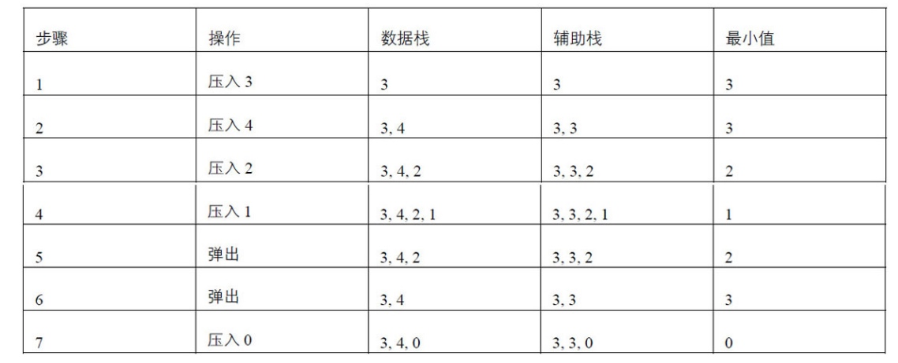

### 20.3 算法实现
```
import java.util.Stack;
public class Solution {
    Stack<Integer> stack = new Stack<Integer>();
    Stack<Integer> minStack = new Stack<Integer>();
    public void push(int node) {
        stack.push(node);
        if (minStack.isEmpty()) {
            minStack.push(node);
        } else if (node < min()) {
            minStack.push(node);
        } else {
            minStack.push(min());
        }
    }
    
    public void pop() {
        stack.pop();
        minStack.pop();
    }
    
    public int top() {
        return stack.peek();
    }
    
    public int min() {
        return minStack.peek(); // 查看
    }
}
```


## 21. 栈的压入、弹出序列
### 21.1 算法描述
输入两个整数序列，第一个序列表示栈的压入顺序，请判断第二个序列是否为该栈的弹出顺序。假设压入栈的所有数字均不相等。例如序列1,2,3,4,5是某栈的压入顺序，序列4，5,3,2,1是该压栈序列对应的一个弹出序列，但4,3,5,1,2就不可能是该压栈序列的弹出序列。（注意：这两个序列的长度是相等的）

[牛客网](https://www.nowcoder.com/practice/d77d11405cc7470d82554cb392585106?tpId=13&tqId=11174&rp=1&ru=/ta/coding-interviews&qru=/ta/coding-interviews/question-ranking)
### 21.2 算法思路
利用一个栈，模拟栈的压入和弹出操作：

 1. 遍历压入序列，每次向栈中压入一个元素。
 2. 每次压入元素后，判断栈顶元素和弹出序列指向的元素是否一致，是则弹出，并指向下一个弹出序列元素。直到栈为空或两元素不一样。
 3. 循环以上过程，直到所有的元素完成入栈操作
 4. 最后判断栈内元素是否为空，如果是则返回true
 
### 21.3 算法实现
```
import java.util.ArrayList;
import java.util.Stack;
 
public class Solution {
    public boolean IsPopOrder(int [] pushA,int [] popA) {
          if (null == pushA && null ==  popA) {
              return true;
          } else if (null == pushA || null == popA) {
              return false;
          } else if (pushA.length != popA.length) {
              return false;
          }
         Stack<Integer> stack = new Stack<Integer>();
          int idx = 0;
          for (int a: pushA) {
              stack.push(a);
              while(!stack.isEmpty() && stack.peek() == popA[idx]) { // 需要判断非空
                  stack.pop();
                  idx++;
              }
          }
        return stack.isEmpty();
    }
}
```

## 22. 从上往下打印二叉树
### 22.1 算法描述
从上往下打印出二叉树的每个节点，同层节点从左至右打印。

### 22.2 算法思路
属于典型的树层次遍历。 需要引入队列：

 1. 首先将根节点存入队列中
 2. 从队列中取出树节点，并遍历。
 3. 如果树节点存在左孩子，则存入队列中；
 4. 如果存在右孩子节点，存入队列中。
 5. 循环以上步骤，直到队列元素都遍历完成。

### 22.3 算法实现
```
import java.util.ArrayList;
import java.util.Queue;
import java.util.LinkedList;

/**
public class TreeNode {
    int val = 0;
    TreeNode left = null;
    TreeNode right = null;

    public TreeNode(int val) {
        this.val = val;

    }

}
*/
public class Solution {
    public ArrayList<Integer> PrintFromTopToBottom(TreeNode root) {
        ArrayList<Integer> result = new ArrayList<Integer>();
        if (root == null) {
            return result;
        }
        Queue<TreeNode> queue = new LinkedList<TreeNode>(); // LinkedList
        queue.offer(root); // offer
        while(!queue.isEmpty()) {
            TreeNode node = queue.poll(); // 是poll 不是take/pop
            result.add(node.val);
            if (node.left != null)
                queue.offer(node.left);
            if (node.right != null) 
                 queue.offer(node.right);
        }
        return result;
    }
}
```

## 23. 二叉搜索树的后序遍历序列
### 23.1 算法描述
输入一个整数数组，判断该数组是不是某二叉搜索树的后序遍历的结果。如果是则输出Yes,否则输出No。假设输入的数组的任意两个数字都互不相同。

### 23.2 算法思路
二叉搜索树后序遍历的特点是 先做孩子、右孩子再根节点。并且左孩子小于根节点、右孩子大于根节点。 

 - 先序列的最后一个节点作为根节点，然后从头遍历，直到第一个大于根节点的值作为右结点起始位置。
 - 遍历右节点的所有元素是否都大于根节点，如果不是则返回false, 否则对左右节点继续按照这个方式进行判断。

### 23.3 算法实现
```
public class Solution {
    public boolean VerifySquenceOfBST(int [] sequence) {
        if (sequence == null || sequence.length == 0) {
            return false;
        }
        return isSquenceOfBST(sequence, 0, sequence.length - 1);
    }
    
    private boolean isSquenceOfBST(int[] seq, int start, int end) {
        if (end <= start ) {
            return true;
        }
        
        int root = seq[end];
        int rightIdx = start;
        for (rightIdx = start; rightIdx < end; rightIdx ++) {
            if (seq[rightIdx] > root) break;
        }
        
        // 检查
        for (int i = rightIdx; i < end; i++) {
            if(seq[i] < root) {
                return false;
            }
        }
        boolean left = isSquenceOfBST(seq, start, rightIdx -1);
        boolean right = isSquenceOfBST(seq, rightIdx + 1, end -1);
        return  left && right; 
    }
}
```

## 24. 二叉树中和为某一值的路径
### 24.1 算法描述
输入一颗二叉树和一个整数，打印出二叉树中结点值的和为输入整数的所有路径。路径定义为从树的根结点开始往下一直到叶结点所经过的结点形成一条路径。

[牛客网](https://www.nowcoder.com/practice/b736e784e3e34731af99065031301bca?tpId=13&tqId=11177&rp=1&ru=%2Fta%2Fcoding-interviews&qru=%2Fta%2Fcoding-interviews%2Fquestion-ranking)

### 24.2 算法思路
用一个栈存储当前遍历的路径，用sum变量记录当前的路径之和。

 1. 遍历节点时，先入栈。 并将sum加上当前节点的值
 2. 如果sum加上当前节点的值等于指定整数，则将栈中的数值打印，并离开。否则对左右节点按相同逻辑处理。
 3. 离开节点时，出栈。sum减去节点值。

注意：路径之和必须是到叶子节点。如果是内部节点之和已经到target, 则不能记录进去。

### 24.3 算法实现
```
import java.util.ArrayList;
import java.util.Stack;
/**
public class TreeNode {
    int val = 0;
    TreeNode left = null;
    TreeNode right = null;

    public TreeNode(int val) {
        this.val = val;

    }

}
*/
public class Solution {
    public ArrayList<ArrayList<Integer>> FindPath(TreeNode root,int target) {
         ArrayList<ArrayList<Integer>> result = new  ArrayList<ArrayList<Integer>> ();
        if (root == null) {
            return result;
        }
        Stack<Integer> stack = new Stack<Integer>();
        findPath(root, 0, target, stack, result);
        return result;
    }
    
    private void findPath(TreeNode root, int sum, int target, Stack<Integer> stack, 
                          ArrayList<ArrayList<Integer>> result) {
        if (root == null) {
            return;
        }
        stack.push(root.val);
        sum += root.val;
        if (sum == target && root.left == null && root.right == null) { 
            // 必须加上root.left == null && root.right == null
            ArrayList<Integer> path = new ArrayList<Integer>();
            for (Integer val : stack) {
                path.add(val);
            }
            result.add(path);
        } else {
            findPath(root.left, sum, target, stack, result);
              findPath(root.right, sum, target, stack, result);
        }
        stack.pop();
        sum -= root.val;
    }
}
```

## 25. 复杂链表的复制
### 25.1 算法描述
输入一个复杂链表（每个节点中有节点值，以及两个指针，一个指向下一个节点，另一个特殊指针指向任意一个节点），返回结果为复制后复杂链表的head。（注意，输出结果中请不要返回参数中的节点引用，否则判题程序会直接返回空）

[牛客网](https://www.nowcoder.com/practice/f836b2c43afc4b35ad6adc41ec941dba?tpId=13&tqId=11178&rp=1&ru=%2Fta%2Fcoding-interviews&qru=%2Fta%2Fcoding-interviews%2Fquestion-ranking)

复制前：


复制后：
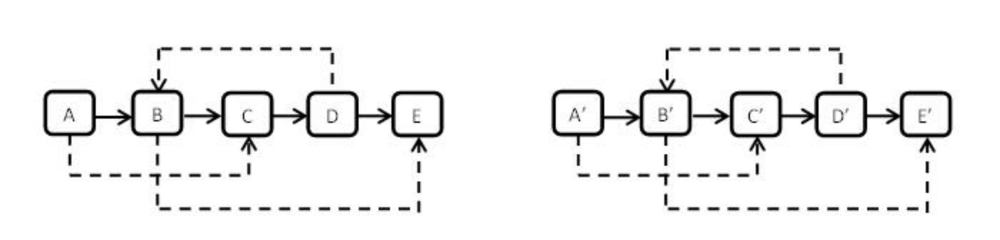


### 25.2 算法思路
1. 遍历一遍原始链表，复制结点N对应的N’，将其插入到结点N的后面，如下图所示

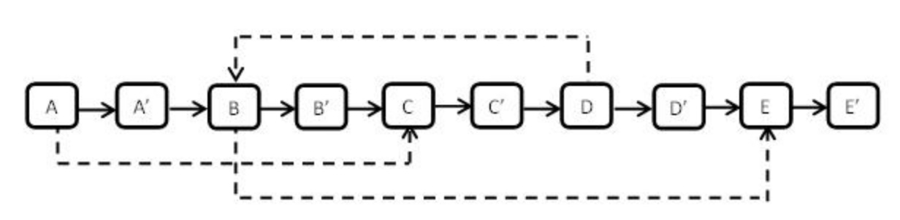

2. 确定每个随机指针的指向，只需遍历一遍链表即可确定每个结点的随机指针的指向，得到如下图结构：

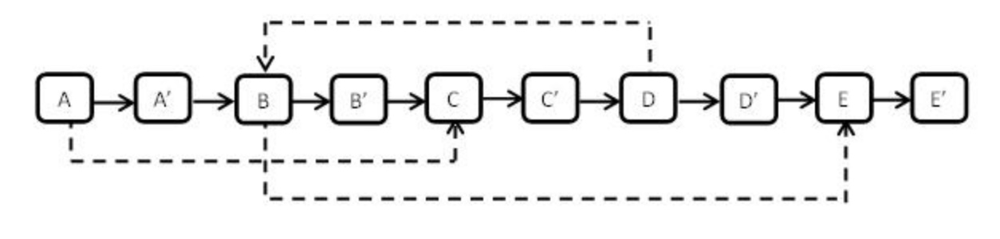


3. 再次遍历一遍，将原始链表和复制链表分开，奇数为原始链表，偶数为复制链表，得到如下图型
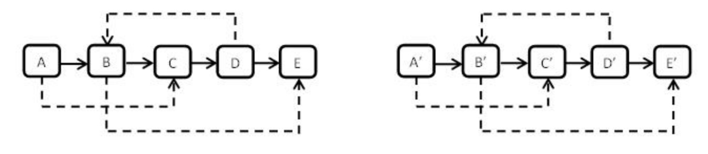

### 25.3 算法实现
```
/*
public class RandomListNode {
    int label;
    RandomListNode next = null;
    RandomListNode random = null;
 
    RandomListNode(int label) {
        this.label = label;
    }
}
*/
public class Solution {
    public RandomListNode Clone(RandomListNode pHead)
    {
        if(null == pHead) {
            return null;
        }
        cloneNodes(pHead);
        connectRandom(pHead);
        return reconnection(pHead);
    }
     
    public void cloneNodes(RandomListNode pHead) {
        RandomListNode node = pHead;
        while(node != null) {
            RandomListNode clone = new RandomListNode(node.label);
            RandomListNode temp = node.next;
            clone.next = temp;
            node.next = clone;
            node = temp;
        }
    }
     
    public void connectRandom(RandomListNode pHead) {
        RandomListNode node = pHead;
        while(null != node) {
            RandomListNode clone = node.next;
            if (node.random != null) {
                clone.random = node.random.next;
            }
            node = clone.next;
        }
    }
     
    public RandomListNode reconnection(RandomListNode pHead) {
        RandomListNode node = pHead;
        RandomListNode cloneHead = pHead.next, cloneNode = pHead.next;
        node.next = cloneNode.next;
        node = node.next;
        while(node != null) {
            cloneNode.next = node.next;
            cloneNode = cloneNode.next;
            node.next = cloneNode.next;
            node = cloneNode.next;
        }
        return cloneHead;
    }
}
```

## 26. 二叉搜索树与双向链表
### 26.1 算法描述
输入一棵二叉搜索树，将该二叉搜索树转换成一个排序的双向链表。要求不能创建任何新的结点，只能调整树中结点指针的指向。

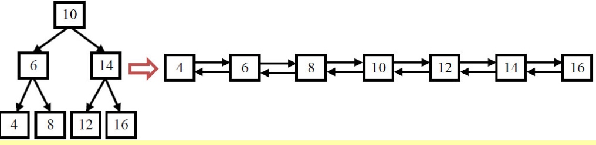

### 26.2 算法思路
我们可以中序遍历树中的每一个结点，这是因为中序遍历算法的特点是按照从小到大的顺序遍历二叉树的每一个结点。

当我们遍历转换到根结点（值为10的结点）时，它的左子树已经转换成一个排序的链表了，并且处在链表中的最后一个结点是当前值最大的结点。我们把值为8的结点和根结点链接起来，此时链表中的最后一个结点就是10了。接着我们去遍历转换右子树，并把根结点和右子树中最小的结点链接起来。


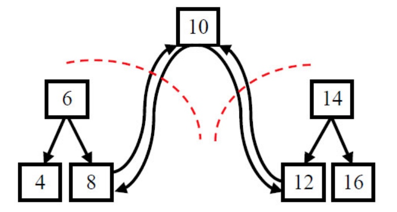

### 26.3 算法实现
```
/**
public class TreeNode {
    int val = 0;
    TreeNode left = null;
    TreeNode right = null;
 
    public TreeNode(int val) {
        this.val = val;
    }
}
*/
public class Solution {
    public TreeNode Convert(TreeNode pRootOfTree) {
        TreeNode lastNode = null;
        lastNode = doConvert(pRootOfTree, lastNode);
        while (lastNode != null && lastNode.left != null) {
            lastNode = lastNode.left;
        }
        return lastNode;
    }
    // 返回lastNode
    public TreeNode doConvert(TreeNode node, TreeNode lastNode) {
        if (null == node) {
            return null;
        }
        if (node.left != null) {
            lastNode = doConvert(node.left, lastNode);
        }
        if (lastNode != null) {
            lastNode.right = node;
        }
        node.left = lastNode;
        lastNode = node;
        if (node.right != null) {
            lastNode = doConvert(node.right, lastNode);
        }
        return lastNode;
    }
}
```

## 27. 字符串的排列
### 27.1 算法描述
输入一个字符串,按字典序打印出该字符串中字符的所有排列。例如输入字符串abc,则打印出由字符a,b,c所能排列出来的所有字符串abc,acb,bac,bca,cab和cba。

[牛客网](https://www.nowcoder.com/practice/fe6b651b66ae47d7acce78ffdd9a96c7?tpId=13&tqId=11180&tPage=2&rp=2&ru=%2Fta%2Fcoding-interviews&qru=%2Fta%2Fcoding-interviews%2Fquestion-ranking)
### 27.2 算法思想
解题思路：本题求整个字符串的全排列可以看做两步：

 1. 首先求出所有可能出现在第一位置的字母，即begin与后面所有与它不同的字母进行交换
 2. 固定第一个字母，求后面字母的全排列，即递归此时begin = begin+1

### 27.3 算法实现
```
import java.util.ArrayList;
import java.util.Collections;
 
public class Solution {
    public ArrayList<String> Permutation(String str) {
        ArrayList<String>  list = new ArrayList<String>();
        if (null == str || str.length() == 0) {
            return list;
        }
        doPermutation(str.toCharArray(), 0, list);
        Collections.sort(list);
        return list;  
    }
     
    public void doPermutation(char[] str, int idx, ArrayList<String>  list) {
        if (idx >= str.length - 1) {
            list.add(new String(str));
            return;
        }
        for (int i = idx; i < str.length; i++) {
            if(i != idx && str[i] == str[idx] )
                continue;
            swap(str, i, idx);
            doPermutation(str, idx+1, list);
            swap(str, i, idx);
        }
    }
    public void swap(char[] str, int i, int j) {
        char temp = str[i];
        str[i] = str[j];
        str[j] = temp;
    }
}
```

## 28. 数组中出现次数超过一半的数字
### 28.1 算法描述
数组中有一个数字出现的次数超过数组长度的一半，请找出这个数字。例如输入一个长度为9的数组{1,2,3,2,2,2,5,4,2}。由于数字2在数组中出现了5次，超过数组长度的一半，因此输出2。如果不存在则输出0。

[牛客网](https://www.nowcoder.com/practice/e8a1b01a2df14cb2b228b30ee6a92163?tpId=13&tqId=11181&tPage=2&rp=2&ru=%2Fta%2Fcoding-interviews&qru=%2Fta%2Fcoding-interviews%2Fquestion-ranking)

### 28.2 算法思路

1. 采用快排，得到中间位置元素。 时间复杂度为 O(nlogN)
2. 遍历数组，利用hashmap记录每个数字以及数字出现的次数。时间复杂度为O（n）
3. 出现的次数超过数组长度的一半，表明这个数字出现的次数比其他数出现的次数的总和还多。我们在遍历的数组的时候可以用两个值来记录，一个用来记录可能为目标值findNum， 一个记录findNum出现的次数与其他数之间的差值。我们把数组的第一个数arr[0]作为结果保存findNum跟下一个数字比较，count记为1。
  - 如果下一个数字跟之前保存的数字findNum相同count+1,
  - 如果跟之前保存的数字findNum不同，则count-1。
  - 如果次数为0，我们需要保存它的下一个数字，并且将次数设为1。
  - 因为要找的数字出现的次数超过数组长度长度的一半，所以最后一次设为1的数字就是我们要找的数字。

### 28.3 算法实现
#### map方式
```
public class Solution {
    public int MoreThanHalfNum_Solution(int [] array) {
        if(array==null||array.length==0){
            return 0;
        }
        HashMap<Integer,Integer>  map = new HashMap<Integer,Integer>();
        for(int i=0;i<array.length;i++){
            if(map.get(array[i])!=null){
                map.put(array[i],map.get(array[i])+1);
            }else{
                map.put(array[i],1);
            }
            if(map.get(array[i])>array.length/2){
                return array[i];
            }
        }
        return 0;  
    }
}
```

#### 方案3
```
public class Solution {
    public int MoreThanHalfNum_Solution(int [] array) {
        if(array == null || array.length == 0 ) {
            return 0;
        }
        int count = 1;
        int findNum  = array[0];
        for (int i = 1; i < array.length; i++) {
            if (array[i] == findNum) {
                count++;
            } else {
                count --;
                if (count == 0) {
                    count = 1;
                    findNum = array[i];
                }
            }
        }
        
        // 注意这边还需要检查一次
        count =0;
        for (int a : array) {
            if (a == findNum) {
                count ++;
            }
        }
        if (count > array.length/ 2) {
            return findNum;
        }
        return 0;
    }
}
```

## 29. 最小的K个数
### 29.1 算法描述
输入n个整数，找出其中最小的K个数。例如输入4,5,1,6,2,7,3,8这8个数字，则最小的4个数字是1,2,3,4,。

[牛客网](https://www.nowcoder.com/practice/6a296eb82cf844ca8539b57c23e6e9bf?tpId=13&tqId=11182&tPage=2&rp=2&ru=%2Fta%2Fcoding-interviews&qru=%2Fta%2Fcoding-interviews%2Fquestion-ranking)

### 29.2 算法思路
1. 思路1：利用快排的思想，寻找第k个位置上正确的数，k位置前面的数即是比k位置小的数组，k后面的数即是比k位置元素大的数组。

2. 思路2：利用堆排序，特别适用于海量数据中寻找最大或者最小的k个数字。即构建一个大堆容器，初始化大小为k，变量初始数，如初始数组大小小于等于k直接返回，如果大于k，则选择数组的前k个元素，填充堆，然后调整为最大堆。调整完之后，继续从初始数组中拿出一个元素，如果该元素比大堆的堆顶小，则替换堆顶，继续调整为最大堆，如果大于等于堆顶则直接丢弃，不作调整。

### 29.3 算法实现
#### 思路1实现
```
public ArrayList<Integer> GetLeastNumbers_Solution(int [] input, int k) {
   ArrayList<Integer> res = new ArrayList<Integer>();
   if (input == null || input.length == 0 || input.length < k || k <= 0) {
       return res;
   }

   int start  = 0;
   int end = input.length-1;
   int index = partition(input, start, end);
   // 一直循环知道找到第k个位置正确的数。
   while (index != k - 1) {
       if (index > k - 1) {
           end = index-1;
           index = partition(input, start, end);
       } else {
           start = index+1;
           index = partition(input, start, end);
       }

   }

   for (int i = 0; i < k; i++) {
       res.add(input[i]);
   }

   return res;
}

private int partition(int input[], int start, int end) {
   int tmp = input[start];
   while (start < end) {
       while (start < end && input[end] >= tmp) {
           end--;
       }
       input[start] = input[end];
       while (start < end && tmp >= input[start]) {
           start++;
       }
       input[end] = input[start];
   }
   input[start] = tmp;
   return start;
}
```

#### 思路2实现
```
import java.util.ArrayList;
public class Solution {
     public ArrayList<Integer> GetLeastNumbers_Solution(int[] input, int k) {
        ArrayList<Integer> result = new ArrayList<Integer>();
        if(input == null || input.length == 0 || input.length < k || k <= 0)//k的范围要注意
            return result;
        int[] maxPQ = new int[k+1];
        for(int i = 0; i < k ; i++)
            maxPQ[i+1] = input[i];
           
        for(int i = k/2; i>=1; i--)
            sink(maxPQ,k,i);
          
        for(int i=k;i<input.length;i++){
            if(input[i] < maxPQ[1]){
                maxPQ[1] = input[i];
                sink(maxPQ,k,1);
            }
        }
        for(int i=1;i<=k;i++)
            result.add(maxPQ[i]);
        return result;
    }
    private void sink(int[] maxPQ,int N,int k){
        while(k*2 <= N){//这边是等号
            int j = k*2;
            if(j< N && maxPQ[j+1] > maxPQ[j]) j++;
            if(maxPQ[j] < maxPQ[k]) break;
            swap(maxPQ,k,j);
            k = j;
        }
    }
    private void swap(int[] array,int i,int j){
        int temp = array[i];
        array[i] = array[j];
        array[j] = temp;
    }
}
```


