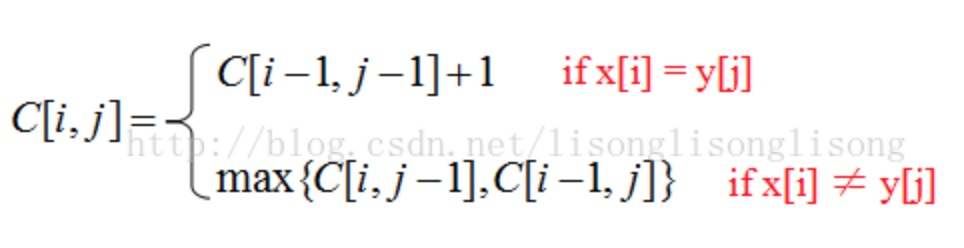
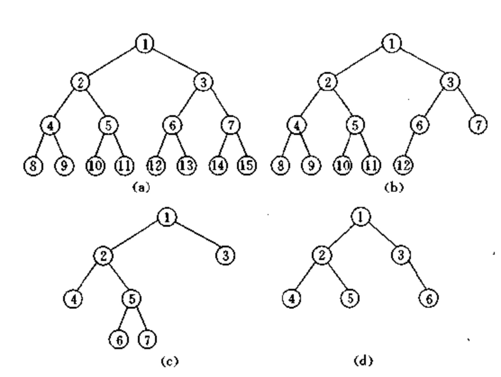
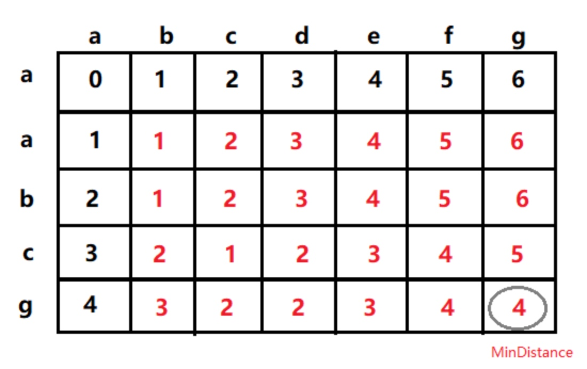

# 面试经典算法题
## 1. 最长连续序列
### 1.1 算法描述
[笔试面试算法经典--最长连续序列](https://blog.csdn.net/u013309870/article/details/70242770)

找出无序数组中的最长连续序列的长度：例如数组[1, 23, 2 , 300, 3 , 9 ,4 , 5 , 90 ]，最长连续序列为：1，2，3，4，5，因此返回长度为5。

### 1.2 算法思路和实现
#### 解法一
先对数组进行排序，然后从前向后遍历排序后的数组并且记录最长连续子数组长度。

时间复杂度O（ nlogn） 空间复杂度O（1）

```
public int longestContinuouSequence(int[] array) {
   if (array == null || array.length == 0) {
       return 0;
   }
   quickSort(array, 0, array.length - 1);

   int maxLen = 1;
   int curLen = 1;
   for (int i = 1; i < array.length; i++) {
       if (array[i] != array[i - 1] + 1) {
           curLen = 1;
       } else {
           curLen++;
       }

       if (curLen > maxLen) {
           maxLen = curLen;
       }
   }
   return maxLen;
}
```

#### 解法二--推荐

使用 hashmap 来保存数组中已经遍历过的元素，key对应元素的值，value表示该元素所在的连续子数组的长度。当遍历到数组的一个元素时有以下几种情况： 

1. 如果hashmap中存在此元素，则遍历下一个元素。 
2. 如果hashmap不存在元素，则看该元素的前后元素是否出现在hashmap中，如果存在则取出前后元素的长度+1。将当前元素存入，并更新改序列的边界值，为最新的长度。

```
public int longestConsecutive(int[] nums) {
   if (null == nums || nums.length == 0) {
       return 0;
   }
   // 某个值附近有连续的几个数字
   Map<Integer, Integer> map = new HashMap<>();
   int len = 0;
   for (int i = 0; i < nums.length; i++) {
       if (map.containsKey(nums[i])) {
           continue; // 已经存在了
       }
       // 左边数连续大小
       int left = map.containsKey(nums[i] - 1) ? map.get(nums[i] - 1) : 0;
       // 右边的数连续的大小
       int right = map.containsKey(nums[i] + 1) ? map.get(nums[i] + 1) : 0;
       int sum = left + right + 1;

       len = Math.max(len, sum);
       // left 到right之间的值肯定是出现过了，所以出现连续的值应该是在左右两边，只要更新左右两边边界的值就可以
       map.put(nums[i] - left, sum);  // 设置边界数值的值
       map.put(nums[i] + right, sum);
   }
   return len;
}
```

### 1.3 拓展
假如要求找到的最大子序列在原来数组中的相对位置不变。 比如[1, 4, 2, 3]   最长有序序列是 1、2、3 不能把4算入进来。这样应该怎么处理呢？ 演变为**最长递增子序列**

## 2.最长递增子序列的三种算法
给定一个长度为N的数组，找出一个最长的**单调自增子序列（不一定连续，但是顺序不能乱）**。例如：给定一个长度为6的数组A{5，4, 6， 7， 1， 2， 8}，则其最长的单调递增子序列为{5，6，7，8}，长度为4.

参考:

- [最长递增子序列的三种算法](https://blog.csdn.net/u013178472/article/details/54926531)
- [牛客网-题目地址](https://www.nowcoder.com/questionTerminal/585d46a1447b4064b749f08c2ab9ce66)

### 解法1：最长公共子序列法


### 解法2：动态规划法（时间复杂度O(N^2))


### 解法3：O(NlgN）算法--推荐
假设存在一个序列d[1..9] ={ 2，1 ，5 ，3 ，6，4， 8 ，9， 7}，可以看出来它的LIS长度为5。
下面一步一步试着找出它。
我们定义一个序列B，然后令 i = 1 to 9 逐个考察这个序列。
此外，我们用一个变量Len来记录现在最长算到多少了

 - 首先，把d[1]有序地放到B里，令B[1] = 2，就是说当只有1一个数字2的时候，长度为1的LIS的最小末尾是2。这时Len=1
 - 然后，把d[2]有序地放到B里，令B[1] = 1，就是说长度为1的LIS的最小末尾是1，d[1]=2已经没用了，很容易理解吧。这时Len=1
- 接着，d[3] = 5，d[3]>B[1]，所以令B[1+1]=B[2]=d[3]=5，就是说长度为2的LIS的最小末尾是5，很容易理解吧。这时候B[1..2] = 1, 5，Len＝2
- 再来，d[4] = 3，它正好加在1,5之间，放在1的位置显然不合适，因为1小于3，长度为1的LIS最小末尾应该是1，这样很容易推知，长度为2的LIS最小末尾是3，于是可以把5淘汰掉，这时候B[1..2] = 1, 3，Len = 2
- 继续，d[5] = 6，它在3后面，因为B[2] = 3, 而6在3后面，于是很容易可以推知B[3] = 6, 这时B[1..3] = 1, 3, 6，还是很容易理解吧？ Len = 3 了噢。
- 第6个, d[6] = 4，你看它在3和6之间，于是我们就可以把6替换掉，得到B[3] = 4。B[1..3] = 1, 3, 4， Len继续等于3
- 第7个, d[7] = 8，它很大，比4大，嗯。于是B[4] = 8。Len变成4了
- 第8个, d[8] = 9，得到B[5] = 9，嗯。Len继续增大，到5了。
- 最后一个, d[9] = 7，它在B[3] = 4和B[4] = 8之间，所以我们知道，最新的B[4] =7，B[1..5] = 1, 3, 4, 7, 9，Len = 5。

**注意，这个1,3,4,7,9不是LIS，它只是存储的对应长度LIS的最小末尾**。有了这个末尾，我们就可以一个一个地插入数据。虽然最后一个d[9] = 7更新进去对于这组数据没有什么意义，但是如果后面再出现两个数字 8 和 9，那么就可以把8更新到d[5], 9更新到d[6]，得出LIS的长度为6。

B[i] 表示所有长度为i递增子序列中，尾数(第i个值)最小的值。

```<java>
public int findLongest(int[] A) {
   // 记录某个长度中最小的后缀
   int[] B = new int[A.length];
   int end = 0;
   B[end] = A[0];
   for (int i = 1; i < A.length; i ++) {
       if (A[i] > B[end]) {
           B[++end] = A[i];
       } else {
           int idx = binarySearch(B, 0, end, A[i]);
           B[idx] = A[i];
       }
   }
   return end + 1;
}

private int binarySearch(int[] array, int start, int end, int target) {
   while (start < end) {
       int mid = start + (end - start) / 2;
       if (array[mid] < target) {
           start = mid + 1;
       } else if (array[mid] > target){
           end = mid;
       } else {
           return mid;
       }
   }
   return start;
}
```


## 3. 最长公共子序列（LCS）
### 3.1 算法描述
公共子串是指连续的公有字符串，公共子序列是指两个字符串都任意删除0个或多个字符后得到的公有字符串，子序列可以是不连续的。
举个例子吧，有两个字符串，串A为“1 2 3 4 5 6 7”，串B 为“1 3 4 5 8 7”，很明显，A和B的公共子串为“3 4 5”，A和B的公共子序列可以是 “3 5”，或是“1 3 7”，等等。
 
最长公共子串：在两个字符串中找到一个最长的公共子串，要求子串在原串中是连续的。
最长公共子序列：在两个字符串中找到一个最长的公共子串，不要求子串在原串中是连续的。

### 3.2 算法思路

https://blog.csdn.net/dq_dm/article/details/45043689

解题思想就是DP，DP无外乎需要知道两个东西，一是状态是什么，二是状态之间的递推关系是什么。

状态C[i][j]表示str1取到第i个字符（包括i），str2取到第j个字符（包括j）时，最长公共子序列的长度。（i,j取值从1开始）
C[i][j] = 0 （i = 0或j = 0）



### 3.3 算法实现

```<java>
public static int getLCS(String str1, String str2) {
   int len1 = str1.length();
   int len2 = str2.length();

   // 记录状态
   int[][] vals = new int[len1 + 1][len2 + 1];

   for (int i = 0; i < len1; i++) {
       // 二维数组从[1][1]开始进行有效存储
       int fi = i + 1;
       for (int j = 0; j < len2; j++) {
           int fj = j + 1;
           //字符相同
           if (str1.charAt(i) == str2.charAt(j)) {
               // 满足第一种状况
               vals[fi][fj] = vals[fi - 1][fj - 1] + 1;
               //字符不相同
           } else if (str1.charAt(i) != str2.charAt(j)) {
               //满足第二种状况
               vals[fi][fj] = Math.max(vals[fi - 1][fj], vals[fi][fj - 1]);
           }
       }
   }
   return vals[len1][len2];
}
```

## 有环链表的第一个公共节点
这个问题其实是分为两部分的:

- 判断一个链表是不是有循环链存在。 
- 求循环链表的第一个公共节点


### 方法一：用HashSet来解决
空间复杂度比较高

```<java>
public ListNode EntryNodeOfLoop(ListNode pHead){
   HashSet<ListNode> hs = new HashSet<ListNode>();
   while(pHead != null){
       if(!hs.add(pHead))   // 如果包含了，那么这个就是入口结点
           return pHead;
       pHead = pHead.next;
   }
   return null;
}
```

### 计算循环


https://blog.csdn.net/kellen_f/article/details/79039597

## 两个链表求公共节点（可能会有循环）
寻找两链表的第一个交点，简便的做法是求出两链表长度差diff后，让长的链表先走diff步，然后依次比较两链表节点，若相同则返回。

但这一个思路的前提是：两个链表都不含环。


## 判断一棵二叉树是否为二叉排序树
<div align="center">  </div>

### 算法描述
给定一棵二叉树，如何判断一棵树是否是二叉排序树。

### 算法思路
#### 解法一---排序思路
最直接的方法，对树进行中序遍历，然后判断遍历结果是否为升序即可，如果为升序，表明是二叉搜索树，否则不是。

#### 解法二--中序遍历
根据二叉排序树的性质，在进行中序遍历的时候，当前结点的值总是大于前驱结点的值，需要在遍历时保存前驱结点的值，这样有利于进行判断，基于这样的思路来进行解题。

```<java>
/**
 * Definition for a binary tree node.
 * public class TreeNode {
 *     int val;
 *     TreeNode left;
 *     TreeNode right;
 *     TreeNode(int x) { val = x; }
 * }
 */
class Solution {
    private boolean flag = true;
    private TreeNode last = null; // 前驱
    
    public boolean isValidBST(TreeNode root) {
        if (root == null) {
            return true;
        }
        
        if (root.left != null && flag) 
            isValidBST(root.left);
        
        if (last != null && root.val <= last.val) { // 等于都不可以
            flag = false;
        }
    
        last = root;
        if (root.right != null && flag) 
            isValidBST(root.right);
        
        return flag;
    }
}
```


## 将字符串A变换为字符串B 所用的最少字符操作次数
解法参考： https://blog.csdn.net/her__0_0/article/details/72855784

### 问题描述
设A 和B 是2 个字符串。要用最少的字符操作将字符串A 转换为字符串B。 

这里所说的字符操作包括：

- (1)删除一个字符； 
- (2)插入一个字符； 
- (3)将一个字符改为另一个字符。 

将字符串A变换为字符串B 所用的最少字符操作次数也称为字符串A到B 的编辑距离，记为 d(A,B)。 
试设计一个有效算法，对任给的2 个字符串A和B，计算出它们的编辑距离d(A,B)。 


### 思路
 
使用动态规划算法 
开一个二维数组d[i][j]来记录a0-ai与b0-bj之间的编辑距离，要递推时，需要考虑对其中一个字符串的删除操作、插入操作和替换操作分别花费的开销，从中找出一个最小的开销即为所求。


首先给定第一行和第一列，然后，每个值d[i,j]这样计算：d[i][j] = min(d[i-1][j] +1, d[i][j-1]+1, d[i-1][j-1] + (s1[i] == s2[j]? 0:1)); 

最后一行，最后一列的那个值就是最小编辑距离 

例如要找出字符串“abcdefg”与“aabcg”之间的最小编辑距离。下图给出二维数组d[i][j]的变化情况。 

<div align="center">  </div>


#### 思考
- 为什么可以拆成子问题？

### 实现
```
public class StringChangeNums {

    public int minDistance(String A, String B) {
        if ((A == null && B == null) || (A.equals("") && B.equals(""))) {
            return 0;
        }
        if (A == null || A.equals("")) {
            return B.length();
        }
        if (B == null || B.equals("")) {
            return A.length();
        }

        int[][] dist = new int[A.length() + 1][B.length() + 1];

        // 初始化
        for (int i = 0; i < A.length(); i++) {
            dist[i][0] = i;
        }

        for (int i = 0; i < B.length(); i++) {
            dist[0][i] = i;
        }

        for (int i = 1; i < A.length() + 1; i++) {
            for (int j = 1; j < B.length() + 1; j++) {
                // dist[i-1][j-1] 是，看 i，j所在位置的值是否相等，如果相等直接不用改变，否则+1
                int cost = dist[i - 1][j - 1] + (A.charAt(i - 1) == B.charAt(j - 1) ? 0 : 1);
                // 删除针对字符串A，当前位置的值不要
                int del = dist[i - 1][j] + 1;
                // 插入新的值
                int insert = dist[i][j - 1] + 1;

                // 取最小值
                dist[i][j] = Math.min(del, insert);
                dist[i][j] = Math.min(dist[i][j], cost);
            }
        }
        return dist[A.length()][B.length()];
    }

    public static void main(String[] args) {
        StringChangeNums changeNums = new StringChangeNums();
        int ret = changeNums.minDistance("CA", "ABC");
        System.out.println(ret);
    }
}
```


