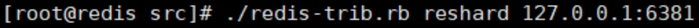

# Redis
### 特性细节
- **内存式**： Redis将键值存储在主存中，用于快速地读写访问。
- **复制**： Redis支持主从复制。数据读取在slave完成，而数据写入在 master 完成。复制提供可伸缩性和可用性。任何一个slave宕机，其他的slave还可以提供数据访问。
- **数据结构**： Redis不仅存储字符串，还支持列表，集合，哈希和有序集合。
- **虚拟内存**： Redis使用RAM作为内存式存储。但是，在内存不足的情况下，它使用虚拟内存来保存数据。
- **发布/订阅模型**： Redis支持创建发布和订阅通道，这样Redis客户端可以订阅任意的通道来进行数据消费，并且任何已订阅该通道的客户端可以发布数据。
- **数据持久性**： Redis将内存中的数据定期保存到文件系统中。当Redis节点故障时，数据可以从Redis数据文件恢复。

### 数据类型和对应命令
有五种基本数据类型：String、Hash(哈希)、List(列表)、Set(集合)、ZSet(有序集合)。

使用不同类型保存的好处：

1. 对各个类型做不同的优化，使用不同的对象存储。
2. 对各个类型可以做校验，防止用非法方式访问对象类型。比如Set、Hash直接使用GET获取是会报错的，要求你必须按照指定类型方式去获取数据。

#### String
特点：

- string类型是**二进制安全**的。意思是redis的string可以包含任何数据。比如jpg图片或者序列化的对象 。
- string类型是Redis最基本的数据类型，**一个键最大能存储512MB**。

对应的命令字： **SET**和**GET**

#### Hash（哈希）

#### List（列表）

特点：

- Redis 列表是简单的字符串列表，按照插入顺序排序。你可以添加一个元素到列表的头部（左边）或者尾部（右边）。 
- **列表最多可存储 232 - 1 元素 (4294967295, 每个列表可存储40多亿)**。


list使用的命令是 **lpush**和**lrange**.

#### Set（集合）

- 命令是**sadd**和**smembers**


## 分布式架构的5个要素
### 伸缩性
Redis通过添加节点提高集群的可用性和伸缩性。

进入集群内任意节点，使用cluster meeet命令即可使新节点加入到集群当中。新节点刚开始都是主节点状态，但是由于没有负责的槽，所以不能接受任何读写操作。对于新节点的后续操作一般有两种选择：

- 为它迁移槽和数据实现扩容。---提高伸缩性
- 作为其他主节点的从节点负责故障转移。---实现可用性

**redis-trib.rb**工具也实现了为现有集群添加新节点的命令，还实现了直接添加从节点的支持，对于上述的扩容操作，可以采用如下命令实现新节点的加入：

```
redis-trib.rb add-node 127.0.0.1:6387 127.0.0.1:6381
redis-trib.rb add-node 127.0.0.1:6388 127.0.0.1:6381
```


#### 迁移槽和数据
**reshard**是redis cluster另一核心功能，它通过迁移哈希槽来达到负载匀衡和可扩展目的。**rebalance**命令可以根据条件动态平衡各个master节点上的slots数目。

- 使用redis-trib.rb槽重分片命令

- 需要确认迁移的槽数量，输入2000个
- 输入6387的节点ID作为目标节点，目标节点只能指定一个
- 之后输入源节点的ID，这里分别输入6381、6382和6383三个节点ID最后用done表示结束
- 数据迁移之前会打印出所有的槽从源节点到目标节点的计划，确认计划无误后输入yes执行迁移工作，计划执行完成之后reshard命令自动退出。

#### reshard原理
reshard转移solt的核心部分则采用compute_reshard_table方法，compute_reshard_table方法主要用来智能计算每个目标节点需要迁移多少slot, 具体代码如下： 

```
# Given a list of source nodes return a "resharding plan"
# with what slots to move in order to move "numslots" slots to another
# instance.
def compute_reshard_table(sources,numslots)
   moved = []
   # Sort from bigger to smaller instance, for two reasons:
   # 1) If we take less slots than instances it is better to start
   #    getting from the biggest instances.
   # 2) We take one slot more from the first instance in the case of not
   #    perfect divisibility. Like we have 3 nodes and need to get 10
   #    slots, we take 4 from the first, and 3 from the rest. So the
   #    biggest is always the first.
   // 1) 通过slot个数对源节点进行排序，slot多的排在前面
   sources = sources.sort{|a,b| b.slots.length <=> a.slots.length}
   // 2) 计算源节点的slot总个数
   source_tot_slots = sources.inject(0) {|sum,source|
       sum+source.slots.length
   }
   // 3) 可以看到按照节点占slot总数的百分比来迁移slot，及slot个数越多的节点将被迁移更多。
   // 还可以看到slot节点最多的节点会为slot的最大整数
   sources.each_with_index{|s,i|
       # Every node will provide a number of slots proportional to the
       # slots it has assigned.
       n = (numslots.to_f/source_tot_slots*s.slots.length)
       if i == 0
           n = n.ceil
       else
           n = n.floor
       end
       // 4) 将slot的分派到节点的信息插入moved变量中
       s.slots.keys.sort[(0...n)].each{|slot|
           if moved.length < numslots
               moved << {:source => s, :slot => slot}
           end
       }
   }
   return moved
end

def show_reshard_table(table)
   table.each{|e|
       puts "    Moving slot #{e[:slot]} from #{e[:source].info[:name]}"
   }
end
```

执行compute_reshard_table方法，计算需要迁移的slot数量如何分配到源节点列表，采用的算法是按照节点负责slot数量由多到少排序，计算每个节点需要迁移的slot的方法为：迁移slot数量 * (该源节点负责的slot数量 / 源节点列表负责的slot总数)。具体步骤如下：

- 通过slot个数对源节点进行排序，slot多的排在前面。
- 计算源节点的slot总个数
- 可以看到按照节点占slot总数的百分比来迁移slot，及slot个数越多的节点将被迁移更多。还可以看到slot节点最多的节点会为slot的最大整数。
- 将slot的分派到节点的信息插入moved变量中


参考: 

- [Redis集群伸缩](https://www.cnblogs.com/skyer5217/p/8994390.html)
- [redis cluster源码研究--reshard](https://blog.csdn.net/whycold/article/details/42585967)
- [Redis 学习笔记（十五）Redis Cluster 集群扩容与收缩](https://blog.csdn.net/men_wen/article/details/72896682)
- [redis cluster管理工具redis-trib.rb详解](http://weizijun.cn/2016/01/08/redis%20cluster%E7%AE%A1%E7%90%86%E5%B7%A5%E5%85%B7redis-trib-rb%E8%AF%A6%E8%A7%A3/)


