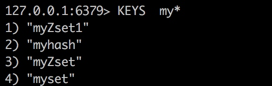

# redis入门
## 一. 环境
### 1.1 安装

```<<linux>>
wget http://download.redis.io/releases/redis-3.0.0.tar.gz
tar zxvf redis-3.0.0.tar.gz
cd redis-3.0.0
```

参考： [redis的安装过程基本配置及遇到问题的解决](http://www.cnblogs.com/HKUI/p/4439575.html)

### 1.2 启动

```<linux>
cd src
// 采用默认方式启动
./redis-server 
```

### 1.3 配置
Redis 的配置文件位于 Redis 安装目录下，文件名为 redis.conf。你可以通过 CONFIG 命令查看或设置配置项。

```<shell>
redis 127.0.0.1:6379> CONFIG GET CONFIG_SETTING_NAME
```

查看所有的配置：

```<shell>
redis 127.0.0.1:6379> CONFIG GET *
```

redis.conf 的配置说明:

- **daemonize no**: Redis默认不是以守护进程的方式运行，可以通过该配置项修改，使用yes启用守护进程
- **pidfile /var/run/redis.pid**：当Redis以守护进程方式运行时，Redis默认会把pid写入/var/run/redis.pid文件，可以通过pidfile指定
- **port 6379**: 指定Redis监听端口，默认端口为6379，作者在自己的一篇博文中解释了为什么选用6379作为默认端口，因为6379在手机按键上MERZ对应的号码，而MERZ取自意大利歌女Alessia Merz的名字.
- **bind 127.0.0.1**: 绑定的主机地址
- **appendfsync everysec**: 指定更新日志条件，共有3个可选值： 
    - no：表示等操作系统进行数据缓存同步到磁盘（快） 
    - always：表示每次更新操作后手动调用fsync()将数据写到磁盘（慢，安全） 
    - everysec：表示每秒同步一次（折衷，默认值）

### Redis可执行文件说明

| 文件名| 说明 |
| --- | --- |
| redis-server | redis服务器| 
| redis-cli | redis命令行客户端 |
|redis-benchmark | redis性能测试工具 |
| redis-check-aof | AOF文件修复工具 |
|redis-check-dump | RDB文件检查工具| 


## 二. 简介
Redis 与其他 key - value 缓存产品有以下三个特点：

- Redis支持数据的**持久化**，可以将内存中的数据保存在磁盘中，重启的时候可以再次加载进行使用。
- Redis不仅仅支持简单的key-value类型的数据，同时还提供list、set、zset、hash、string等数据结构的存储。
- Redis支持数据的**备份**，即master-slave模式的数据备份。

Redis 优势:

- **性能极高** – Redis能读的速度是110000次/s,写的速度是81000次/s 。
- **丰富的数据类型** – Redis支持二进制案例的 Strings, Lists, Hashes, Sets 及 Ordered Sets 数据类型操作。
- **原子** – Redis的所有操作都是原子性的，意思就是要么成功执行要么失败完全不执行。单个操作是原子性的。多个操作也支持事务，即原子性，通过MULTI和EXEC指令包起来。
- **丰富的特性** – Redis还支持 publish/subscribe, 通知, key 过期等等特性。


## 三. 常用指令
### 3.1 按不同类型设置缓存
#### 1）String

- string是redis最基本的类型，你可以理解成与Memcached一模一样的类型，一个key对应一个value。
- string类型是**二进制安全的**。意思是redis的string可以包含任何数据。比如jpg图片或者序列化的对象 。
- string类型是Redis最基本的数据类型，一个键**最大能存储512MB**。
- 命令**SET**和**GET**

```<shell>
redis 127.0.0.1:6379> SET name "runoob"
OK
redis 127.0.0.1:6379> GET name
"runoob"
```

#### 2）Hash（哈希）
Redis hash 是一个键值(key=>value)对集合。 Redis hash 是一个**string 类型的 field 和 value 的映射表**，hash 特别适合用于存储对象。 **每个 hash 可以存储 232 -1 键值对（40多亿）**。

```<shell>
redis> HMSET myhash field1 "Hello" field2 "World"
"OK"
redis> HGET myhash field1 # 必须制定属性， 如果不指定会报错
"Hello"
redis> HGET myhash field2
"World"
```

注意以下几点：

- 设置使用的是 **HMSET**, 获取使用的是**HGET**. 如果使用简单的GET获取是会报错的：


- 使用HGET时，必须指定hash数据结构中的key, 直接指定缓存的key是无法获取到整个hash结构的内容：


#### 3）List（列表）
Redis 列表是简单的字符串列表，按照插入顺序排序。你可以添加一个元素到列表的头部（左边）或者尾部（右边）。 

- list使用的命令是 **lpush**和**lrange**.
- **列表最多可存储 232 - 1 元素 (4294967295, 每个列表可存储40多亿)**。
- 添加一个 string 元素到 key 对应的 set 集合中，**成功返回1**，如果元素已经在集合中返回0，如果 key 对应的 set 不存在则返回错误。

```<shell>
redis 127.0.0.1:6379> lpush runoob redis
(integer) 1
redis 127.0.0.1:6379> lpush runoob mongodb
(integer) 2
redis 127.0.0.1:6379> lpush runoob rabitmq
(integer) 3
redis 127.0.0.1:6379> lrange runoob 0 10
1) "rabitmq"
2) "mongodb"
3) "redis"
redis 127.0.0.1:6379>
```

#### 4）Set（集合）
- Redis的Set是**string类型的无序集合**。？？？ 整数一定会转换为字符串？？
- 集合是通过哈希表实现的，所以添加，删除，查找的复杂度都是O(1)。 数据量小的时候使用的是zlist（压缩列表）
- 命令是**sadd**和**smembers**
- **成功返回1**，如果元素已经在集合中返回0，如果 key 对应的 set 不存在则返回错误。

```<shell>
redis 127.0.0.1:6379> sadd runoob redis  // 报错，因为runoob已经被使用, 且类型不是set
(error) WRONGTYPE Operation against a key holding the wrong kind of value
redis 127.0.0.1:6379> sadd myset redis
(integer) 1
redis 127.0.0.1:6379> sadd myset mongodb
(integer) 1
redis 127.0.0.1:6379> sadd myset rabitmq
(integer) 1
redis 127.0.0.1:6379> sadd myset rabitmq  // 已存在
(integer) 0
redis 127.0.0.1:6379> smembers myset
1) "redis"
2) "rabitmq"
3) "mongodb"
```

#### 5）ZSet(sorted set：有序集合)
- Redis zset 和 set 一样也是string类型元素的集合, 且**不允许重复**的成员。
- **不同的是每个元素都会关联一个double类型的分数**。redis正是通过分数来为集合中的成员进行从小到大的排序。
- zset的成员是唯一的,但分数(score)却可以重复。
- **成功返回1**，如果元素已经在集合中返回0，如果 key 对应的 set 不存在则返回错误。
- 获取时，默认按升序排序

命令: **zadd**和**ZRANGEBYSCORE**

添加元素到集合，元素在集合中存在则更新对应score

```
zadd key score member 
```

示例：

```<shell>
redis 127.0.0.1:6379> zadd myZset 0 redis
(integer) 1
redis 127.0.0.1:6379> zadd myZset 1 mongodb
(integer) 1
redis 127.0.0.1:6379> zadd myZset 2 rabitmq
(integer) 1
redis 127.0.0.1:6379> zadd myZset 3 rabitmq  // 这种是否会更新值？
(integer) 0
redis 127.0.0.1:6379> > ZRANGEBYSCORE myZset 0 1000
1) "mongodb"
2) "rabitmq"
3) "redis"
```

#### 总结


### 3.2 常用命令
#### PING
**PING**： 用于检测 redis 服务是否启动

#### 在远程服务上执行命令
如果需要在远程 redis 服务上执行命令，同样我们使用的也是 redis-cli 命令。

```
redis-cli -h host -p port -a password
```

例如：

```
redis-cli -h 127.0.0.1 -p 6379 -a "mypass"
```

#### Redis 键(key)
Redis 键命令用于管理 redis 的键。语法：

```
COMMAND KEY_NAME
```

常用的有：

- **keys \***: 查看所有的key
- **DEL key**: 该命令用于在 key 存在时删除 key。
- **DUMP key**: 序列化给定 key ，并返回被序列化的值。
- **EXISTS key**: 检查给定 key 是否存在.
- **EXPIRE key seconds**: 为给定 key 设置过期时间。
- **EXPIREAT key timestamp**：EXPIREAT 的作用和 EXPIRE 类似，都用于为 key 设置过期时间。 不同在于 EXPIREAT 命令接受的时间参数是 UNIX 时间戳(unix timestamp)。
- **PEXPIRE key milliseconds**: 设置 key 过期时间的时间戳(unix timestamp) 以毫秒计
- **KEYS pattern**: 查找所有符合给定模式(pattern)的 key 。 比如 KEYS *


- **MOVE key db**: 将当前数据库的 key 移动到给定的数据库 db 当中。-----里面是如何维护这种key, 使得后面查询的时候可以到对应的db去查找。记得是按槽分配的
- **PERSIST key**: 移除 key 的过期时间，key 将持久保持。
- **PTTL key**: 以毫秒为单位返回 key 的剩余的过期时间。
- **TTL key**: 以秒为单位，返回给定 key 的剩余生存时间(TTL, time to live)。
- **RANDOMKEY**: 从当前数据库中随机返回一个key。----一般什么场景会使用
- **RENAME key newkey**: 修改 key 的名称
- **RENAMENX key newkey**: 仅当 newkey 不存在时，将 key 改名为 newkey 。
- **TYPE key**: 返回 key 所储存的值的类型。

#### Redis 字符串命令
详细见：http://www.runoob.com/redis/redis-strings.html

- **SET key value**: 设置指定 key 的值
- **GET key**: 获取指定 key 的值.
- **GETRANGE key start end**: 返回 key 中字符串值的子字符
- **GETSET key value**: 将给定 key 的值设为 value ，并返回 key 的旧值(old value)。
- **GETBIT key offset**: 对 key 所储存的字符串值，获取指定偏移量上的位(bit)。
- **MGET key1 [key2..]**: 获取所有(一个或多个)给定 key 的值
- **SETBIT key offset value**: 对 key 所储存的字符串值，设置或清除指定偏移量上的位(bit)。
- **SETEX key seconds value**: 将值 value 关联到 key ，并将 key 的过期时间设为 seconds (以秒为单位)。
- **SETNX key value**: 只有在 key 不存在时设置 key 的值。
- **SETRANGE key offset value**: 用 value 参数覆写给定 key 所储存的字符串值，从偏移量 offset 开始。
- **STRLEN key**: 返回 key 所储存的字符串值的长度。
- **MSET key value [key value ...]**: 同时设置一个或多个 key-value 对。
- **MSETNX key value [key value ...]**: 同时设置一个或多个 key-value 对，当且仅当所有给定 key 都不存在。
- **PSETEX key milliseconds value**: 这个命令和 SETEX 命令相似，但它以毫秒为单位设置 key 的生存时间，而不是像 SETEX 命令那样，以秒为单位。
- **INCR key**: 将 key 中储存的数字值增一。
- **INCRBY key increment**: 将 key 所储存的值加上给定的增量值（increment） 。
- **INCRBYFLOAT key increment**: 将 key 所储存的值加上给定的浮点增量值（increment） 。
- **DECR key**: 将 key 中储存的数字值减一。
- **DECRBY key decrement**: key 所储存的值减去给定的减量值（decrement） 。
- **APPEND key value**: 如果 key 已经存在并且是一个字符串， APPEND 命令将指定的 value 追加到该 key 原来值（value）的末尾。


#### Redis 哈希(Hash)
- **HDEL key field1 [field2]**: 删除一个或多个哈希表字段
- **HEXISTS key field**: 查看哈希表 key 中，指定的字段是否存在。
- **HGET key field**: 获取存储在哈希表中指定字段的值。
- **HGETALL key**: 获取在哈希表中指定 key 的所有字段和值
- **HINCRBY key field increment**: 为哈希表 key 中的指定字段的整数值加上增量 increment 。
- **HINCRBYFLOAT key field increment** : 为哈希表 key 中的指定字段的浮点数值加上增量 increment 。
- **HKEYS key**: 获取所有哈希表中的字段
- **HLEN key**: 获取哈希表中字段的数量
- **HMGET key field1 [field2]**: 获取所有给定字段的值
- **HMSET key field1 value1 [field2 value2 ]**: 同时将多个 field-value (域-值)对设置到哈希表 key 中。
- **HSET key field value**: 将哈希表 key 中的字段 field 的值设为 value 。
- **HSETNX key field value**: 只有在字段 field 不存在时，设置哈希表字段的值。
- **HVALS key**: 获取哈希表中所有值


#### Redis 集合(Set)
- **SADD key member1 [member2]**: 向集合添加一个或多个成员
- **SCARD key**: 获取集合的成员数
- 	**SDIFF key1 [key2]**:返回给定所有集合的差集
- **SISMEMBER key member**: 判断 member 元素是否是集合 key 的成员
- **SMEMBERS key**: 返回集合中的所有成员
- **SREM key member1 [member2]**: 移除集合中一个或多个成员
- **SUNION key1 [key2]**: 返回所有给定集合的并集


#### Redis 有序集合(sorted set)
参考: http://www.runoob.com/redis/redis-sorted-sets.html

- **ZADD key score1 member1 [score2 member2]**: 向有序集合添加一个或多个成员，或者更新已存在成员的分数
- **ZCARD key**: 获取有序集合的成员数
- **ZCOUNT key min max**: 计算在有序集合中指定区间分数的成员数
- **ZLEXCOUNT key min max**: 在有序集合中计算指定字典区间内成员数量
- **ZRANK key member**: 返回有序集合中指定成员的索引
- **ZREM key member [member ...]**:移除有序集合中的一个或多个成员
- 	**ZSCORE key member**: 返回有序集中，成员的分数值


#### Redis 发布订阅命令
- **PSUBSCRIBE pattern [pattern ...]**: 订阅一个或多个符合给定模式的频道。
- 	**PUBLISH channel message**: 将信息发送到指定的频道。
- 	**SUBSCRIBE channel [channel ...]**: 订阅给定的一个或多个频道的信息。
- **UNSUBSCRIBE [channel [channel ...]]**: 指退订给定的频道。


#### Redis 事务
Redis 事务可以一次执行多个命令， 并且带有以下两个重要的保证：

- 批量操作在发送 EXEC 命令前被放入队列缓存。
- 收到 EXEC 命令后进入事务执行，事务中任意命令执行失败，其余的命令依然被执行。
- 在事务执行过程，其他客户端提交的命令请求不会插入到事务执行命令序列中。

一个事务从开始到执行会经历以下三个阶段：

- 开始事务。
- 命令入队。
- 执行事务。


单个 Redis 命令的执行是原子性的，但 Redis 没有在事务上增加任何维持原子性的机制，所以 Redis 事务的执行并不是原子性的。

事务可以理解为一个打包的批量执行脚本，但批量指令并非原子化的操作，中间某条指令的失败不会导致前面已做指令的回滚，也不会造成后续的指令不做。

- **DISCARD**: 取消事务，放弃执行事务块内的所有命令。
- **EXEC**: 执行所有事务块内的命令。
- **MULTI**: 标记一个事务块的开始。
- **UNWATCH**: 取消 WATCH 命令对所有 key 的监视。
- **WATCH key [key ...]**: 监视一个(或多个) key ，如果在事务执行之前这个(或这些) key 被其他命令所改动，那么事务将被打断。

#### Redis 服务器命令
Redis 服务器命令主要是用于管理 redis 服务。

- **BGREWRITEAOF**: 异步执行一个 AOF（AppendOnly File） 文件重写操作
- **BGSAVE**: 在后台异步保存当前数据库的数据到磁盘
- **CLUSTER SLOTS**:获取集群节点的映射数组
- **TIME**: 返回当前服务器时间
- **INFO [section]**: 获取 Redis 服务器的各种信息和统计数值
- **ROLE**: 返回主从实例所属的角色
- **SAVE**: 同步保存数据到硬盘
- **SYNC**: 用于复制功能(replication)的内部命令
- **SLAVEOF host port**: 将当前服务器转变为指定服务器的从属服务器(slave server)


## 四. java 使用redis

引入mvn 包：

```<xml>
 <!-- redis 里面依赖了commons-pool2 包 -->
<dependency>
  <groupId>redis.clients</groupId>
  <artifactId>jedis</artifactId>
  <version>2.9.0</version>
</dependency>
```


JredisPool实现原理: https://www.cnblogs.com/plf112233/p/6527902.html

https://blog.csdn.net/luyee2010/article/details/17580381


