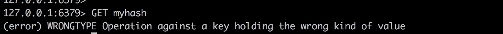
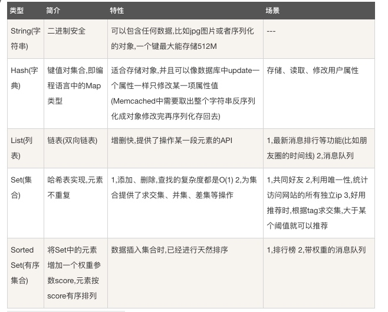

# redis入门
## 一. 环境
### 1.1 安装

```<<linux>>
wget http://download.redis.io/releases/redis-3.0.0.tar.gz
tar zxvf redis-3.0.0.tar.gz
cd redis-3.0.0
```

参考： [redis的安装过程基本配置及遇到问题的解决](http://www.cnblogs.com/HKUI/p/4439575.html)

### 1.2 启动

```<linux>
cd src
// 采用默认方式启动
./redis-server 
```

### 1.3 配置
Redis 的配置文件位于 Redis 安装目录下，文件名为 redis.conf。你可以通过 CONFIG 命令查看或设置配置项。

```<shell>
redis 127.0.0.1:6379> CONFIG GET CONFIG_SETTING_NAME
```

查看所有的配置：

```<shell>
redis 127.0.0.1:6379> CONFIG GET *
```

redis.conf 的配置说明:

- **daemonize no**: Redis默认不是以守护进程的方式运行，可以通过该配置项修改，使用yes启用守护进程
- **pidfile /var/run/redis.pid**：当Redis以守护进程方式运行时，Redis默认会把pid写入/var/run/redis.pid文件，可以通过pidfile指定
- **port 6379**: 指定Redis监听端口，默认端口为6379，作者在自己的一篇博文中解释了为什么选用6379作为默认端口，因为6379在手机按键上MERZ对应的号码，而MERZ取自意大利歌女Alessia Merz的名字.
- **bind 127.0.0.1**: 绑定的主机地址
- **appendfsync everysec**: 指定更新日志条件，共有3个可选值： 
    - no：表示等操作系统进行数据缓存同步到磁盘（快） 
    - always：表示每次更新操作后手动调用fsync()将数据写到磁盘（慢，安全） 
    - everysec：表示每秒同步一次（折衷，默认值）

### Redis可执行文件说明

| 文件名| 说明 |
| --- | --- |
| redis-server | redis服务器| 
| redis-cli | redis命令行客户端 |
|redis-benchmark | redis性能测试工具 |
| redis-check-aof | AOF文件修复工具 |
|redis-check-dump | RDB文件检查工具| 


## 二. 简介
Redis 与其他 key - value 缓存产品有以下三个特点：

- Redis支持数据的**持久化**，可以将内存中的数据保存在磁盘中，重启的时候可以再次加载进行使用。
- Redis不仅仅支持简单的key-value类型的数据，同时还提供list、set、zset、hash、string等数据结构的存储。
- Redis支持数据的**备份**，即master-slave模式的数据备份。


Redis 优势:

- **性能极高** – Redis能读的速度是110000次/s,写的速度是81000次/s 。
- **丰富的数据类型** – Redis支持二进制案例的 Strings, Lists, Hashes, Sets 及 Ordered Sets 数据类型操作。
- **原子** – Redis的所有操作都是原子性的，意思就是要么成功执行要么失败完全不执行。单个操作是原子性的。多个操作也支持事务，即原子性，通过MULTI和EXEC指令包起来。
- **丰富的特性** – Redis还支持 publish/subscribe, 通知, key 过期等等特性。


## 三. 常用指令
### 3.1 按不同类型设置缓存
#### 1）String

- string是redis最基本的类型，你可以理解成与Memcached一模一样的类型，一个key对应一个value。
- string类型是**二进制安全的**。意思是redis的string可以包含任何数据。比如jpg图片或者序列化的对象 。
- string类型是Redis最基本的数据类型，一个键**最大能存储512MB**。

```<shell>
redis 127.0.0.1:6379> SET name "runoob"
OK
redis 127.0.0.1:6379> GET name
"runoob"
```

#### 2）Hash（哈希）
Redis hash 是一个键值(key=>value)对集合。 Redis hash 是一个**string 类型的 field 和 value 的映射表**，hash 特别适合用于存储对象。 **每个 hash 可以存储 232 -1 键值对（40多亿）**。

```<shell>
redis> HMSET myhash field1 "Hello" field2 "World"
"OK"
redis> HGET myhash field1 # 必须制定属性， 如果不指定会报错
"Hello"
redis> HGET myhash field2
"World"
```

注意以下几点：

- 设置使用的是 **HMSET**, 获取使用的是**HGET**. 如果使用简单的GET获取是会报错的：


- 使用HGET时，必须指定hash数据结构中的key, 直接指定缓存的key是无法获取到整个hash结构的内容：


#### 3）List（列表）
Redis 列表是简单的字符串列表，按照插入顺序排序。你可以添加一个元素到列表的头部（左边）或者尾部（右边）。 

- list使用的命令是 **lpush**和**lrange**.
- **列表最多可存储 232 - 1 元素 (4294967295, 每个列表可存储40多亿)**。
- 添加一个 string 元素到 key 对应的 set 集合中，**成功返回1**，如果元素已经在集合中返回0，如果 key 对应的 set 不存在则返回错误。


```<shell>
redis 127.0.0.1:6379> lpush runoob redis
(integer) 1
redis 127.0.0.1:6379> lpush runoob mongodb
(integer) 2
redis 127.0.0.1:6379> lpush runoob rabitmq
(integer) 3
redis 127.0.0.1:6379> lrange runoob 0 10
1) "rabitmq"
2) "mongodb"
3) "redis"
redis 127.0.0.1:6379>
```

#### 4）Set（集合）
- Redis的Set是**string类型的无序集合**。？？？ 整数一定会转换为字符串？？
- 集合是通过哈希表实现的，所以添加，删除，查找的复杂度都是O(1)。 数据量小的时候使用的是zlist（压缩列表）
- 命令是**sadd**和**smembers**
- **成功返回1**，如果元素已经在集合中返回0，如果 key 对应的 set 不存在则返回错误。

```<shell>
redis 127.0.0.1:6379> sadd runoob redis  // 报错，因为runoob已经被使用, 且类型不是set
(error) WRONGTYPE Operation against a key holding the wrong kind of value
redis 127.0.0.1:6379> sadd myset redis
(integer) 1
redis 127.0.0.1:6379> sadd myset mongodb
(integer) 1
redis 127.0.0.1:6379> sadd myset rabitmq
(integer) 1
redis 127.0.0.1:6379> sadd myset rabitmq  // 已存在
(integer) 0
redis 127.0.0.1:6379> smembers myset
1) "redis"
2) "rabitmq"
3) "mongodb"
```

#### 5）ZSet(sorted set：有序集合)
- Redis zset 和 set 一样也是string类型元素的集合, 且**不允许重复**的成员。
- **不同的是每个元素都会关联一个double类型的分数**。redis正是通过分数来为集合中的成员进行从小到大的排序。
- zset的成员是唯一的,但分数(score)却可以重复。
- **成功返回1**，如果元素已经在集合中返回0，如果 key 对应的 set 不存在则返回错误。
- 获取时，默认按升序排序

命令: **zadd**和**ZRANGEBYSCORE**

添加元素到集合，元素在集合中存在则更新对应score

```
zadd key score member 
```

示例：

```<shell>
redis 127.0.0.1:6379> zadd myZset 0 redis
(integer) 1
redis 127.0.0.1:6379> zadd myZset 1 mongodb
(integer) 1
redis 127.0.0.1:6379> zadd myZset 2 rabitmq
(integer) 1
redis 127.0.0.1:6379> zadd myZset 3 rabitmq  // 这种是否会更新值？
(integer) 0
redis 127.0.0.1:6379> > ZRANGEBYSCORE myZsetm 0 1000
1) "mongodb"
2) "rabitmq"
3) "redis"
```

#### 总结



