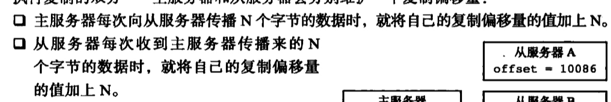

# 笔记
## 复制
- 旧版本
    - 方式：同步sync和命令传播， BGSAVE方式执行。
        - 同步sync 
            - 通过生成RDB文件发送，新数据写入缓存， 从服务器载入
            - 将缓存中的命令发送给从服务器，从服务器执行命令
        - 命令传播：将执行的命令发送给从服务器执行 
    - 命令：
        - 从服务器发送SLAVEOF命令，在发送SYNC命令要求同步。
    - 问题：断线后复制有问题(命令传播阶段)，需要重新执行
- 新版本
    -  方式:同步PSYNC和命令传播
    -  同步PSYNC
        - 完整同步：和就版本一样，生成RDB文件发送   PSYNC ? -1 
        - 部分同步： 断线后允许按照命令的方式传播执行  PSYNC <runid> <offset>
        - 实现原理
            - 主服务器复制偏移量和从服务器复制偏移量
            - 主服务器复制积压缓冲区---先进先出队列
            - 服务器运行Id

## 集群
16384个槽

