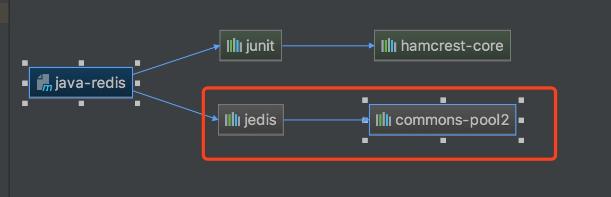

# 资源池化
对象的池化技术:

我们都知道一个对象比如car(对象)在其生命周期大致可氛围"创建","使用","销毁"三大阶段,那么它的总时间就是T1(创建)+T2(使用)+T3(销毁),如果创建N个对象都需要这样的步骤的话是非常耗性能的,就算JVM对垃圾回收机制有优化,但"创建"和"销毁"多少总会占用部分资源,那么我们就会想能否像常量池那样,让对象可复用,从而减少T1和T3所消耗的资源呢？这就引出了我们今天的内容-----对象池化技术即ObjectPool  (jedis也是一个Object对象,我们下面先介绍对象池)

官网对对象池的解释是:

将用过的对象保存起来,等下次需要这种对象的时候再拿出来重复使用,从而在一定程度上减少频繁创建对象所造成的开销,用于充当保存对象的"容器"对象,被称为"对象池"。

对于没有状态的对象,String,在重复使用之前,无需进行任何处理,对于有状态的对象如StringBuffer，在重复使用之前,需要恢复到同等于生成的状态，如果恢复不了的话,就只能丢掉,改用创建的实例了。并非所有对象都可以用来池化,因为维护池也需要开销,对生成时开销不大的对象进行池化,它可能降低性能。

恰当地使用对象池化，可以有效地降低频繁生成某些对象所造成的开销，从而提高整体的性能。而借助Apache Commons Pool组件，可以有效地减少花在处理对象池化上的工作量，进而，向其它重要的工作里，投入更多的时间和精力。 

https://www.cnblogs.com/plf112233/p/6527902.html


JedisPool使用了apache的GenericObjectPool来作为redis连接管理pool




配置：

```
<!-- 连接池的配置信息 -->  
<bean id="jedisConfig" class="redis.clients.jedis.JedisPoolConfig">  
  <!-- 说明一个pool可以有多少个Jedis实例 -->  
  <property name="maxActive" value="10" />  
  <!-- 最大Idle-->  
  <property name="maxIdle" value="5" />  
  <!-- 最小Idle -->  
  <property name="minIdle" value="1" />  
  <!-- 获得一个jedis实例的时候是否检查连接可用性（ping()） -->  
  <property name="testOnBorrow" value="true" />  
  <!-- return 一个jedis实例给pool时，是否检查连接可用性（ping()） -->  
  <property name="testOnReturn" value="true" />  
  <!-- idle状态监测用异步线程evict进行检查， -->  
  <property name="testWhileIdle" value="true" />  
  <!-- 一次最多evict的pool里的jedis实例个数 -->  
  <property name="numTestsPerEvictionRun" value="10" />  
  <!-- test idle 线程的时间间隔 -->  
  <property name="timeBetweenEvictionRunsMillis" value="60000" />  
  <!--最大等待wait时间-->  
  <property name="maxWait" value="3000" />  
  <property name="whenExhaustedAction" value="" />  
   //WHEN_EXHAUSTED_FAIL = 0; 直接抛出异常throw new NoSuchElementException("Pool exhausted");  
   //WHEN_EXHAUSTED_BLOCK = 1;borrowObject()将会阻塞，直到有可用新的或者空闲的object为止，或者如果配置了maxWait，  
   //如果请求阻塞超时，将抛出NoSuchElementException.如果maxWait为负数，请求将会无限制的阻  
   //塞下去，默认配置。  
   //WHEN_EXHAUSTED_GROW = 2;borrowObject()将会继续创建新的对象，并返回，因此，pool维护的对像数将超出maxActive；  
   //  
</bean>  
```

